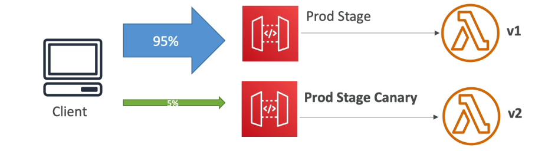
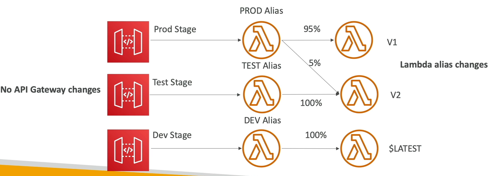
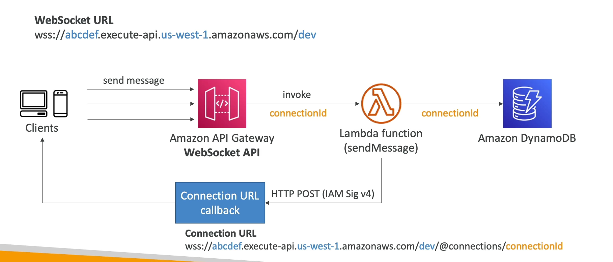
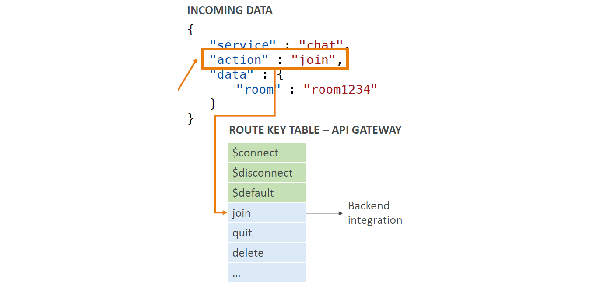
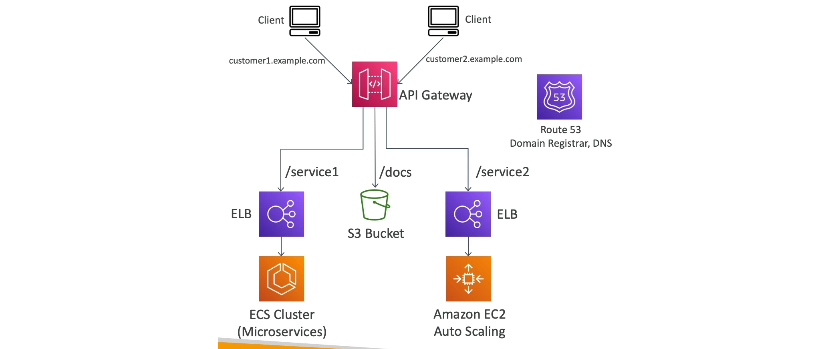
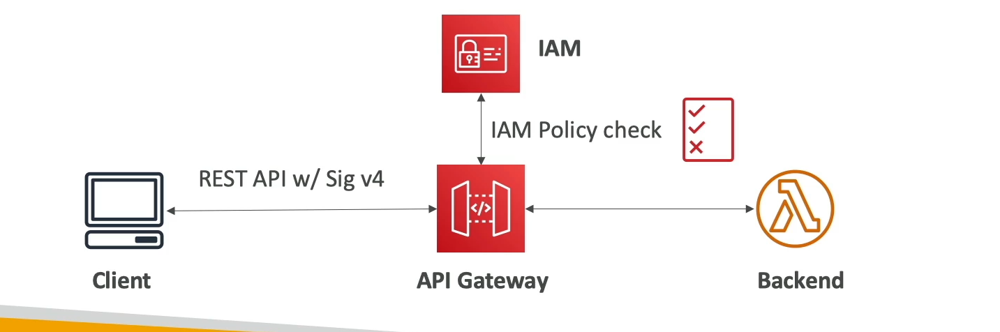
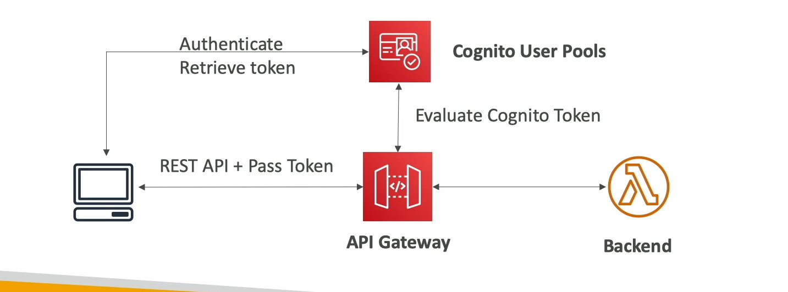
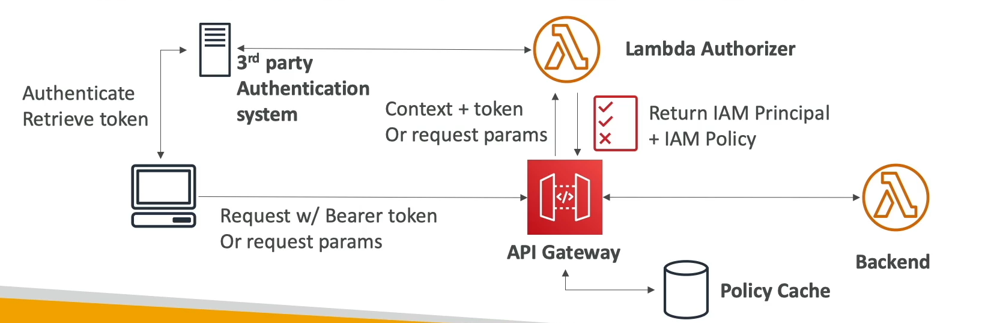

[Back](./AWS.md)

# API Gateway - Basics

## API Gateway - Timeout

- The maximum integration timeout for AWS API Gateway is 29 seconds. This is the time limit for the backend integration (e.g., Lambda function, HTTP endpoint) to respond to the API Gateway.
- If the Integration didn't process the request and return a response in 29 seconds, API Gateway will timeout
- Error 504: timeout after 29 second maximum

## API Gateway - APIs

- HTTP API, much cheaper APIs, doesn't support resource policies
- Rest API, doesn't support Native OpenID Connect / OAuth2.0 / JWT
- WebSocket API

## API Gateway - Targets

- Lambda Function: invoke Lambda Function
- HTTP endpoint
- AWS Service: ex: start an AWS Step function workflow, send a message to SQS

## API Gateway - Endpoint Types

### Edge-Optimized (default)

- For global clients
- Requests are routed through CloudFront Edge Locations
- The API Gateway still lives in only one region

### Regional

- For clients within the same region
- Could manually combine with CloudFront (more control over the caching strategies and the distribution)

### Private

- Can only be accessed from your VPC using an interface VPC endpoint (ENI)
- Use a resource policy to define access

## API Gateway - Stages

- Making changes in the API Gateway does not mean they're effective
- You need to make a **deployment** for them to be in effect
- Changes are deployed to **stages**
- Use the naming you like for stages (dev,test,prod)
- Each stage can have its own configuration parameters
- Stages can be rolled back, because the history of deployments is kept

### Stage Variables

- Stage variables are like environment variables for API Gateway
- Use them to change often changing configuration values
- Format: `${stageVariables.variableName}`
- Format example: `${stageVariables.lambdaAlias}` this will give us a **input field** names 'lambdaAlias' to enter which alias of lambda we want to invoke (ex: DEV, PROD, TEST)

## API Gateway - Mapping Templates

- Uses **Velocity Template Language (VTL)** for loop, if else, etc...
- Must set **Content-Type** to **application/json** or **application/xml**

### Mapping Templates are used to

- **modify request/responses**
- Rename / Modify query string parameters
- Modify body content
- Add headers
- Used for filter output results (remove unnecessary data)
- Rename Query String Parameters
- **Transform JSON to XML** for a SOAP API
- Access stage variables in the mapping templates
- **Pass configuration parameters** to:

  - Lambda Function: Stage variables are passed to the **context** object in AWS Lambda
  - HTTP Endpoint

## API Gateway - Integration Types

- Integration Type MOCK
  - API Gateway returns a response without sending the request to the backend
- Integration Type HTTP/AWS
  - You must configure both the integration request and the integration response
  - Setup data mapping using **mapping templates** for the request & response
- Integration Type AWS_PROXY (lambda proxy)
  - No mapping template
  - incoming request from the client is the input to lambda
  - the function is responsible for the logic of request/response
  - **Possibility to add HTTP headers if needed (ex: API key)**
- Integration type HTTP_PROXY
  - No mapping template
  - The HTTP request is passed to the backend
  - The HTTP response from the backend is forwarded by API Gateway
  - **Possibility to add HTTP headers if needed (ex: API key)**

## API Gateway - Canary Deployment

- Canary deployment to switch between stages\*\*
- Choose the % of traffic the canary channel receives
- Metrics & logs are separate (for better monitoring)

- We can also have canary deployment via lambda (with no API gateway changes)

# API Gateway - Additional Features

## API Gateway - Open API spec

- Old name (swagger)
- You can import/export API's as a code (YAML or JSON)
- If using the Open API format you can generate SDKs for your applications (JavaScript, swift, ruby, etc...) through the console that will match your API

## API Gateway - Request Validation

- You can configure API gateway to perform basic validation of an API request before proceeding with the integration request
- When the validation fails, API gateway immediately fails the request (return 400 error to the caller)
- This reduces unnecessary calls to the backend
- Checks:
  - The required request parameters in the URL, query string, and headers of an incoming request are included and non-blank
  - The applicable request payload adheres to the configured JSON schema request model of the method

## API Gateway - Caching

- Caching reduces the number of calls made to the backend
- Default TTL: 300sec (min: 0s, max: 3600s)
- Caches are defined per stage
- Possible to override cache setting set on the stage per method (GET/POST, etc...)
- Cache encryption option
- Cache capaciy between 0.5GB to 237GB
- Cache is expensive, makes sense in production, may not make sense in dev/test

### Cache Invalidation

- Able to flush the entire cache through the console
- Clients can invalidate the cache with the **HTTP header** `cache-control:max-age:0`, when 'Require authorization' is checked it requires **InvalidateCache** action in IAM policy
- If you do not select the 'Require authorization' checkbox in the console, any client can invalidate the API cache.

## API Gateway - Usage Plans & API Keys

- If you want to make an API available as an offering ($) to your customers, have usage plans
- configure throttling limits (requests per seconds) and quota (requests per month) limits that are enforced on indiviual API key
- Callers of the API must supply an assigned API key in the **x-api-key** header in requests to the API

### Correct order for API keys and usage plans

1. Create one or more APIs
2. Configure the methods to require an API key
3. Deploy API to stages
4. Generate or import API keys to distribute
5. Create the usage plan with the desired throttle and quota limits
6. Associate API stages and API keys with the usage plan

## API Gateway - WebSocket API

- What's WebSocket?
  - Two-way interactive communication between a user's browser and a server
  - Server can push information to the client
  - The enables **stateful** application use cases
- WebSocket APIs are often used in real-time applications:
  - chat applications
  - multiplayer games
  - financial trading platforms

### WebSocket API Routing

- Incoming JSON messages can be routed to different backends
- Routing tables should be defined in API Gateway
- An action is specified in the JSON message, this actions is matched with the value on the route table

## API Gateway - Architecture

- Create a signel interface for all the microservices in your company

# API Gateway - Security & Logging

## API Gateway - Security

### IAM Permissions

- Create an IAM Policy authorization and attach to User/Role
- Authentication = IAM
- Authroization = IAM Policy
- SigV4 is used, where IAM credentials are in headers

### Cognito User Pools

- Cognito fully manages user lifecycle, token expiration
- Authentication = Congnito
- Authorization = API Gateway methods

### Lambda Authorizer (fromerly Custom Authorizers)

- Token-based authorizer: JWT or Oauth
- This method is used mainly when you use 3rd party authentication system
- Lambda Authrorizer returns an IAM policy that will be cached
- Authentication = external
- Authrorization = Lambda Function

### Resource Policies

- Resource Policies on API Gateway
- Allow for cross account access combined with IAM security
- Allow traffic from within the VPC
- Allow only from IP ranges

## API Gateway - Logging and tracing

### CloudWatch Logs

- Log contains information about request/response body
- Enable CloudWatch logging at the stage level

### CloudWatch Metrics

- Metrics are collected by a stage, possibility to enable detailed metrics
- **CacheHitCount & CacheMissCount:** efficiency of the cache
- **Count:** The total number API requests in a given period
- **InegrationLatency:** The time between when API Gateway relays a request to the backend and when it receives a response from the backend
- **Latency:** The time between when API Gateway receives a request from a client and when it returns a response to the client. The latency includes the integration latency and other API Gateway overhead
- **4XXError** metric (client-side)
- **5XXError** metric (server-side)

### X-Ray

- Enable Tracing to get extra information about requests in API Gateway

## API Gateway - Throttling

- Account Limit
  - API Gateway throttles requests at 10000 rps across all APIs
  - If one API consumes all quotas, other APIs will be throttled
  - Soft limit can be increased upon request
- In case of throttling, **429 Too Many Requests** error will occur (retriable with exponential backoff)
- Can set **Stage limit & Method limits** to improve performance
- Or you can define **Usage Plans** to throttle per customer

## API Gateway - CORS

- CORS must be enabled on API Gateway when you request API calls from another domain (ex: S3 website) to make a request to API Gateway
