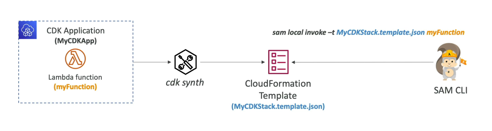

[Back](./AWS.md)

# CDK

## CDK - Basics

- CDK let's you define your cloud infrastructure using a programming language: JavaScript/TypeScript, python, Java and .NET
- The code is **compiled** into a CloudFormation template (JSON/YAML) using `cdk synth`

## CDK vs SAM

| Feature                   | SAM                                               | CDK                                                                                            |
| ------------------------- | ------------------------------------------------- | ---------------------------------------------------------------------------------------------- |
| Services                  | Serverless focused                                | All AWS Services                                                                               |
| Language                  | Write your template declaratively in JSON or YAML | Write infrastructure in a programming language (JavaScript/TypeScript, Python, Java, and .NET) |
| Infrastructure Management | Leverages CloudFormation                          | Leverages CloudFormation                                                                       |

## CDK - Testing Locally via SAM

- You can use SAM CLI to locally test your CDK apps
- you must first run **cdk synth**

## CDK - Constructs

Constructs are the basic building blocks of AWS Cloud Development Kit (AWS CDK) applications. A construct is a component within your application that represents one or more AWS CloudFormation resources and their configuration. You build your application, piece by piece, by importing and configuring constructs.

### Construct Libraries

- AWS Construct Library: a collection of constructs included in AWS CDK (L1,L2,L3)
- Construct Hub: contains additional constructs from AWS 3rd parties

### Layer 1 Constructs

- These are low-level constructs that directly correspond to AWS CloudFormation resources.
- Construct names starts with **Cfn** (ex: CfnBucket)
- You must explicitly configure all resource properties that are required such as a bucket name for a S3 bucket

### Layer 2 Constructs

- Represents AWS resources but with a higher level
- Similar functionality as L1 but with convenient defaults, methods and boilerplate

### Layer 3 Constructs

- Can be called **patterns**, which represents multiple related resources
- Examples: build api gateway with lambda or ECS with fargate with minimal effort

## CDK - Creating an app

The correct order of steps to be followed for creating an app using AWS CDK

1. Create the app from a template provided by AWS CDK
2. Add code to the app to create resources within stacks
3. Build the app (optional)
4. Synthesize one or more stacks in the app
5. Deploy stack(s) to your AWS account

## CDK - Commands

- `cdk bootstrap` You have to run this command for every region and will leverage a **S3 Bucket** to store files and **IAM Roles** to grant permissions for deployments
- `cdk synth` Synthesizes and prints the CloudFormation template
- `cdk deploy` Deploy a stack
- `cdk diff` View differences of local CDK and deployed Stack
- `cdk destroy` Destroy the Stack

## CDK - Unit Testing

- To unit test CDK apps, use **CDK Assertions Module**
- Two Types of tests:
  - Fine-grained Assertions (common): test specific aspects of the CloudFormation template
  - Snapshot Tests: test the template against a previously stored template
- To import a template in the test file use:
  - Template.fromStack(MyStack): if the stack is built in CDK
  - Template.fromString(myString): stack build outside CDK (ex: a file)
