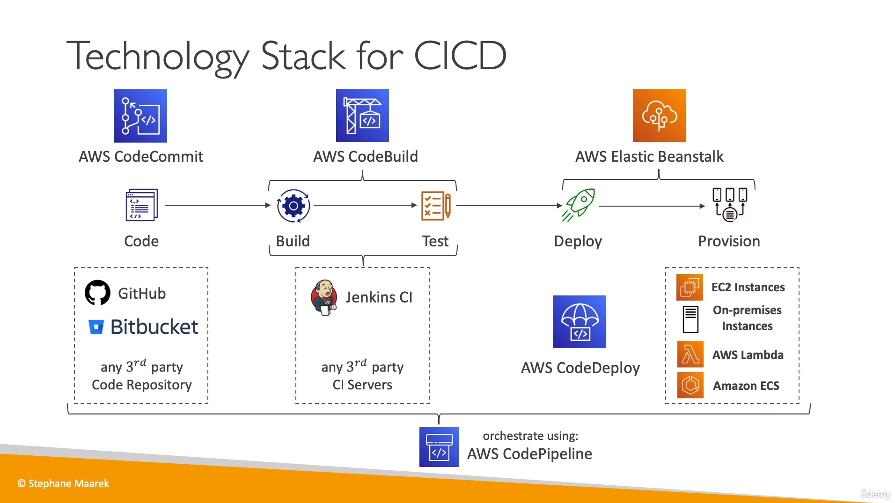
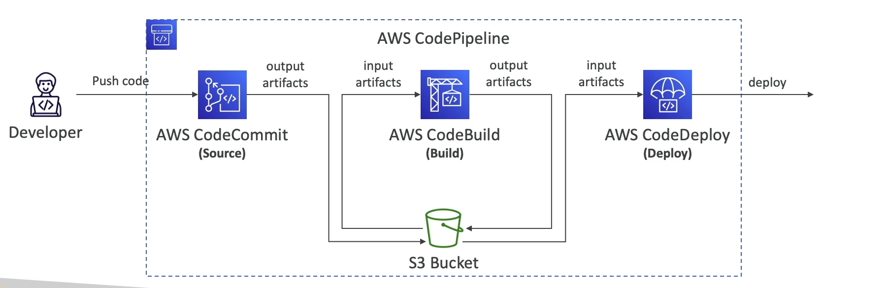
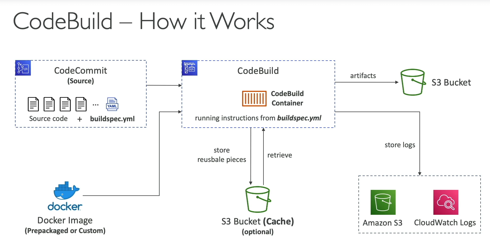
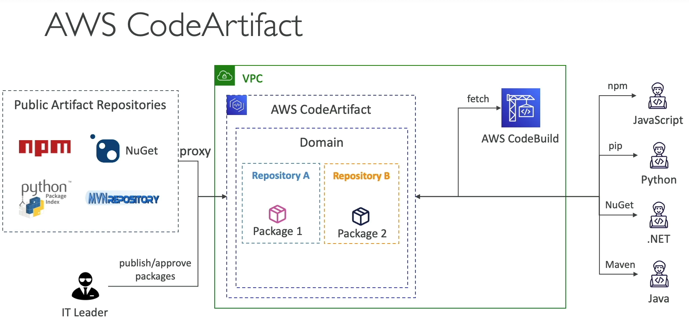
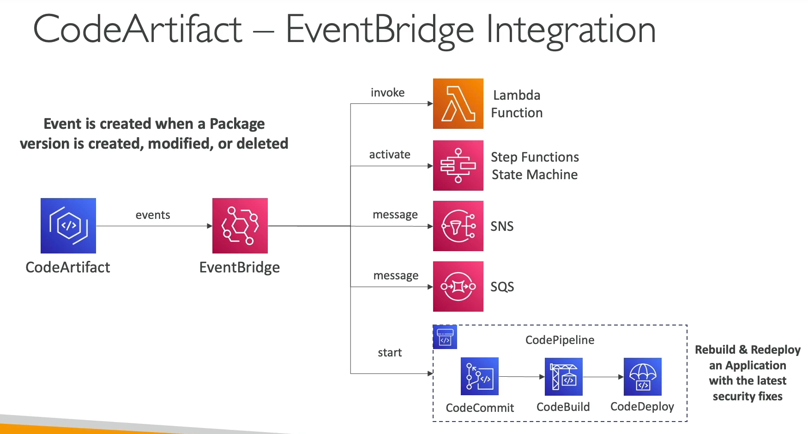

[Back](./AWS.md)

# CodeCommit DEPRECATED since July 25, 2024

## CodeCommit - Basics

- CodeCommit Provides Version Control (Git)
- No size limit on repositories
- Code Commit is deprecated on AWS

## CodeCommit - Best practices

- AWS recommends setting your dependencies to point to a specific version. AWS does not recommend that you set the version to the latest because that can introduce changes that might break your application without notice.

## CodeCommit - Security

### Cross-account Access

- Use an IAM Role in your AWS account and ask the other account to use **AWS STS (AssumeRole API)**

### Migration to CodeCommit from GitHub

- To migrate the existing application code from a GitHub repository to AWS CodeCommit use **Git credentials generated from IAM**
- **Don't use** authentication offered by **GitHub secure tokens** because these are meant for GitHub not CodeCommit

# CodePipeline

## CodePipeline - Basics

- Visual Workflow to **orchestrate** your CI/CD
- The best sequence for CI/CD is: Build -> Test -> Deploy
- Pipeline consists of stages
  - Stage example: Build > Test > Deploy
  - Each stage can have **sequential action groups** and/or **parallel action groups**
  - Action group example: CodeBuild, Manual approval, etc...
  - If your release process includes activities that are not included in the default actions, such as an internally developed build process or a test suite, you can create a custom action for that purpose and include it in your pipeline.
- Elastic Beanstalk has direct integration with CodePipeline, and doesn't require CodeDeploy



## CodePipeline - Artifacts

- Each stage creates **artifacts**
- Artifacts are stored in an **S3 bucket** and passed on the next stage



## CodePipeline - Troubleshooting

- If CodePipeline fails a stage, your pipeline **stops**, and you can get information in the console
- Use EventBridge to create events for failed pipelines or cancelled stages (ex: get email through SNS)

# CodeBuild

## CodeBuild - Basics

- Build instructions: Code file **buildspec.yml** at the root level of the code files, or insert manually in console

## CodeBuild - How it works

- CodeBuild uses a docker image as an environment to build your code (managed image or custom image)
- CodeBuild containers are deleted at the end of their execution (success or failure). You can't SSH into them, even while they're running.



## CoudBuild - buildspec.yml

### env

- env is used to define environment variables or reference parameter store or secrets-manager

### phases

- specify commands
  - install: install dependencies
  - pre_build: final commands before build
  - build: actual build commands
  - post_build: finishing touches (ex: zip output)

### artifacts

- what to upload to S3 for the next step

### cache

- files to cache (usually dependencies) to S3 for future build speedup

```yml
version: 0.2

env:
  variables:
    JAVA_HOME: "/usr/lib/jvm/java-8-openjdk-amd64"
  parameter-store:
    LOGIN_PASSWORD: /CodeBuild/dockerLoginPassword

phases:
  install:
    commands:
      - echo "Entered the install phase..."
      - apt-get update -y
      - apt-get install -y maven
  pre_build:
    commands:
      - echo "Entered the pre_build phase..."
      - docker login -u User -p $LOGIN_PASSWORD
  build:
    commands:
      - echo "Entered the build phase..."
      - echo "Build started on `date`"
      - mvn install
  post_build:
    commands:
      - echo "Entered the post_build phase..."
      - echo "Build completed on `date`"

artifacts:
  files:
    - target/messageUtil-1.0.jar

cache:
  paths:
    - "/root/.m2/**/*"
```

## CodeBuild - Troubleshooting

- Output logs can be stored in **Amazon S3 & CloudWatch Logs**
- Use CloudWatch Metrics to monitor build statistics
- Use CloudWatch Alarms
- Use EventBridge to detect failed builds and trigger notifications

## CodeBuild - Overriding a build command

- To override the build command, run the start build AWS CLI command with **buildspecOverride** property set to the new **buildspec.yml** file
- This option might be helpful if the developer has access to run the builds but does not have access to the code and to edit the CodeBuild project

# CodeDeploy

## CodeDeploy - Basics

- In AWS CodeDeploy, the **deployment group** is essentially the set of instances that you want to deploy your application to.
- A file names **appspec.yml** defines how the deployment happens, at the root level of the code files

## CodeDeploy lifecycle for EC2

1. ApplicationStop
2. DownloadBundle
3. BeforeInstall
4. Install
5. AfterInstall
6. ApplicationStart
7. ValidateService

## CodeDeploy lifecycle for Lambda

1. BeforeAllowTraffic (supports lambda validation functions)
2. AllowTraffic
3. AfterAllowTraffic (supports lambda validation functions)

- Deploy new applications versions to:

  - EC2 Instances
  - ECS
  - Lambda functions
  - On-premises servers

## CodeDeploy - EC2/On-premises Platform

- Perform **in-place deployments** or **blue/green deployments**
- In place uses the same instances, while blue/green creates new instances
- Must run the **CodeDeploy Agent** on the target instances
- The EC2 Instances must have sufficient permissions to access **S3** to get deployment bundles
- Define Deployment speeds for in-place:
  - AllAtOnce
  - HalfAtATime
  - OneAtATime
  - Custom %

## CodeDeploy - Lambda

- CodeDeploy can help you automate traffic shift for lambda aliases
- Feature is integrated within the SAM framework
- Strategies:
  - AllAtOnce: immediate
  - Linear: grow traffic every N minutes until 100%
  - Canary: Try X percent then 100%

## CodeDeploy - ECS Platform

- Only Blue/Green Deployments
- CodeDeploy can help you automate the deployment of a new ECS Task Definition
- Strategies:
  - AllAtOnce: immediate
  - Linear: grow traffic every N minutes until 100%
  - Canary: Try X percent then 100%

## CodeDeploy - Troubleshooting

- **Automated Rollback** capability in case of failed deployments **or** trigger a **CloudWatch Alarm**
- If a rollback happens, CodeDeploy redeploys the last known good revision as a **new deployment (not a restored version)**
- During AWS CodeDeploy automatic roll-back, it will try to retrieve files that were part of previous versions. If these files are deleted or missing, you need to manually add those files and run automated deployment (don't do a manual deployment)
- Restarting the **CodeDeployAgent service** will recreate a log file if the log file was deleted

### Number of healthy instances error

- AWS CodeDeploy generates a **HEALTH_CONSTRAINTS_INVALID** error when a minimum number of healthy instances defined in the deployment group are not avaliable during deployment
- Solution: reduce the number of required healthy instances by updating your deployment configuration or increase the number of instances in this deployment group

# CodeArtifact

## CodeArtifact - Basics

- **Developers and CodeBuild** can then retrieve dependencies straight from CodeArtifact
- CodeArtifact works as a proxy between the developers and the public artifact repositories that will cache dependencies

### CodeArtifact - Structure

- Your CodeArtifact lives in a VPC
- In the VPC we have a Domain
- Within a Domain we have repositories where the packages will be saved



## CodeArtifact - Integration with EventBridge

- Event is created when a package version is created, modified or deleted
- Used for Rebuild & Redeploy an application



## CodeArtifact - Resource Policy

- Resource Policy can be used to authorize another account to access CodeArtifact
- Another account can either read all the packages in a repository or none of them

# CodeGuru

## CodeGuru - Basics

- CodeGuru is an AI powered service
- CodeGuru provides:
  - CodeGuru Reviewer: automated code reviews (during development)
  - CodeGuru Profiler: application performance recommendations during runtime (during production)
