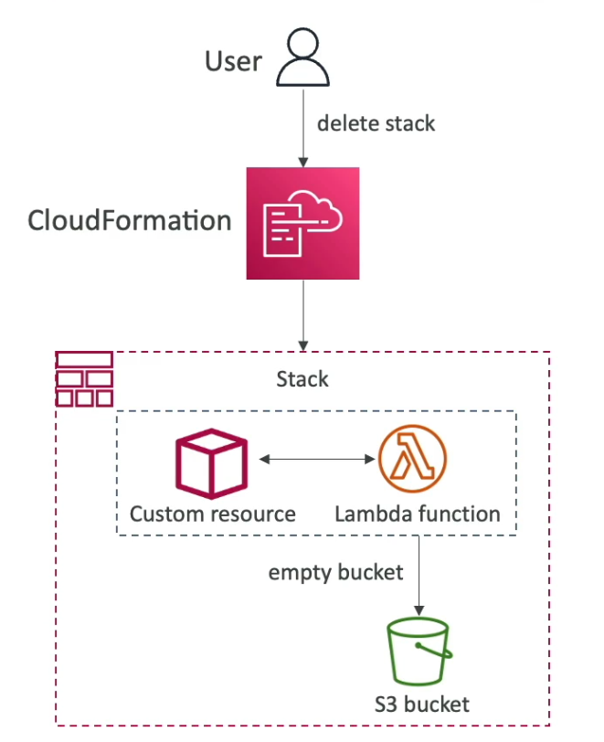

[Back](./AWS.md)

# CloudFormation

## General

### Definition

- CloudFormation is **Infrastructure as a Code**
- CloudFormation Provides **Application Composer** tool to see the resources of a stack and their relations

### Stacks

- Stacks are identified by a name that has to be **unique** within a **region**
- Deleting a stack deletes every single artifact that was created by CloudFormation

### Templates

- A template is always uploaded to **S3** first behind the scenes and referenced by CloudFormation
- To update a template, we can't edit previous ones. We have to re-upload a new version of the template to AWS
- CloudFormation is smart enough to **create/delete** resources in the right order
- Templates are written using **JSON or YAML**

## Deploying CloudFormation Templates

- Manual way
- Automated way:
  - Using CLI
  - Using Continuous Delivery (CD) tool

## CloudFormation - Template's Components

### AWSTemplateFormatVersion

Version "2010-09-09"

### Description

Description about the template

### Resources (required)

- A list of your AWS resources declared in the template
- Only few AWS services are not supported, you can work around that using **CloudFormation Custom Resources**
- Resource types identifiers are of the form: `service-provider::service-name::data-type-name`
- Resource type example: `AWS::EC2::Instance`

### Parameters

- Parameters are a way to provide **inputs** to your AWS CloudFormation template
- Mask password inputs using `NoEcho: true`
- CloudFormation **Pseudo Parameters**, some of them are:
  - `AWS::AccountId` - returns your account id
  - `AWS::Region` - returns region of the template is deployed in
  - `AWS::NoValue` - Returns no value and removes the corresponding resource property (usually used with an `if`)
  - `AWS::StackId` - returns the stack id

### Mappings

- Fixed values for your template
- Mappings might have more than one map
- Mappings matches a key to a corresponding set of named values
- Map example:

```YAML
Mappings:
    RegionMap:
        us-east-1:
            HVM64: ami-0ff8a91507f77f867
            HVMG2: ami-0awnco249c21a3399
        us-west-1:
            HVM64: ami-03bdfca24591913na
            HVMG2: ami-0239jcnwoen20s235
        eu-west-1:
            HVM64: ami-2n3is2302091dcd1a
            HVMG2: ami-2nsom1ca132239519
```

### Outputs

- Import/Export values from a stack to another stack
- The export name must be **unique** in the **region**
- You can't delete the underlying stack until all the references are **deleted** (stacks that uses the outputs)

### Conditions

- Conditions are used to control the creation of **resources**, **outputs** or other **conditions** based on a condition
- Conditions can **not** be used to control the creation of **parameters** (or Outputs), parameters are always created in the template
- Conditions keywords: (Warning: the **!** here is **not** a boolean operator, you can ignore it)
  - !And
  - !Equals
  - !If
  - !Not
  - !Or
- Example:

```YAML
Resources:
    MountPoint:
        Type: AWS::EC2::VolumeAttachment
        Condition: CreateProdResources # The MountPoint is created only if this condition is true
Conditions:
    CreateProdResources: !Equals [!Ref EnvType, prod] # Warning: the (!) here is not a boolean logical operator
```

## CloudFormation - Intrinsic Functions

### !Ref

- Can reference:

  - Parameters: returns the value of the parameter
  - Resources: returns the physical ID of the underlying resource (EC2 ID)

- Can **not** reference:
  - Conditions

### !GetAtt

- Get attribute
- Attributes are attached to any resources you create (AZ, PrivateIP, DNS name, etc...)
- Example: `!GetAtt EC2Instance.AvailabilityZone`

### !FindInMap

- We use it to return a named value from a specific key in a map
- `!FindInMap [MapName, TopLevelKey, SecondLevelKey]`

### !ImportValue

- Import values that are exported in other stacks
- `!ImportValue SSHSecurityGroup`

### !Base64

- Convert string to it's Base64 representation
- Used to pass encoded data to EC2 Instance's **UserData** property

## CloudFormation - Rollback

### Stack creation fails

- Default: everything rolls back (gets deleted)
- Option to preserve successfully provisioned resources (via `--disable-rollback` command option)

### Stack update fails

- The stack automatically rolls back to the previous known working state
- Option to preserve successfully provisioned resources

### Rollback failure (can't do a rollback)

- Fix resources manually
- Use **ContinueUpdateRollback API** after fixing resources

## CloudFormation - Service Role

- **Service Role**: IAM role that allows CloudFormation to create/update/delete stack resources on your behalf
- User must have **iam:PassRole** permission to be able to pass an IAM Role to CloudFormation (even if the user doesn't have direct permissions to create, update, or delete those resources)

## CloudFormation - Capabilities

- Capabilities are used for authorizing CloudFormation to perform certain actions that might involve security-sensitive operations.

- **CAPABILITY_IAM** Required when your template creates or updates general IAM resources without custom names (users, roles, policies).

- **CAPABILITY_NAMED_IAM** Use this if you are creating IAM resources with **custom names**

- **CAPABILITY_AUTO_EXPAND** This capability is needed when your template uses **macros** or **nested stacks**

- **InsufficientCapabilitiesException** If you encounter this exception(error), it means your template needs capabilities that haven't been acknowledged.

## CloudFormation - Deletion Policy

- **Deletion Policy** is **not** about deleting the stack, it's about the **resources** in the stack, if you want to enable deletion protection on the stack you have to use **Termination Protection**
- **Deletion Policy** Controls what happens to the **resources** when the CloudFormation stack is deleted
- **DeletionPolicy** Is specified in the template for the resource
- **DeletionPolicy=Delete** is the default
- Delete **won't** work on an S3 bucket if the bucket is not empty
- **DeletionPolicy=Retain**, specify on resources to preserve
- **DeletionPolicy=Snapshot**, It will **delete** the resource, but create a **snapshot** first

## CloudFormation - Stack Policies

- When you create a stack, all update actions are allowed on all resources. By default
- You can use a stack policy to protect your resources from unintentional updates
- A Stack Policy is a **JSON document**
- After you set a stack policy, all the resources in the stack are protected by default.
- Specify an explicit **Allow** for the resources you want to be allowed to be updated

- Example: Allow updated on all resources **except** the production database

```json
{
  "Statement": [
    {
      "Effect": "Allow",
      "Action": "Update:*",
      "Principal": "*",
      "Resource": "*"
    },
    {
      "Effect": "Deny",
      "Action": "Update:*",
      "Principal": "*",
      "Resource": "LogicalResourceId/ProductionDatabase"
    }
  ]
}
```

## CloudFormation - Termination Protection

- To prevent accidental deletes of CloudFormation stacks, enable **Termination Protection**

## CloudFormation - Custom Resources

- Defined in the template using:
  - `AWS::CloudFormation::CustomResource` or
  - `Custom::MyCustomResourceTypeName` (recommended)
- Use case:
  - Define AWS resources not yet supported by CloudFormation
  - Define custom logic for resources outside AWS (on-premises, 3rd party...)
  - Define a custom resource to be used
- Use example:
  - Have custom scripts running through lambda functions (empty an S3 bucket before deleting it)



## CloudFormation - StackSets

- **Create, update, or delete** stacks **across multiple accounts** and **regions** with a single template
- When you update a stack set **all** associated stack instances are updated throughout **all accounts** and **regions**
