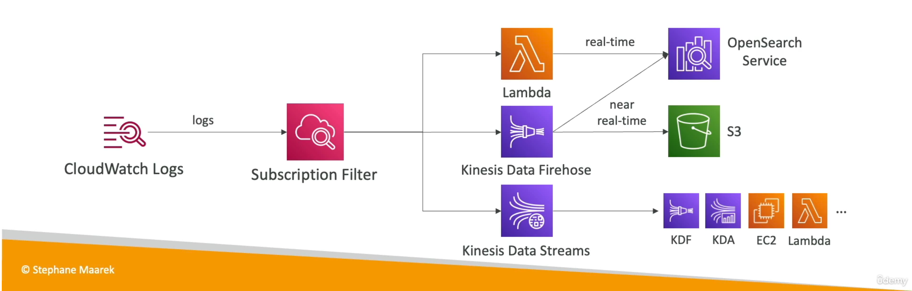
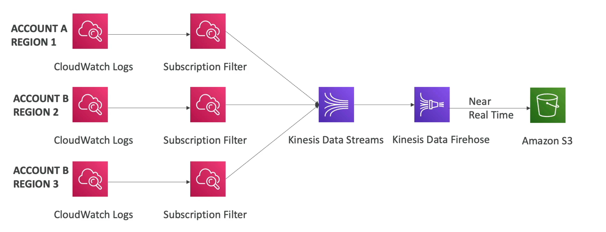
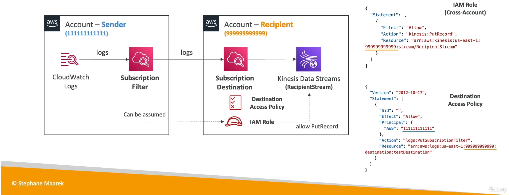
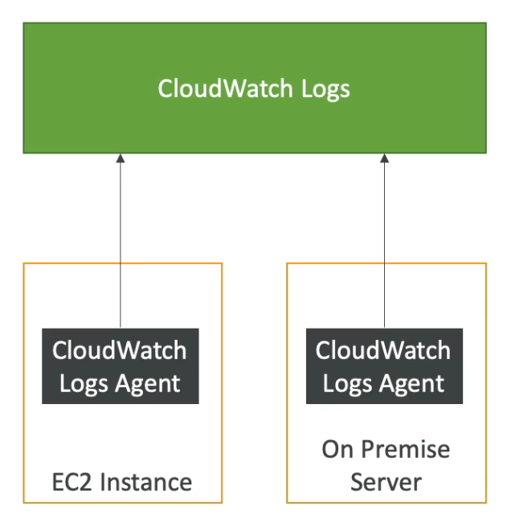
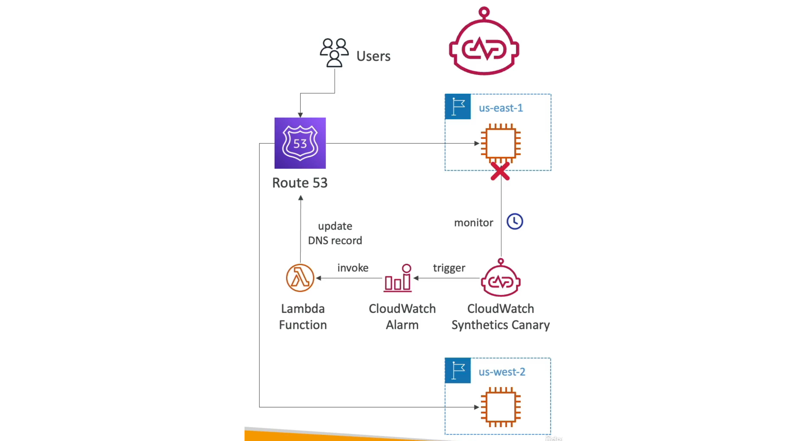
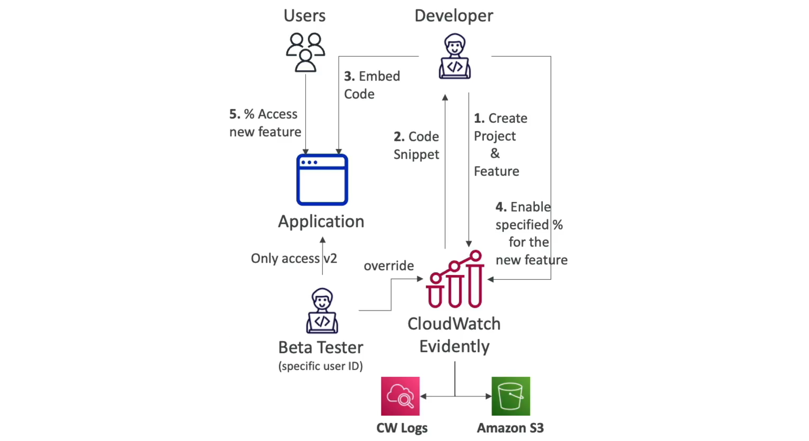

[Back](./AWS.md)

# CloudWatch

## CloudWatch - Metrics

- **Metric** is a variable to monitor (CPU-Utilization, NetworkIn...)
- Metrics belong to **namespaces** (a container of metrics beloning to the same service)
- **Dimension** is an attribute of a metric (instance id, environment, ec2 instance type), that helps you categorize and filter your metrics, ex: filter EC2 instances with CPU higher than 90% and t2.micro type

### EC2 Detailed monitoring

- EC2 instance metrics send metrics every 5 min by default
- With detailed monitoring (for a cost), you get data every 1 min

## CloudWatch - Custom Metrics

- Possibility to define and send your own custom metrics to CloudWatch using a **custom script**
- Example: memory (RAM) usage, disk space, number of logged-in users...
- CloudWatch custom metrics use **PutMetricData API**
- Metric resolution (**StorageResolution API parameter** - two possible values):
  - Standard: 1 minute (60 seconds)
  - High resolution: 1/5/10/30 seconds - higher cost ($$$)
- With **custom metrics** CloudWatch accepts data points two weeks in the past and two hours in the future without giving an error

## CloudWatch - Logs

- **Log groups:** usually representing an application
- **Log stream:** instances within application / containers
- Log group is scoped to a **region**

### Expiration Policy

- At the group level we can define retention (expiration) policies (never expire, or between 1 day to 10 years)
- Default is: never expire

### Logs Insights

- CloudWatch has **Logs Insights** feature that will make you able to write a **query** to search your logs

### Live Tail

- CloudWatch has **Live Tail** feature that provides a real-time streaming interface for viewing log events as they are coming in a log group and optionally log streams

### Logs Security

- Logs are encrypted by default
- Logs are encrypted at the group level not the stream level
- Can set up KMS-based encryption with your **Customer Managed Key** (the key policy must allow it)
- You can not associate a CMK (Customer Managed Key) with a log group using CloudWatch console
- You must use one of the following APIs:
  - **associate-kms-key** if the log group already exists
  - **create-log-group** if the log group doesn't exist yet and directly associate the key

### Logs Sources

- CloudWatch Logs Agent (on EC2 or on Premises Server)
- CloudWatch Unified Agent (on EC2 or on Premises Server)
- And more...

### Logs Targets

- Amazon S3 (Batch export)
- AWS Lambda
- OpenSearch
- Kinesis Data Firehose
- Kinesis Data Streams

## CloudWatch - Subscription Filter

- As example exporting to an S3 may take up to **12 hours**, it is not real-time or near-real time

### Use CloudWatch Logs Subscription to:

- Get a **real-time** log events from CloudWatch logs
- Filters which logs are events delivered to your destination
- **Multi-region** log aggregation
- **Multi-account** log aggregation

### Subscription filter Targets

- Send logs to:
  - Kinesis Data Streams
  - Kinesis Data Firehose
  - Lambda
- The services above can then send logs to the other destinations at real-time
  

### CloudWatch Logs Aggregation for multi-region

1. Define a subscription filter for each region you want to send logs from
2. Send logs from subscription filter to Kinesis Data Streams as example

### CloudWatch Logs Aggregation for multi-account

1. Uses a **subscription filter** on the sender and **subscription destination** on the recipient
2. We have to define a destination Access Policy in the recipient (defines "who" can send the logs)
3. We have to define an IAM role in the destination with a **trust relationship to the sender account** to allow to put record in Kinesis Data Streams as example (grants the permissions needed to "do" the action)

## CloudWatch Logs For EC2

- By default, no logs from your EC2 machine will be sent to CloudWatch (We are talking about logs not metrics)
- Sending logs from EC2 instance requires
  - You need to run a **CloudWatch logs agent** on EC2 to push the log files you want
  - Make sure the EC2 has a correct **IAM permissions** (IAM role) to send logs to CloudWatch
- The **CloudWatch logs agent** can be setup on-premise server too
  

## CloudWatch Logs Agent & Unified Agent

- For EC2 instances, on-premise servers

### CloudWatch Logs Agent

- Old version of the agent
- Can **only** send to CloudWatch logs

### CloudWatch Unified Agent

- Collect deep detailed system-level metrics such as RAM, processes, etc...
- It can do both **metrics** and **logs**

**\*NOTE: We can use both Unified Agent and Custom Metrics to send some metrics such as RAM usage**

**\*NOTE: For application-specific metrics like the number of logged-in users, use custom metrics**

## CloudWatch - Logs Metric Filter

- Logs metric filter is **creating** a **metric** based on **logs**
- The metric can be used to trigger a **CloudWatch Alarm**
- Example: Check the logs for the word "ERROR" and trigger a CloudWatch alarm if more than 5 errors are counted in the logs
- Note: the metric will only capture the logs that are created after the metric filter has been created

## CloudWatch - Alarms

### Alarms States

- OK
- INSUFFICIENT_DATA: if the alarm has not enough data to evaluate the state
- ALARM

### Alarms Options

- Max, Min, Average

### Alarms Period

- The duration of the time interval, in seconds, used to evaluate the aggregated metric data.
- Has a high resolution time for high resolution custom metrics

### Alarms Targets

- EC2 Instances (trigger stop, trigger terminate, trigger reboot)
- ASG (Trigger Auto Scaling)
- SNS
- Trigger a lambda function

### Alarms - Composite Alarms

- Composite Alarms are monitoring the states of multiple other alarms
- Use AND and OR conditions
- Helpful to reduce **alarm noise** by creating complex composite alarms

### Alarms - Testing an alarm

- To test alarms and notifications, set the alarm state to **ALARM** using CLI (You don't have to wait until the alarm state is reached by overloading the EC2 instances to get high CPU percentage as example)

`aws cloudwatch set-alarm-state --alarm-name "myalarm" --state-value ALARM --state-reason "testing purposes"`

## CloudWatch - Synthetics Canary

- Synthetics Canary is a tool within CloudWatch
- Purpose: Configurable script that monitor your APIs, URLs, Websites, ...
- Script Languages: **Node.js** or **Python**
- Functionality: Programmatically reproduce customer actions, with access to a headless Google Chrome browser.
- Triggers a CloudWatch Alarm when things go wrong
- The CloudWatch Alarm may invoke a lambda function to do a Route 53 DNS swap to redirect the users to an instance
  

## CloudWatch - Evidently

- Safely validate new features by serving them to a specified % of your users
- Experiments (= A/B testing): compare multiple versions of the same feature
- Launches (= feature flags): enable and disable features for a subset of users
- Overrides: pre-define a variation for a specific user (ex: beta tester)
- Store your experiment data on CloudWatch logs or S3

