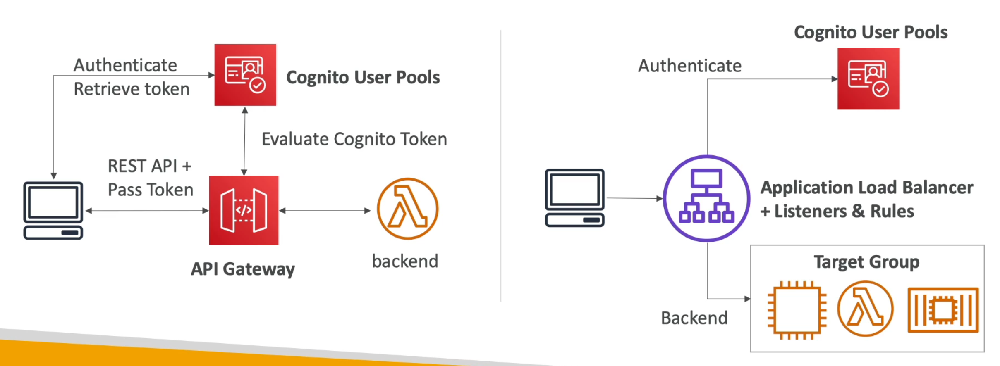
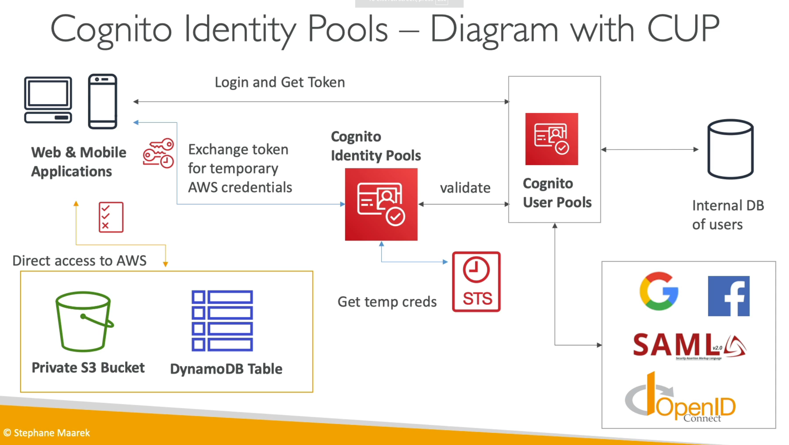
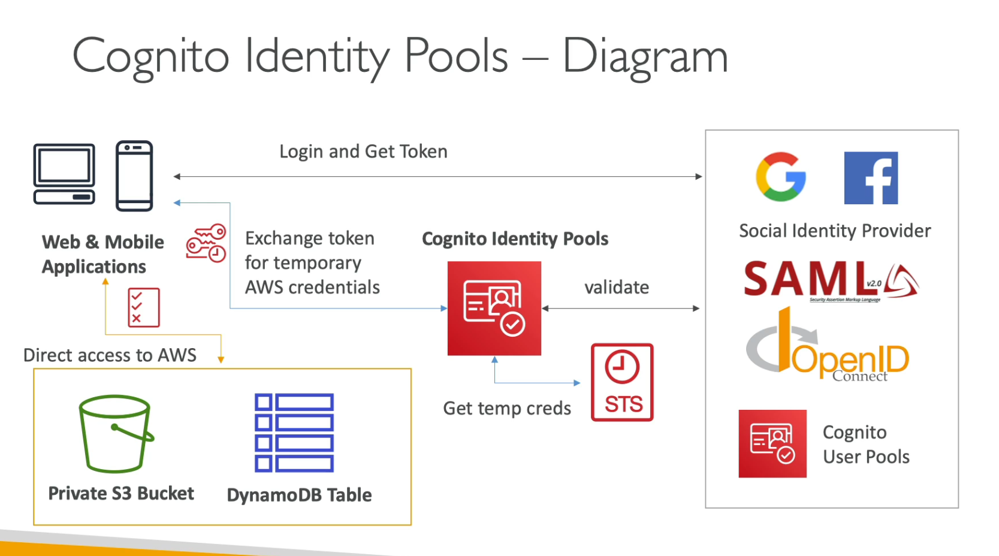

[Back](./AWS.md)

# Cognito User Pools

## CUP - Basics

- Create a **serverless database** of users for your apps
- Is used for Authentication
- Login returns a JWT Token

### Features

- Simple login: Username/Password
- Password reset
- Email & Phone number Verification
- MFA
- Federated Identities: login with Facebook, Google, SAML

## CUP - Access to AWS resources

- With CUP, you can access AWS resources through **API Gateway** or **ALB**

### API Gateway

### Application Load Balancer

- Your application load balancer can securely authenticate users
- Authenticate users through:
  - Identity provider (IdP): OpenID Connect (OIDC) compliant
  - Cognito User Pools
- Must use an HTTPS listener
- **OnUnauthenticatedRequest** options:
  - authenticate (default): ask the user to authenticate
  - deny
  - allow

## CUP - Lambda Triggers

- CUP can invoke a lambda function **synchronously** on triggers such as:
  - Authentication Events: event logging for custom analytics
  - Sign-up: Custom welcome message
  - Messages
  - Token Creation

## CUP - Customs Hosted UI

- You can customize the logo and the CSS on the hosted UI
- For custom domains Hosted UI, you must create an **ACM certificate** in **us-east-1**
- The custom domain must be defined in the **App Integration** section

## CUP - Adaptive Authentication

- Cognito examines each sign-in attempt and generates a risk score for how likely the sign-in request is to be from a malicious attacker based on same device, location or IP
- Users are prompted for a second MFA only when risk is detected
- Adaptive Authentication has integration with **CloudWatch Logs** (sign-in attempts, risk score, failed challenges)

## CUP - JSON Web Token

- Login returns a JWT Token
- Base64 encoding that contains:
  - Header
  - Payload
  - Signature

# Cognito Identity Pools

## CIP - Basics

- Is used for authorization
- Users can be unauthenticated (guests) - in this case **no Cognito User Pool is needed**
- Auth might happen via **CUP** or via **3rd party services**
- Users may then access **AWS services directly** or via **API Gateway**
- Token is exchanged for IAM credentials, obtained by CIP through STS
- The roles must have a trust policy of CIP

## CIP - Role Based Control

- Amazon Cognito identity pools assign your authenticated users a set of temporary, limited-privilege credentials to access your AWS resources. The permissions for each user are controlled through IAM roles that you create.
- Rules are evaluated in sequential order & **IAM role** for first matching rule is used, unless a **CustomRoleArn** is specified to override the order

### Auth with 3rd party services happening via CUP

### Auth with 3rd party services not happening via CUP

## CIP - Policy variables

- You can partition your users access using **policy variables**
- Example: giving access to users access to their own files in a prefix in an S3 bucket or DynamoDB LeadingKey

## CUP vs CIP

| Feature                     | Cognito User Pools (CUP)                                                            | Cognito Identity Pools (CIP)                                           |
| --------------------------- | ----------------------------------------------------------------------------------- | ---------------------------------------------------------------------- |
| **Primary Use**             | Authentication / Creating an account                                                | Authorization                                                          |
| **Access to AWS Resources** | Through API Gateway or ALB                                                          | Directly access to AWS resources (ex: S3, DynamoDB) or via API Gateway |
| **Returns**                 | JWT Token                                                                           | IAM Credentials                                                        |
| **Guest Users**             | Support via OnUnauthenticatedRequest on the load balancer (but use CIP in the exam) | Native Support                                                         |
