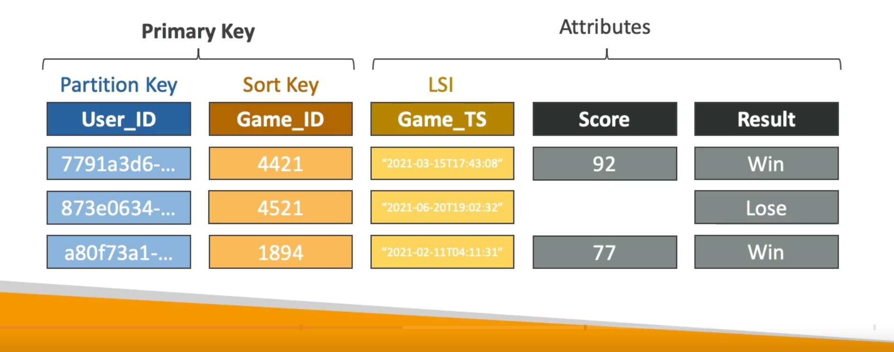
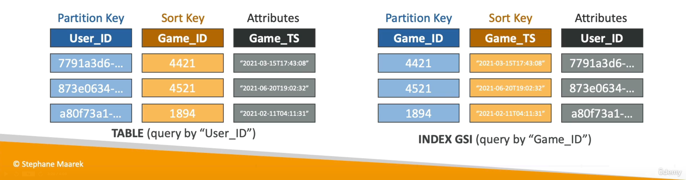
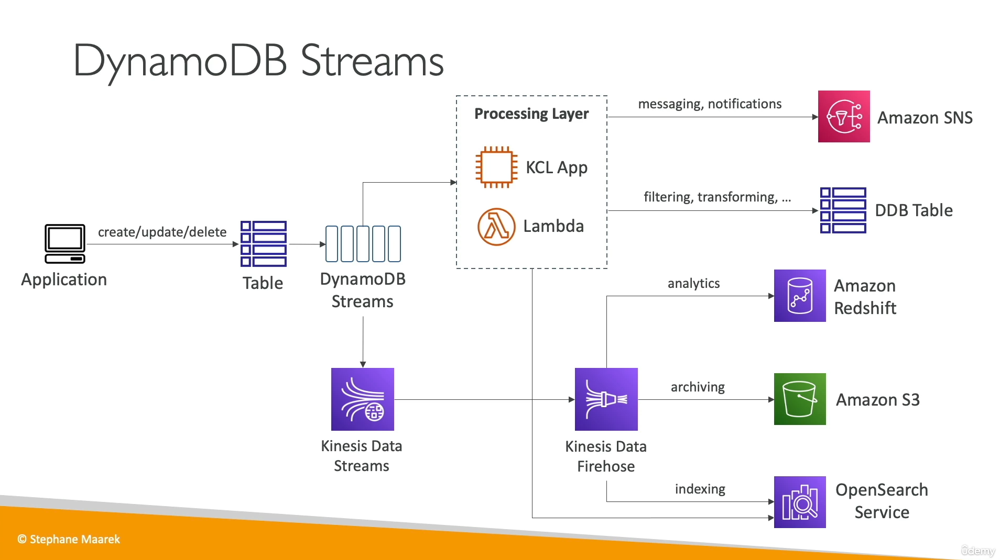

[Back](./AWS.md)

# DynamoDB

## NoSQL Databases

### Definition

- NoSQL databases are non-relational databases
- NoSQL databases include MongoDB, DynamoDB...

### Limitations

- NoSQL databases do not support query joins
- NoSQL databases do not support aggregation such as "SUM", "AVG"

### Scaling

- RDS databases are limited for horizontal scaling (we scale reads by adding read replicas, we can't scale writes), while NoSQL databases scale horizontally by adding RCUs, WCUs

## DynamoDB - Basics

- Standard & Standard-IA Table Classes
- Each table has a primary key, must be decided at creation time
- Each table can have an infinite number of items (= rows)
- Each item can have attributes (can be added over time - can be null)
- Maximum size of an item is **400KB**

### Supported Data types

- Scalar Types:
  - String
  - Boolean
  - Binary (0101011)
  - Number
  - etc...
- Document Types:
  - List (collection of items)
  - Map (key/value pairs)
- Set Types (Sets are a collection of unique values, no two values can be the same):
  - String Set
  - Number Set

## DynamoDB - Primary Key

- Has two options:

### Option 1: Partition Key (HASH)

- Partition key must be unique for each item
- Partition key might not be null
- Partition key must be "diverse" so that the data is distributed (ex: user_id)

### Option 2: Partition Key + Sort Key (HASH + RANGE)

- The combination must be unique for each item
- Partition Key or Sort Key might not be null
- While the same partition key or sort key may appear multiple times in the table, the same combination of both cannot be duplicated.

### Write Sharding

- Imagine we have a voting application with two candidates, candidate A and candidate B
- If Partition Key is Candidate ID this results into two partitions, which will generate issues (ex: Hot Partition)
- A strategy that allows better distribution of items evenly across partitions: add a suffix or a prefix to a partition key value (ex: candidate_A-11, candidate_A-20)

## DynamoDB - Capacity Modes

- You can switch between modes once every 24 hours
- Has two modes:

### Provisioned Mode (Default)

- You specify the number of WCUs/RCUs
- You need to plan capacity beforehand
- Support for **auto-scaling** to dynamically adjusts the provisioned throughput capacity (define min, max capacity units)

### On-Demand Mode

- Read/writes automatically scale up/down with your workloads
- No capacity planning needed
- Unlimited WCU & RCU, no throttling
- Use case: unknown workloads, unpredictable application traffic
- Pay for reads/writes, more expensive ($$$)

## DynamoDB - WCUs/RCUs

### WCU/RCU

- One Write Capacity Unit (WCU) represents one write per second for an item up to 1KB in size
- One Read Capacity Unit (RCU) represents one read per second for an item up to 4KB in size
- If item size exceeds the limit, more WCU or RCU is consumed

### Read modes

- Eventual Consistency (2x less the RCUs is consumed)
  - If we read just after a write, it's possible we'll get some stale data
- Strong Consistency (1x times the RCUs is consumed)
  - If we read just after a write, we will get the correct data
  - Set **ConsistentRead** parameter to **True** in API calls
  - Request is not cached in DAX
- Transactional (2x more the RCUs is consumed)
  - You can group multiple actions together and submit them as a single all-or-nothing operation
  - On multiple items or multiple tables

### Write modes

- Standard (1x times the WCUs is consumed)
- Transactional (2x times the WCU is consumed)
  - You can group multiple actions together and submit them as a single all-or-nothing operation
  - On multiple items or multiple tables

### Examples

- Example: we write 10 items per second, with item size 2KB = 20WCUs
- Example: we write 6 items per second, with item size 4.5KB = 30WCUs
- Example: 10 Strongly Consistent Reads per second with item size 4KB = 10 RCUs
- Example: 16 Eventually Consistent Reads per second, with item size 12KB = 24 RCUs
- Example: 10 Strongly Consistent Reads per second, with item size 6KB = 20 RCUs
- Example: 3 Transactional writes per second, with item size 5KB = 30 WCUs
- Example: 5 Transactional reads per second, with item size 5KB = 20 RCUs

## DynamoDB - Partitions

- Data is stored in partitions
- Partition Keys go through a hashing algorithm to know to which partition they go to
- Data with same partition key goes to the same partition
- WCUs and RCUs are spread evenly across partitions

## DynamoDB - Throttling

- Throughput can be exceeded temporarily using **Burst Capacity**
- If Burst Capacity has been consumed, you'll get a **ProvisionedThroughputExceededException**

### Reasons for throttling

- Hot Keys: one partition key is being read too many times
- Hot Partitions: Remember RCUs and WCUs are spread across all the table's partitions.
  (throttling might happen even if you didn't exceed the total number of WCU/RCU)
- Very Large Items: remember RCU and WCU depends on size of items

### Solutions

- Exponential backoff
- Use distributed partition keys
- If it is RCU issue, we can use **DynamoDB Accelerator (DAX)**

## DynamoDB - Writing Operations

### Writing techniques

- Concurrent Writes: the second write might overwrite the first write (ex: update value to 1, then update value to 2. value will be 2)
- Conditional Writes: Accept a **write/update/delete** only if a condition is met (attribute_exists, attribute_not_exists, categories, prices, etc...), Use case: change price of an item if it's price falls in the 'discount' category
- Optimistic Locking: each item has an attribute that acts as a version number, a strategy to ensure an item hasn't changed before you update/delete it, it is handy for scenarios where two users are updating the same item at the same time
- Atomic Writes: ensure that a single write operation (like updating or deleting an item) is applied completely or not at all (roll back), without leaving the item in a partially updated state (it is like Transactions, but atomic writes is for one item operation, while transactions are for multiple operations)

### Writing APIs

- PutItem: Creates a new item or fully replace an old item (same Primary Key)
- UpdateItem: Edits an existing item's attributes or adds a new item if it doesn't exist
- BatchWriteItem
  - Up to 25 PutItem and/or DeleteItem in one call
  - Up to 16MB of data
  - Can't use (UpdateItem)
  - If some operations fails (ex: we can't write because lack of capacity) we will get back the **UnprocessedItems** and thereafter we can use exponential backoff or add WCU

## DynamoDB - Reading Operations

- GetItem: read **one item** based on primary key (HASH or HASH + RANGE)

- BatchGetItem

  - Return multiple items from **one or more tables**
  - Up to 100 items, up to 16MB of data
  - **UnprocessedKeys** for failed read operations (Exponential backoff or add RCU)

- Query: returns items based on Partition key and (optionally) Sort Key

  - `ScanIndexForward: true` returns the results in the order in which they are stored (default)
  - `ScanIndexForward: false` returns the results in reverse order.
  - Use the **KeyConditionExpression** parameter to provide:
    - Partition Key Value (must be = operator) - required
    - Sort Key Value (=, >, <, =>, <=, between, begins with) - optional
  - Returns up to 1MB of data - use pagination to keep on reading

- Scan: scan the entire table and then filter out data client side

  - Returns up to 1MB of data - use pagination to keep on reading
  - Consumes a lot of RCU
  - You can have a **Limit** parameter
  - You can have **parallel scans** to speed up the scan (consumes more RCU)

- FilterExpression (optional): A filter expression is applied after a **Query/Scan finishes**, used **only** with **non-key attributes**, **can't** be applied for **BatchGetItem**
- Use ProjectionExpression: can be specified to retrieve only certain attributes

### Consumed Capacity

- If you want to know how much of the consumed capacity is being used for the queries, ensure to set the **ReturnConsumedCapacity** in the query request to **TOTAL**

## DynamoDB - Deleting Operations

### Delete techniques

- The best way to erase all data in a DynamoDB table is to DeleteTable and then create the table again it is **not** recommended to use scan and delete the items after

### Delete APIs

- DeleteItem
- DeleteTable

## DynamoDB - CLI

- `--projection-expression` one or more attributes to retrieve
- `--filter-expression` filter items
- `--max-items: 100` Limits the total number of items returned in the response. (returns NextToken) It controls the total count of items regardless of pagination.
- `--starting-token: eyJFeGNsdXN...` specify the last NextToken to retrieve the next set of items (works in combination with max-items) will get items 101-200
- `--page-size: 10` Defines the number of items to retrieve per page. This parameter does not limit the total number of items retrieved; instead, it controls how many items are retrieved per individual API call. (handy to avoid timeout)

---

- Note: you can use `--max-items` without using page size, just to scan items in one API call without pagination.
- Note: If you only use `--page-size`, the AWS CLI will retrieve items in pages of the size specified by `--page-size`. You will receive paginated results for all items

## DynamoDB - Local Secondary Index (LSI)

- Alternative Sort Key for your table
- Has same partition key as the table
- Up to 5 LSI's per table
- Must be defined at table creation time
- Use a Local Secondary Index (LSI) when you need to query with a different sort key but share the same partition key as the primary key.
  

## DynamoDB - Global Secondary Index (GSI)

- Alternative Primary Key (HASH or HASH+RANGE)
- Can be added/modified after table creation
- You can see it as if you are creating a new table
- If the WCUs/RCUs in the GSI are throttled, the WCUs/RCUs in the main table will be throttled
- Use a Global Secondary Index (GSI) when you need to query a DynamoDB table using an attribute that is not part of the primary key.
  

## DynamoDB - DAX

- DAX = Fully Managed, highly available, seamless in memory cache nodes for DynamoDB
- Create DAX nodes
- Microseconds latency for cached reads & queries
- Solves too many reads problem
- Has TTL, (default 5 minutes = 300 sec)
- Support for Multi-AZ (3 nodes required for high availability)
- DAX can be combined with ElastiCache in an architecture
- Has encryption capabilities (at rest, in transit)
- IAM Service role required for DynamoDB access

## DynamoDB - TTL

- Automatically delete items after an expiry **timestamp (Unix time)**
- you have to add an attribute as type **Number** with a value of **Unix time**
- When enabling TTL you have to add a custom name for the expire attribute (ex:expires_on)
- Doesn't consumes any WCUs
- Expired items deleted within **48 hours of expiration (it is not immediately)**
- Expired items are deleted from both LSIs and GSIs
- A delete operation for each expired item enters the DynamoDB streams (can help recover expired items)

## DynamoDB - Streams

- Ordered stream of item-level modifications (create/update/delete) in a table
- You don't provision shards, this is automated by AWS
- Only changes after creating the stream will appear in the stream
- DynamoDB Streams are made of shards, just like Kinesis Data Streams (This is way Kinesis Client Library can be used)
- Streams records can be sent to:
  - Kinesis Data Streams
  - Kinesis Client Library (KCL)
  - AWS Lambda
- Data retention for up to 24 hours
- Use cases:
  - React to changes in real-time (welcome email to users)
  - Implement cross-region replication
  - Analytics
  - You can have Kinesis Data Streams as a consumer and then send data to Kinesis Data Firehose and then to RedShift, OpenSearch, S3
    

### Ability to choose the information that will be written to the stream

- Key attributes: only the key attribute of the modified item
- New Image: the entire item, as it appears after it is modified
- Old image: the entire item, as it appeared before it was modified
- New and old images: both the new and the old images of the item

## DynamoDB - Security

### Security

- VPC Endpoints available to access DynamoDB without using the public internet
- Access Fully controlled by IAM
- Create the DynamoDB table by using default encryption settings, uses AWS owned key (cost effectively)
- Encryption at rest using AWS KMS and in-transit using SSL/TLS

### Backup and restore feature available

- Point-in-time recovery

## DynamoDB - Additional Features

### PartiQL

- SQL-compatible query language for DynamoDB

### Session State Cache

- It's common to use DynamoDB to store session state

### Working with S3

- Large Objects Pattern: store a reference to S3 bucket (ex: Image URL), the client will get the item from DynamoDB and download from S3
- Indexing S3 Objects Metadata: store object's metadata through a lambda function in a DynamoDB Table

### Global Tables

- Multi-region, high performance

### DynamoDB Local

- Develop and test apps locally without accessing the DynamoDB web service (without internet)

### Migrate to DynamoDB (AWS DMS)

- AWS Database Migration Service (AWS DMS) can be used to migrate to DynamoDB (from Oracle, MySQL, etc...)

### Users interact with DynamoDB Directly

1. User Login: Users authenticate using identity providers like Amazon Cognito User Pool.
2. Temporary AWS Credentials: After authentication, users receive temporary AWS credentials associated with an IAM role.
3. IAM Role Conditions: The IAM role includes conditions, such as **LeadingKey**, to restrict users' access to data based on the primary key, ensuring users can only access their own data.
4. Attribute-Level Access Control: Additional conditions can be set on attributes to limit which specific attributes a user can view or modify.
