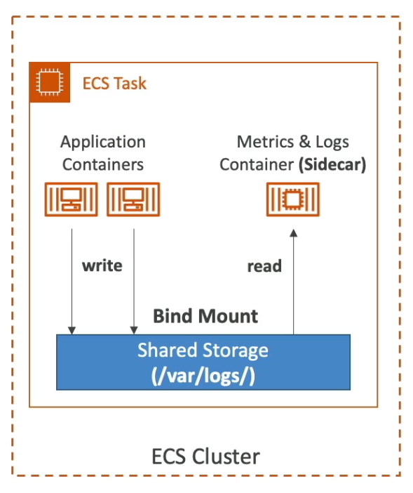

[Back](./AWS.md)

# ECS, EKS, ECR

## ECS Architecture

- Launch **Docker Containers** on AWS = Launch **ECS Tasks** on **ECS Clusters**
- A Task is a collection of one or more containers together
- If the essential container within a task is failed or killed the whole task is going to be stopped
- Each task has its own task definition
- ECS Service: manages a group of tasks
- ECS has two Launch Types:
- ECS has two Launch Types:

| **EC2 Launch Type**                                                                | **AWS Fargate**                                              |
| ---------------------------------------------------------------------------------- | ------------------------------------------------------------ |
| You must provision & maintain the EC2 instances.                                   | You don't provision & maintain any infrastructure.           |
| The EC2 instance will be a part of an Auto Scaling Group (ASG).                    | It's all serverless (you just create task definitions).      |
| Each EC2 Instance must run the **ECS agent** to register with the **ECS Cluster**. | AWS runs ECS tasks for you based on the CPU/RAM you specify. |

## ECS - Removing Containers From a Cluster

- Problem: After stopping a container it still might appear in the cluster
- If you terminate a container instance in the RUNNING state, that container instance is automatically removed, or deregistered, from the cluster.
- If you terminate a container instance while it is in the STOPPED state, that container instance isn't automatically removed from the cluster. You will need to deregister your container instance in the STOPPED state by using the Amazon ECS console or AWS Command Line Interface.

## ECS - Tag & Retag

- To retag docker images in Amazon ECR, it is not required to pull or push these images again to the ECR depository. The **--image-tag option of the put-image command** can be used to retag the existing image in the repository.

## ECS IAM Roles

- EC2 Instance Profile (EC2 Launch Type **only**):

  - Used by the ECS Agent
  - Usage example: Pull an ECR image

- ECS Task Role:
  - Allow each task to have an IAM role
  - Defined in the **task definition**
  - Usage example: Get Object from S3

## ECS - Config File

- Config file `/etc/ecs/ecs.config`
- In the config file you have to configure the cluster name you want the container to be registered to `ECS_CLUSTER=<your_cluster_name>`
- A CloudFormation template might accept the name of the cluster as a parameter, but however if the name of the cluster is not changed in the config file the container will still be registered to the default cluster specified in the config file
- Enable IAM roles for your ECS tasks in the config file using `ECS_ENABLE_TASK_IAM_ROLE`

## ECS - Data Volumes

### S3 (Can't)

- Amazon S3 cannot be mounted as a file system for ECS Tasks

### EFS

- Mount EFS File Systems into ECS Tasks
- Works with both **EC2** and **Fargate** launch types
- Use Case: persistent Multi-AZ shared storage for your containers

### EBS

### Bind Mounts

- Within a Task: Share data between multiple containers defined in the same Task Definition
- Works for both EC2 and Fargate Tasks (using ephemeral storage)
- Use cases:
  - Share ephemeral data between multiple containers
  - "sidecar" container pattern, where the "sidecar" container is used to send metrics/logs to other destinations (separation of concerns)

## ECS - Service Auto Scaling

- ECS Service Auto Scaling (task level) is **NOT** EC2 Auto Scaling Group (EC2 instance level)
- Fargate Auto Scaling is much easier to setup (because serverless)
- Amazon ECS Auto Scaling uses **AWS Application Auto Scaling**

### Service Scaling methods

- Target Tracking - scale based on target value for a specific CloudWatch metrics:

  - ECS Service Average CPU Utilization
  - ECS Service Average Memory Utilization - Scale on RAM
  - ALB Request Count Per Target - Metric coming from the ALB

- Step Scaling - scale based on a specified CloudWatch Alarm
- Scheduled Scaling - scale based on a specified date/time

### Auto Scaling EC2 Instances

- Auto Scaling Group scaling
  - Add EC2 instances over time based on scaling policies
- ECS Cluster Capacity Provider (optional)
  - Smarter new way of managing the capacity
  - Manages the interaction between ECS and the ASG, ensuring there’s enough EC2 capacity.
  - ECS Cluster Capacity Provider It's **NOT** used with **ECS Fargate**

## ECS Tasks Placement (EC2 Launch Type only)

- When a task of launch type EC2 is launched, ECS must determine where to place it
- Strategies and Constraints are written in JSON

### Strategies

- Binpack: Place tasks based on the least available amount of CPU or memory (to minimizes the number of running EC2 - cost savings)
- Randomly: place randomly
- Spread: spread tasks for EC2s

### Constraints

- distinitInstance: place each task on a different instance
- memberOf: place task on instances that satisfy and expression (ex: t2.\*)

## ECS Rolling Update

- Update tasks from v1 to v2
- By default:

  - Minimum healthy percentage: 100%
  - Maximum percent: 200%

- Example:
  - having 10 v1 tasks running
  - ECS will create new v2 tasks without terminating v1 tasks (because we can go above 100%)
  - ECS there after will shut down old v1 tasks (we can do it because we are above 100%)

## ECS - Task Definitions

- **Task definition** is a blueprint for your application. It is a text file in JSON format to tell ECS how to run your task and the container(s) within
- Can define up to **10 containers** in a Task Definition
- It contains crucial information, such as:
  - Image Name
  - IAM Role
  - Port binding for Container and Host
  - Environment variables (Hardcoded, reference to SSM Parameter store or AWS secrets manager)
  - Memory and CPU required
  - Networking information
  - Logging configuration (ex: CloudWatch)

## ECS - Load Balancing

### EC2

- By default, if you launch two copies of the same Docker container instance on the same EC2 instance, one will start, but the second one will encounter an error because the port is already in use. To resolve this issue, you should set the host port to 0 in the task definition. This setting allows ECS to dynamically assign any available port on the host when it runs the Docker container, avoiding port conflicts and enabling multiple instances to run concurrently on the same host.

- We get a **Dynamic Host Port Mapping** if you define only the container port in the task definition
- The ALB finds the right port on your EC2 instances
- You must allow on the EC2 instance's Security Group **any port** from the ALB's Security Group

### Fargate

- Each task has a unique private IP from the ENI
- We have to define only the container port (host port is not applicable)
- On the SG of the task allow port 80 from the ALB SG

## Migrating containers from EC2 to Fargate

- Use the **PutClusterCapacityProviders API** operation to associate the ECS cluster with the **FARGATE** and **FARGATE_SPOT** capacity provider strategies.
- Use **FARGATE as provider 1** with a **base value**. Use **FARGATE_SPOT as provider 2** for **failover**

- **Note: DON'T** use **CreateCapacityProvider API** because we already have a cluster and just want to update it

## AWS Copilot

- AWS Copilot is a CLI tool to simplifies build, release, set up infrastructure, and operate production-ready containerized apps
- You can use AWS Copilot CLI to define the AWS Copilot pipeline and to deploy the AWS CodePipeline

## Elastic Kubernetes Service (EKS)

- Kubernetes is an open-source system for automatic deployment, scaling and management of containerized (usually Docker application)
- It's an alternative to ECS, similar goal but different API, and ECS is not open source
- EKS supports EC2 deploy and Fargate
- Use case: if your company is already using Kubernetes on-premises and wants to migrate to AWS using Kubernetes
- Kubernetes is cloud-agnostic (can be used in any cloud - Azure, GCP...)
- EKS Pod = ECS Task
- EKS Node = ECS Launch Type

### Node types

- Managed Node Groups (EC2 instances)
- Self-managed Nodes (EC2 instances)
- AWS Fargate (no nodes managed)

### Data Volumes

- You need to specify **StorageClass** manifest on your EKS cluster
- Leverages a **Container Storage Interface (CSI)** compliant driver

- Support for:
  - EBS
  - EFS
  - FSx for Lustre
  - FSx for NetApp ONTAP

## Elastic Container Registry (ECR)

- store container images, privately or publicly
- User must have the required permissions to push/pull Docker images to/from ECR repository

### Example pulling an image from ECR

1. `aws ecr get-login-password --region $AWS_REGION | docker login --username AWS --password-stdin $ECR_URL`
2. `docker pull $ECR_IMAGE_URL`

#### Steps explained

1. Retrieve a temporary password from AWS, then docker login
2. Pull Docker image from ECR
