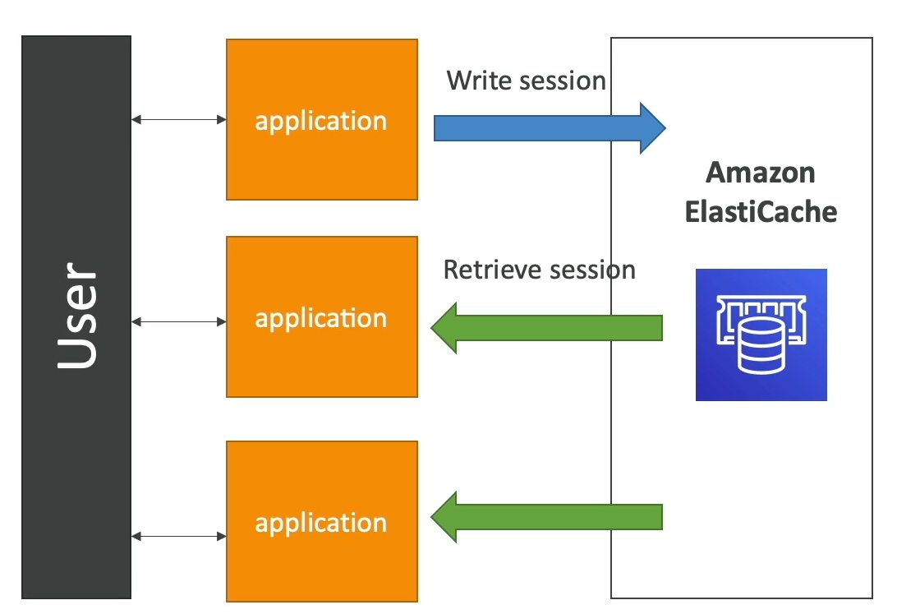
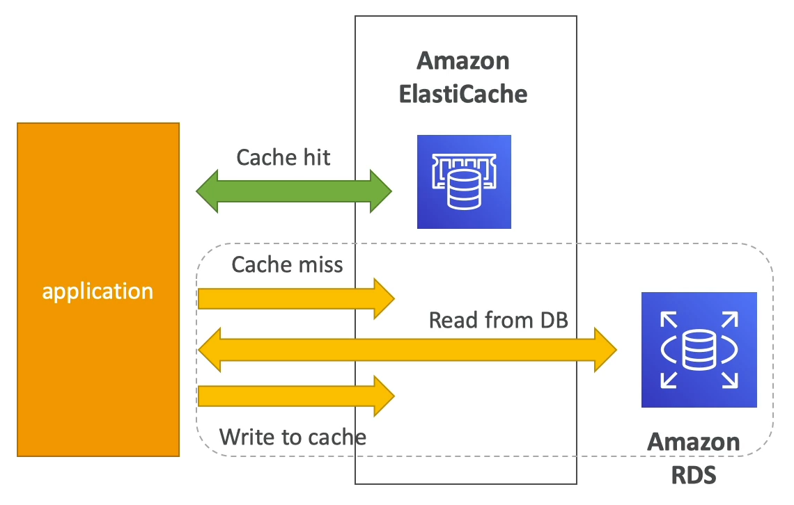
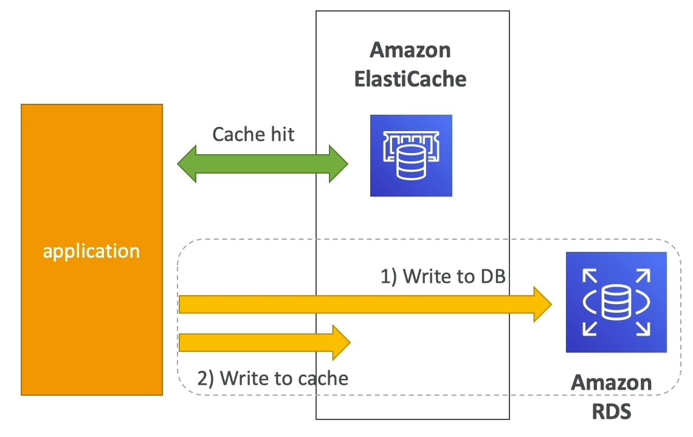

[Back](./AWS.md)

# ElastiCache

## General

- ElastiCache is to get managed in memory data storage systems Redis or Memcached
- Caches are in-memory databases with really high performance, low latency
- Helps reduce load off of databases for read intensive workloads
- Helps make your application **stateless**
- Using ElastiCache involves heavy application **code changes**

## ElastiCache - Redis vs Memcached

| Redis                                                           | Memcached                                      |
| --------------------------------------------------------------- | ---------------------------------------------- |
| Multi-AZ with Auto-Failover                                     | Multi-node for partitioning of data (sharding) |
| Read Replicas (max 5) to scale reads and have high availability | No high availability (replication)             |
| Data Durability using AOF (Append Only File) persistence        | Non persistent                                 |
| Backup and restore features                                     | No backup and restore                          |
| Supports Sets and Sorted Sets                                   | Multi-threaded architecture                    |

## ElastiCache - Parameter Groups

- parameter groups are collections of **settings or configuration options** that are applied to your ElastiCache clusters or nodes. They allow you to manage and customize the behavior of your Redis or Memcached instances.

## Amazon Memory DB for Redis

- Redis-compatible, durable, in-memory database service
- Up to **160 millions** requests/second
- Scales seamlessly from **10 GBs** to **100 TBs** of storage
- Durable in-memory data storage with Multi-AZ transactional log

## ElastiCache Strategies

### User Session Store

1. User logs into any of the application instances
2. The application writes the session data into ElastiCache
3. The user hits another instance of our application
4. The instance retrieves the data and the user is already logged in

- The process above made our application stateless

- Stateless: application instances themselves do not store session state. This means any instance can handle any request from a user, and the session state is consistently accessible from the shared cache.

### Lazy Loading / Cache-Aside / Lazy Population

- Note: Lazy loading is sometimes called Cache Aside or Lazy Population

1. Application queries ElastiCache (it reads data from it)
2. if data not available
3. get from RDS
4. and store in ElastiCache.

- Pros:
  - Only requested data is cached (the cache isn't filled up with unused data)
  - Node failures are not fatal (just increased latency to warm the cache)
- Cons:
  - Cache miss penalty that results in 3 round trips, noticeable delay for that request
  - Stale data: data can be updated in the database and outdated in the cache

### Write Through

1. Application queries ElastiCache (it reads data from it)
2. When your application modifies the DB
3. Application write the changes to the cache

- Pros:
  - Data in cache is never stale, reads are quick
  - Write penalty vs Read penalty: each write requires 2 calls
- Cons:
  - Missing Data until it is added
  - A lot of the data will never be read

## Cache Evictions and Time-to-live (TTL)

### Cache Evictions Methods

- You delete the item explicitly in the cache
- Item is evicted because the memory is full, and it's not recently used Least Recently Used (LRU)
- You set an item time-to-live TTL ('EXPIRE' keyword)

- **Note:** if too many evictions happen due to memory shortage, you should scale up or out

## ElastiCache - Cluster Memory

- The total memory capacity of the cluster is calculated by multiplying the number of nodes in the cluster by the RAM capacity of the node after deducting the system overhead.
- **Example (35 GB is needed):** Use cache.t2.medium type of nodes with each having 3.22 GiB memory, 2 cores, and a quantity of 11 nodes giving 35.42 GiB in total meeting the requirement
