[Back](./AWS.md)

# Elastic Beanstalk

## What is Elastic Beanstalk?

- Elastic Beanstalk is **Platform as a Service (PaaS)**
- Deploy and manage applications in the AWS Cloud without worrying about the infrastructure
- Allowing developers to deploy and manage applications without needing to handle the underlying EC2 instances directly. However, Elastic Beanstalk creates and manages EC2 instances as part of its environment to host your application.
- **A S3 bucket is created** by Elastic Beanstalk to hold your application versions
- Resources managed by EB get deleted if the environment is deleted
- You have the ability to clone an environment and it's configuration
- Elastic Beanstalk uses CloudFromation under the hood

## Elastic Beanstalk - Deployment Process

1. Describe dependencies (requirements.txt / package.json)
2. Package code as zip
3. Upload zip file (console or CLI)
4. Elastic Beanstalk will deploy the zip on each EC2 instance, resolve dependencies and start the application

## Elastic Beanstalk - Components

- Application: collection of Elastic Beanstalk components (environments, versions, configurations)
- Application version: an iteration of your application code
- Environment:
  - Collection of **AWS resources** running an **application version** (only one application version at a time), environments ex: dev, prod
  - Environment Tiers:
    - Web Server Tier (ELB in front of an ASG)
    - Worker Tier (SQS in front of an ASG)
  - You can create multiple environments (ex: dev, test, prod)
- Supported Platforms: Go, Java, .NET, Node.js, PHP, Python, Ruby... **It doesn't support Rust**

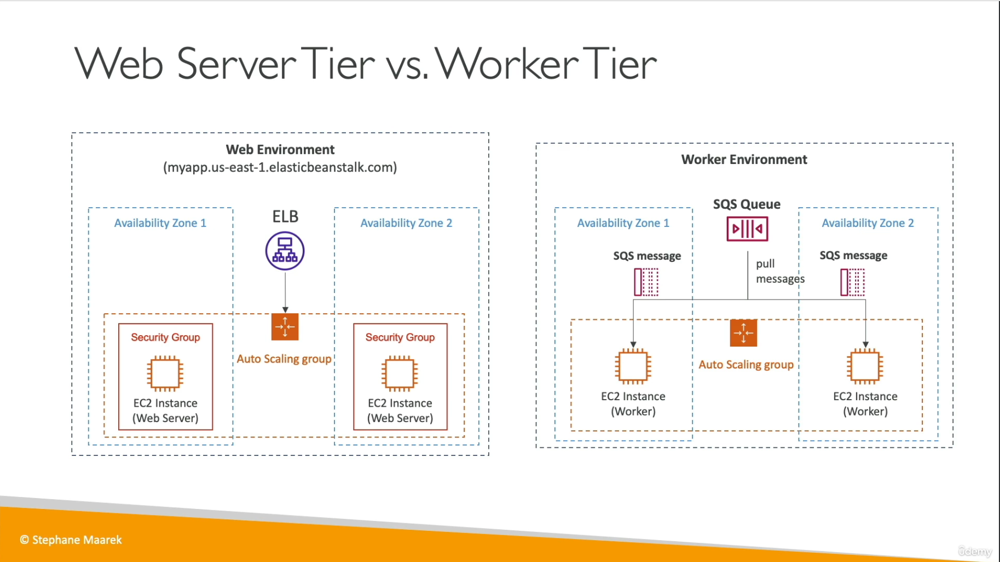

## Elastic Beanstalk - Deployment Modes (presets)

- Signle instance: one instance with an elastic IP, one RDS instance, no ELB. Great for development
- High Availability: with Load Balancer, Multi-AZ RDS instances (master & standby). Great for production

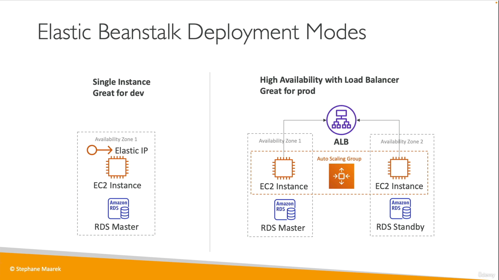

## Elastic Beanstalk - Deployment options for updates

### All at once

- Fastest
- Downtime
- No additional cost
- Code is deployed on the same instances
- Amazon EC2 burst balances is not lost because instances aren't replaced

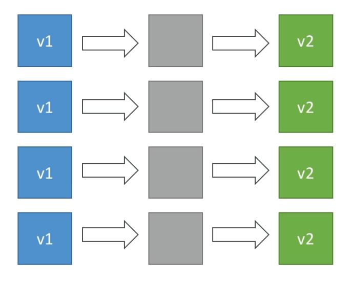

### Rolling

- Update a few instances at a time until healthy (bucket)
- Long deployment
- Application is running below capacity during updating
- No additional cost
- Code is deployed on the same instances
- If some instances complete the deployment successfully but other instances fail during the update, Elastic Beanstalk will replace the failed instances with new instances running the application version from the most recent successful deployment. As a result, there will be a mix of instances running the new version and instances running the previous version. However, with an Immutable Deployment strategy, if any instances fail during the update, the entire deployment will roll back, and there will be no swapping of instances

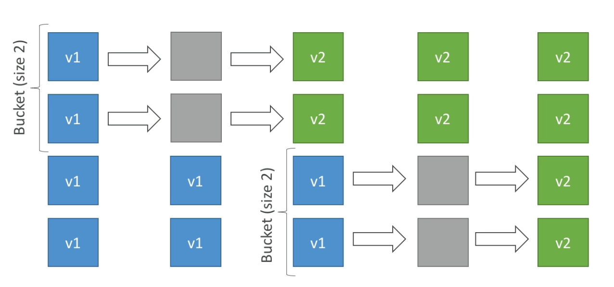

### Rolling with additional batches

- Running additional patches
- Small additional cost
- Longer deployment
- Application is running at full capacity
- Code is deployed on the additional batches and the same instances
- Additional batches are removed at the end of the deployment

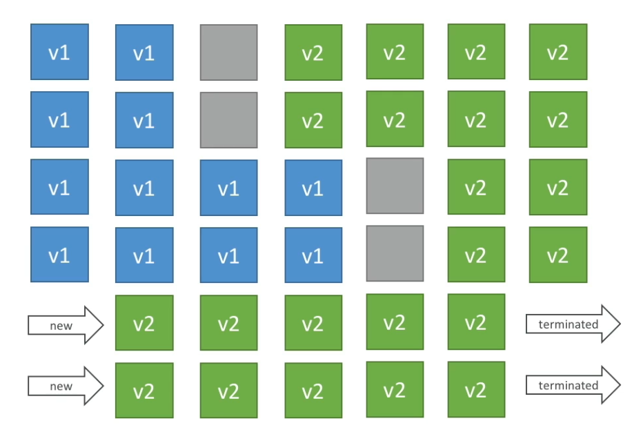

### Immutable

- High cost, double capacity
- longest deployment
- Code is deployed on new instances in a new ASG
- swaps all the instances when everything is healthy
- Automated rollback on failure
- Great for production
- Code run on new instances
- Amazon EC2 burst balances were lost because instances are replaced

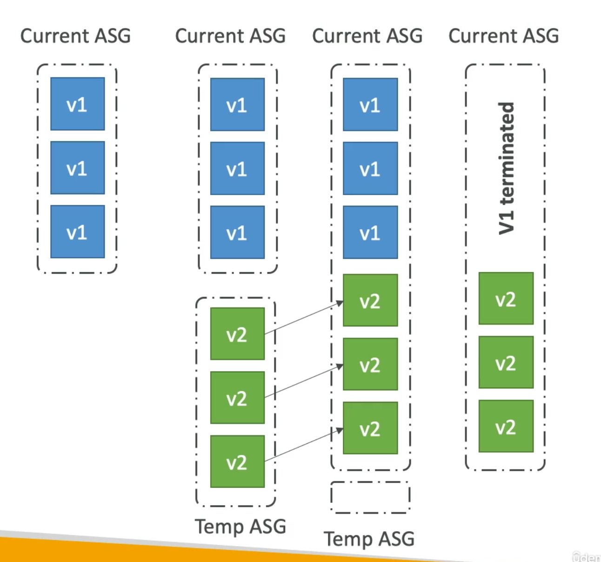

### Blue/Green

- Manually
- Not a "direct feature" of Elastic Beanstalk
- Create a **new environment** (green) and switch over when ready
- Use Route 53 can be setup using **weighted policies** to redirect a little bit of traffic to the stage environment to test it out, and then shut down the blue environment
- Code is deployed on new instances

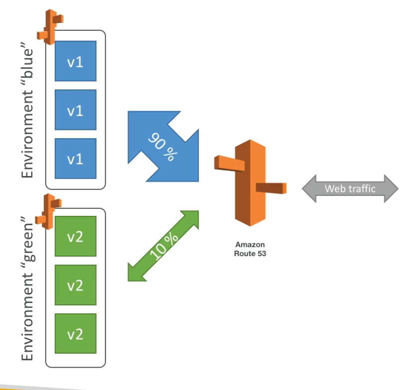

### Traffic Splitting

- Automated
- Is used for **canary testing**: a new version of an application to a small subset of users before deploying it to the entire user base.
- ELB sends a small % of traffic to new deployment
- New application version is deployed to a temporary ASG with the same capacity
- New instances are migrated from the temporary ASG to the original ASG
- Automated rollback on failure
- Code is deployed on new instances
- Amazon EC2 burst balances were lost because instances are replaced

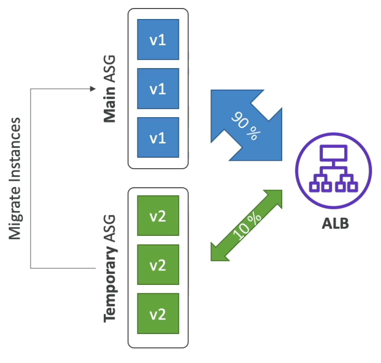

## Elastic Beanstalk - CLI

- We can install an additional CLI called EB CLI which makes working with Beanstalk from the CLI easier

## Elastic Beanstalk - Application Lifecycle Policy

- Elastic Beanstalk can store at most 1000 application versions
- If you don't remove old versions, you won't be able to deploy anymore
- Use lifecycle policy to delete old versions:
  - based on time
  - based on remaining space
- Versions that are currently used won't be deleted

## Elastic Beanstalk - Extensions

- EB extensions = Configuration files
- Configuration files are used to set configuration options like run the environment on m4.large instead of t1.micro
- Add the configuration through the files in your .zip file **not through CLI**
- Requirements:
  - Place your configuration files in the **.ebextensions/** directory in the root of source code
  - YAML or JSON should be the content of the file
  - Each configuration file should have a **.config** extensions (ex: loggin.config)
  - Configuration files can be used to modify Elastic Beanstalk default settings using the **option_settings** section within the .config files
- option settings example

```
option_settings:
  aws:elasticbeanstalk:application:environment:
    ENVIRONMENT: production
    DEBUG_MODE: false
```

## Elastic Beanstalk - Migrations

### Load Balancer migration

- After creating an Elastic Beanstalk environment, **you cannot change the Elastic Load Balancer type** (you can only change the configuration)
- To migrate to a new ELB type:
  1. create a new environment with the same coniguration except ELB
  2. deploy your application onto the new environment
  3. Perform a CNAME swap or Route 53 update

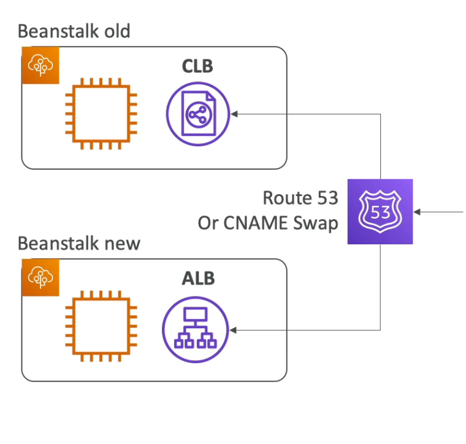

### RDS migration

1. Create a snapshot of RDS (as a safegurad)
2. Go to the RDS console and protect the RDS database from deletion
3. Create a new Elastic Beanstalk environment, without RDS
4. Point your application to existing RDS
5. Perform a Route 53 update or CNAME swap
6. Terminate the old environment (RDS won't be deleted because of delete protection)
7. Delete CloudFormation stack (in DELETE_FAILED state)

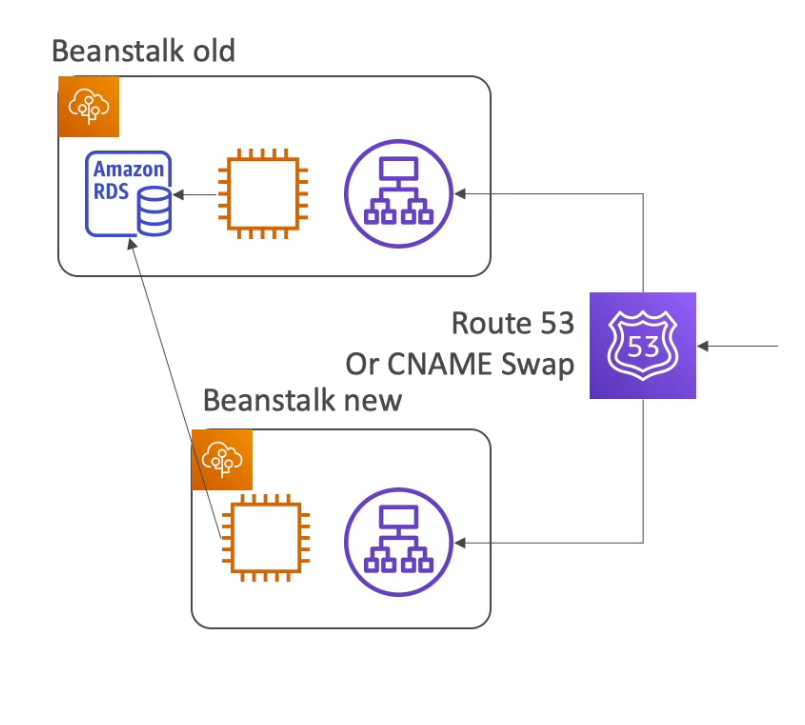
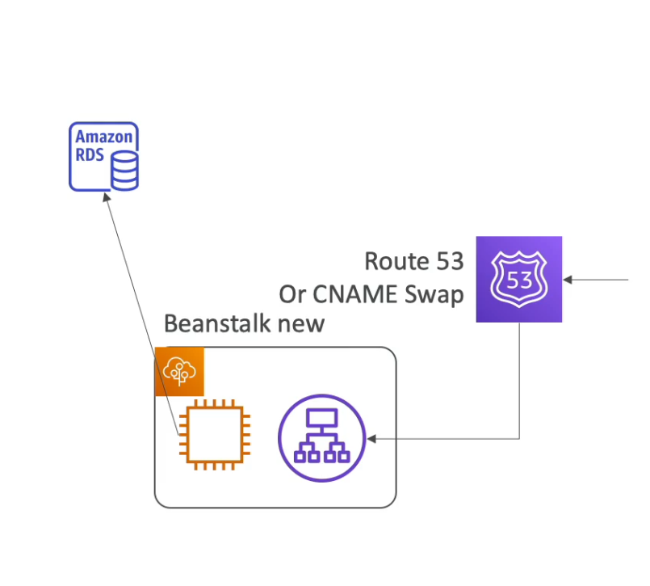
