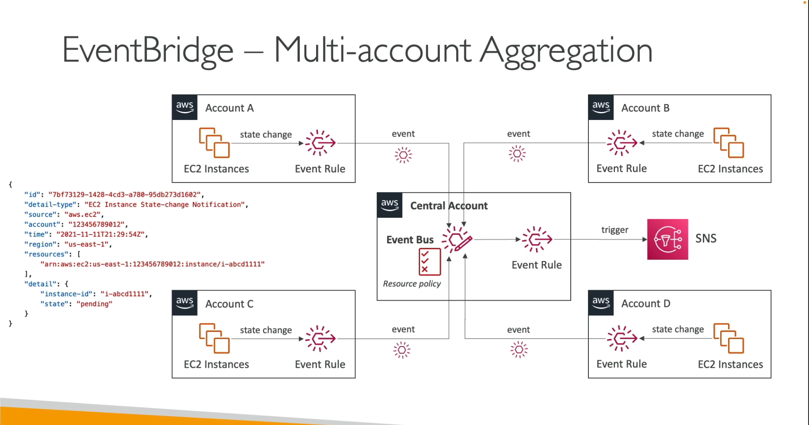

[Back](./AWS.md)

# Amazon EventBridge

- Old name was: CloudWatch Events
- Events are in JSON format
- An event bus contains rules.
- Rules contain event patterns or schedule.

## EventBridge - Event Bus

- Event buses can be accessed by other AWS accounts using Resource-based Policies
- You can archive events sent to event bus
- Ability to replay archived events

### Event Bus Types

- Default Event Bus: has AWS Services as resources for events
- Partner Event Bus: Has AWS SaaS Partners as resources
- Custom Event Bus: Has custom apps as resources

## EventBridge - Rules

- Rules specify to which target service it should push the event to
- Ability to have another EventBridge Event bus as a target (in another account as example)

### Rules might contain

- Schedule: Cron Jobs (scheduled scripts)
  - Example: Trigger script on Lambda function every hour, or on every Monday at 8am
- Event Pattern: Event rules to react to a service doing something

  - Example: Start or stopping EC2 Instance
  - Example: Upload Object in S3

### Event Pattern example

```json
{
  "source": ["aws.ec2"],
  "detail-type": ["EC2 Instance State-change Notification"],
  "detail": {
    "state": ["terminated"]
  }
}
```

## EventBridge - Resource-based policy

- Manage Permissions for a specific Event Bus
- Policy written in JSON
- Example: allow/deny events from another AWS account

## EventBridge - Schema Registry

- EventBridge can analyze the events in your bus and infer the JSON schema
- The Schema Registry allows you to generate code for your application (Java, Python, TypeScript...), that will know in advance how data is structured in the event bus

## EventBridge - Multi-account Aggregation

- Create event **Rules** in the accounts that should send the events to the Central Account **Event Bus**
- Define a **Resource-based Policy** on the Central Account **Event Bus** to allow other accounts to send events into the event bus
  
