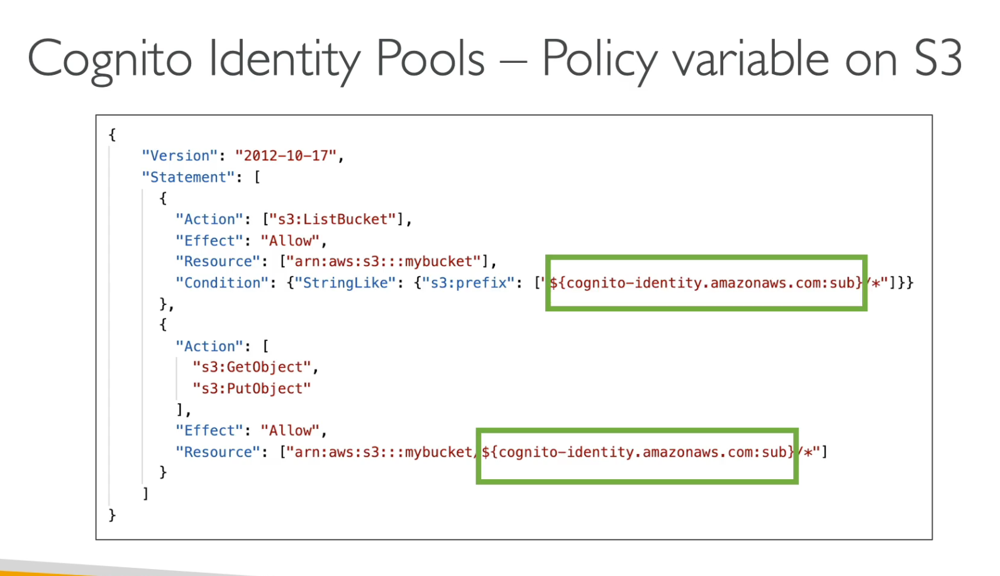
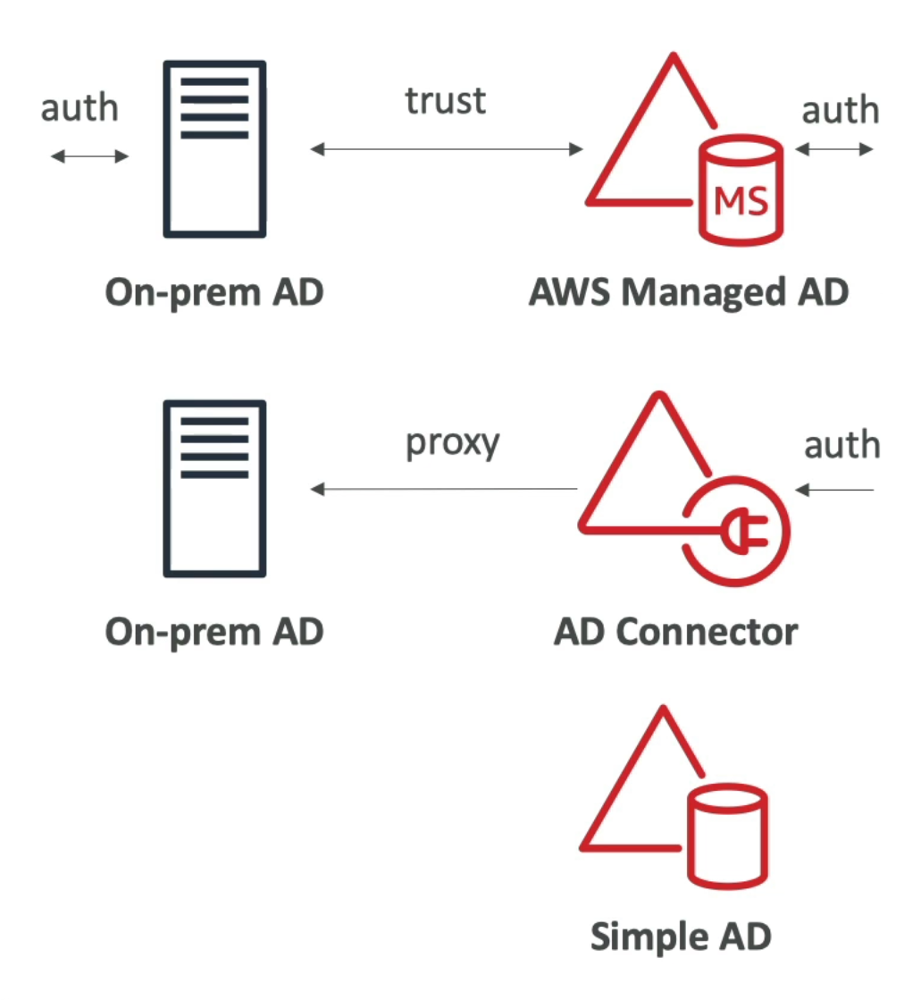

[Back](./AWS.md)

# IAM: Users & Groups

- IAM = Identity and Access Management
- IAM is a global service, so if we create a user it would be available everywhere
- Users are people within your organization, and can be grouped
- Groups **only** contain users, not other groups
- Some users don't have to belong to a group (but it's not the best practice)
- A user can belong to multiple groups

## IAM Permissions

- Users or Groups can have JSON documents assigned called policies
- These policies define the permissions of the users
- In AWS you apply the **least privilege principle:** don't give more permissions than a user needs
- If a user doesn't belong to a group you could provide **inline policy** which is a policy only attached to a user
- Permissions are inherited from the group, example: if a user is part of the group 'admin' it will get the admin permissions (Policies inheritance)

## IAM - Policies

### AWS Managed Policy

- Maintained by AWS
- Updated in case of new services/new APIs

### Customer Managed Policy

- Best practice, re-usable can be applied to many principals
- Version Controlled, able to see all versions of a policy

## IAM - Trust Relationship

- Trust relationship is a **policy** on the **role** that defines which services might assume this role
- This is to prevent adding Lambda role meant for DynamoDB on EC2 instance as example

## IAM Policies Structure

```json
{
  "Version": "2012-10-17",
  "Id": "S3-Account-Permissions", //optional
  "Statement": [
    //required one or more individual statements
    {
      "Sid": "1", //optional
      "Effect": "Allow", //allow or deny
      "Principal": {
        "AWS": ["arn:aws:iam::123456789012:root"] //account/user/role to which this policy is applied to
      },
      "Action": ["s3:GetObject", "s3:PutObject"], //list of actions this policy allows or denies
      "Resource": ["arn:aws:s3::mybucket/*"] //list of resources to which the actions is applied to
      //Condition: We can add conditions here for when this policy is in effect (optional)
    }
  ]
}
```

## IAM Password Policy

- In AWS, you can set up a password policy:

  - minimum length
  - specific character types
  - allow IAM users to change their password or not
  - Require users to change their password after some time (password expiration)
  - Prevent password re-use (a password an user had before)
  - Changing the password policy (such as changing the minimum length) doesn't require users to change their old passwords immediately. Instead, they will have to meet the new password policy when their passwords expire.

- Multi-Factor Authentication - MFA

  - MFA = password you know + security device you own (for generating tokens)

## IAM CLI & SDK

- AWS CLI: manage your AWS services using the command-line
  - AWS CLI requires **Python** as its runtime
- AWS SDK: manage your AWS services using a programming language
  - if you don't specify or configure a default region, then us-east-1 will be chosen by default

## AWS CloudShell

- Note: CloudShell is not available in all the regions
- CloudShell is a terminal in the cloud of AWS
- It will operate (as if the credentials has been used of the account)

## IAM Roles

- An IAM role is an identity you can create that has specific permissions with credentials that are valid for short durations. Roles can be assumed by entities that you trust. (It's sometimes called EC2 Instance Profile)
- To enable AWS services to perform actions on your behalf, assign permissions to these services using IAM Roles.
- You **cannot** directly assign an IAM role to an on-premises server. IAM roles are specifically designed for AWS resources.
- When we use an IAM Role the instance uses the **instance metadata** to get **temporarily** credentials

## IAM Security Tools

- IAM Credentials Report (account-level): a report that lists all your account's users and the status of their various credentials
- IAM Access Advisor (user-level): Access advisor shows the service permissions granted to a user and when those services were last accessed: You can use this information to revise your policies

## Shared Responsibility Model for IAM

| AWS Responsibilities                     | Your Responsibilities                                    |
| ---------------------------------------- | -------------------------------------------------------- |
| Infrastructure (global network security) | Users, Groups, Roles, Policies management and monitoring |
| Configuration and vulnerability analysis | Enable MFA on all accounts                               |
| Compliance validation                    | Rotate all your keys often                               |
|                                          | Use IAM tools to apply appropriate permissions           |
|                                          | Analyze access patterns & review permissions             |

## IAM - Authorization Model

### S3 Access (and other services)

- The user IAM permissions **ALLOW** it **OR** the resource policy **ALLOWS** it
- **AND** there's no explicit **DENY** in IAM or in the S3 Policy
- For cross account access, both the resource policy and the IAM permission should **ALLOW** the access

### KMS Access

- A user must have the proper IAM permissions to access the key even if the KMS key policy allows every one
- If the policy explicitly allow a user in the principal, the user doesn't need an IAM policy

## IAM - Pass Role

- In the policy below we are allowed to pass the role named **S3Access**

```json
{
  "Version": "2012-10-17",
  "Statement": [
    {
      "Effect": "Allow",
      "Action": "iam:PassRole",
      "Resource": "arn:aws:iam::123456789012:role/S3Access" //the name of the role we are allowed to pass
    }
  ]
}
```

## IAM - Dynamic Policy

- You can partition your users access using **policy variables**
- Example: giving access to users access to their own files in a prefix in an S3 bucket or DynamoDB LeadingKey



## IAM - Premission Sets

- You can configure **permission sets** in AWS IAM Identity Center to grant access to other accounts, allowing you to easily assign a set of permissions to users across AWS accounts without managing individual IAM roles directly.

- Premission Sets vs AssumeRole API: AssumeRole API is used to obtain temporary security credentials for a specific IAM role, allowing users or applications to assume that role and gain its permissions for a limited time. It’s more about dynamically switching roles for specific tasks.

# AWS STS

- STS Allows to grant limited and temporary access to AWS resources (up to 1 hour)

## STS - APIs

- AssumeRole: Assume roles within your account or cross account
- AssumeRoleWithSAML: return credentials for users logged with SAML
- AssumeRoleWithWebIdentity: reurn credentials for users logged in with Facebook or Google
- GetSessionToken: for MFA
- GetCallerIdentity: return details about the IAM user or role used in the API call
- DecodeAuthorizationMessage: decode error message when an AWS API is denied

## STS - Assume Role

1. Define an IAM Role within your account or cross account
2. Define which principals can access this IAM Role
3. Use AWS STS to retrieve temporary credentials
4. You will receive temporary security credentials an **access key** a **secret access key** and a **session token**. To use these credentials in subsequent AWS CLI commands, the application needs to set the access key, secret access key, and session token in the **environment variables**

# Active Directory

- Database of objects, user accounts, computers, printers, file shares
- Centralized security management, create account, assign permissions

## AWS Managed Microsoft AD

- Managed Directory on AWS
- Establish trust connections with your on-premise AD
- Supports MFA

## AD Connector

- Proxy to redirect to on-premise AD
- Supports MFA

## Simple AD

- Managed Directory on AWS
- Cannot be joined with on-premise AD


