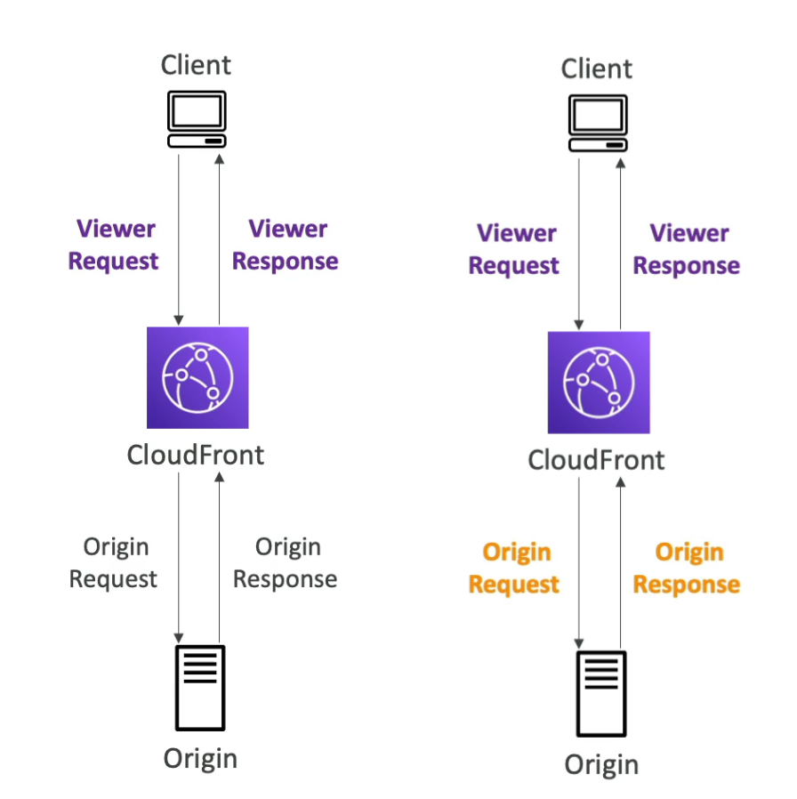

[Back](./AWS.md)

# Lambda

## Lambda - Programming languages

- Many programming languages are supported
- **C++ and Rust** are not natively supported
- To run **C++ and Rust**, we use **Lambda Custom Runtime API** with **Lambda Layers**

## Lambda - Pricing

### Pay per request

- Pay for function calls

### Pay per duration

- Pay per **compute duration**, based on RAM used in that duration
- 400.000 seconds of compute time per month is free (based on the function has 1GB RAM)
- 3.200.000 seconds if the function has 128 MB RAM

## Lambda - IAM

- IAM in lambda is done through **IAM Execution role** and **Resource Based Policy**
- We use an IAM execution role to allow Lambda functions to write to destinations.
- Use Resource-Based Policies in the Lambda function to grant permissions to other AWS accounts and services to use your Lambda resources. (ex: S3)
- **Note:** When lambda is invoking the SQS, there is no Resource Based Policy needed, beacuse we poll the Event Source Mapping with the Lambda Role

## Lambda - Destinations

- Lambda destinations are for **asynchronous** invocations
- There are no destination configurations available for failed events from **sychronous** invocations
- We can define destinations for **successful** and destinations **failed** events
- Destinations:
  - SQS
  - SNS
  - Lambda
  - EventBridge
- Note: AWS recommends you to use **lambda destinations** instead of **DLQ** (but both can be used)

## Lambda - Event and Context Objects

### Event Object

- JSON document contains data for the function to process
- Contains information from the invoking service (ex: EventBridge)

### Context Object

- Provides methods and properties that provide information about the invocation (ex: function name, memory limit)
- Passed to your function by Lambda service at runtime

### Execution Context

- The execution context is a temporary runtime environment that initializes any external dependencies for your lambda code (ex: DB connections)
- The execution context is maintained for some time and can be re-used for the next invocation (ex: connection to DB is not run again)
- The execution context includes the **/tmp** directory
- Move your code outside of the function handler (DB connection, import dependencies), in order to be run by the execution context

```python
import os
# BAD EXAMPLE, each time the lambda function will run, connection is established again
def get_user_handler(event,context):
  DB_URL = os.getenv("DB_URL")
  db_client = db.connect(DB_URL)
  user = db_client.get(user_id=event["user_id"])
return user
```

```python
import os
# Good Example, connection is handled through execution context
DB_URL = os.getenv("DB_URL")
db_client = db.connect(DB_URL)
def get_user_handler(event, context):
    user = db_client.get(user_id = event["user_id"])
return user
```

#### /tmp

- It is a directory to store files temporarily (ephemeral)
- Storage: Min 512 MB - Max 10GB
- `/tmp` may persist temporarily between invocations to the same lambda function,
- **Not** shared across all invocations of other lambda functions
- When the lambda function is stopped data in `/tmp` directory is deleted
- Use case: if a lambda function needs to download a large file

## Lambda - Envrionment Variables

- We can add environment variables in the lambda configuration
- Environment variable = key/value pair in "string" form
- Max size: 4KB of all environment variables

## Lambda Logging & Monitoring

- CloudWatch metrics are recordded from the lambda function (duration, invocations, error count, etc...)
- When we create a lambda function a basic role is attached to it by default to allow to send logs to CloudWatch Logs
- AWS Lambda execution logs are stored in AWS CloudWatch Logs
- You can enable **active tracing** for x-ray on lambda

## Lambda - VPC configuration

### Default Lambda Deployment

- Default Lambda Deployment: Outside VPC: By default, Lambda functions are launched outside your VPC, in an AWS-managed VPC.
- Access Limitations: Cannot access resources in your VPC (e.g., EC2 instances, RDS databases, ElastiCache, internal ELBs).
- It can access the internet

### Deploying in a VPC

- When a Lambda function is deployed in a VPC, in a subnet, it creats an Elastic Network Interface (ENI) with a security group around the ENI in order to connect to AWS resources
- It can not access the internet by default when deployed in your VPC
- Even deploying a Lambda function in a public subnet doesn't give it internet access or a public IP (For EC2 it does)
- In order for a Lambda function to connect to the internet, it has to happen via NAT Gateway or a NAT Instance placed in a public subnet

## Lambda - Storage Options

- **Note:** EBS is not a valid type of a storage for a Lambda function

|                               | Ephemeral /tmp | Amazon S3 | Amazon EFS |
| ----------------------------- | -------------- | --------- | ---------- |
| Max. Size                     | 10240MB        | Elastic   | Elastic    |
| Persistence                   | Ephemeral      | Durable   | Durable    |
| Shared across all invocations | No             | Yes       | Yes        |

## Lambda - Concurrency and Throttling

- Concurrency limit: up to 1000 concurrent executions on all functions per region per account
- Can set a **reserved concurrency** at the function level (limit for one function)
- Each invocation over the concurrency limit will trigger a **throttle**
- Throttle behavior:
  - If sync invocation => return ThrottleError - 429
  - If async invocation => lambda return the event to the internal **Event Queue** retry automatically and then send event to DLQ (this is other kind of retries than the retry on errors)
- If you need a higher account limit, open a support ticket

## Lambda - Starting types

### Cold Start

- Occurs when a new Lambda instance is initialized to handle an incoming request
- First request served by new instances has higher latency than the rest

### Provisioned Concurrency

- A feature that pre-warms a specified number of Lambda instances
- Low latency, ready to respond immediately to incoming function requests

## Lambda - Dependencies

- If your Lambda function depends on external libraries: X-Ray SDK, ...
- You need to install the packages alongside your code and zip it together
- Upload the zip stright to lambda if less than 50MB, else to S3 first and reference it from lambda
- AWS SDK comes by default with every lambda function
- The dependencies can only be used by that specific lambda function if this way is used

## Lambda - Layers

- 5 Layers per function up to 250MB per layer
- More than one Lambda function can use these libraries

- Use cases:

  - Create Lambda Custom Runtimes (C++, Rust)
  - Externalize **Dependencies** to re-use them (libraries)

## Lambda - Versions and Aliases

### Versions

- When you work on a lambda function, we work on $LATEST
- When we're ready to publish a Lambda function, we create a version
- Versions are immutable (can not be edited)
- Versions get their own Amazon Resource Name (ARN)

### Aliases

- Aliases are **pointers** to Lambda function versions
- Aliases have their own ARN
- Aliases can not reference other aliases
- Aliases are mutable (can be edited), you can change what version an alias points to without changing the alias itself.
- We can have an alias pointing at $LATEST
- We can define a "dev", "test" and "prod" aliases and have them point at different lambda versions
- Aliases support **Canary Deployment** by assigning weights to different lambda versions

## Lambda - All Limits

- Memory: 128MB - 10GB (1MB increments)
- You can not add more vCPU directly, you have to add more memory, and you will get more vCPU
- Maximum execution time: 900 sec (15 min)
- Environment variables (4 KB)
- /tmp: 512 MB to 10GB
- Concurrency: 1000
- Max Lambda function deployment size (compressed .zip): 50MB
- Max Lambda function uncompressed size: 250MB
- 5 Layers per function up to 250MB
- Lambda Container Images: max image size 10GB

## Lambda - Best Practicies

- Perform heavy-duty work outside of your function handler: DB connections, initialize SDK, import dependencies
- Use environment variables for: DB connection strings, S3 Buckets, don't put these in your code
- Use Layers where necessary
- Avoid using recursive code, never have a lambda function call itself
- Use Lambda for:
  - Thumbnail creation: create a thumbnail for a new image that is uploaded in an S3 bucket with Lambda through S3 event notification.
  - Running Cron jobs: Trigger a Lambda function from EventBridge in order to preform a scheduled task (daily, weekly)
- Use Lambda Container Images to upload large Lambda functions (up to 10GB of image size)

# Lambda - Types Of Invocations

## Lambda - Synchronous Invocation

- Invoke a Lambda Function synchrounasly through:
  - CLI
  - SDK
  - API Gateway
  - Application Load Balancer
  - CloudFront (Lambda@Edge)
  - and more...
- Results is returned to the caller
- Error handling must happen client side (click on retry button, exponential backoff, etc...)
- Lambda doesn't provide retry mechanism on errors
- Lambda destinations **can't** be configured with synchronous invocation

## Lambda - Asynchronous Invocations

- Invoke a Lambda Function asynchrounasly through:

  - S3
  - SNS
  - EventBridge
  - and more...

- The result is not sent back to the caller
- The events are placed in an internal **Event Queue** in Lambda Serivce
- Lambda attempts to retry on **errors** (3 tries total)
- Failed tasks might be sent to a destination
- Tasks that couldn't be processed might be moved to SQS DLQ or SNS DLQ **via Lambda and not via SQS** (requires IAM execution role)
- Use case: use it if you are handling too many requests

## Lambda - Event Source Mapping

- Invokes through:

  - Kinesis Data Streams
  - SQS & SQS FIFO queue
  - DynamoDB Streams
  - and more...

- Your Lambda function is invoked **synchronously**
- An **event source mapping** is created internally in Lambda
- The event source mapping polls the service and returns a batch
- Requires an appropriate IAM execution role to pull

### Kinesis & DynamoDB

- Items are processed in order at the shard level
- Low traffic: use batch window to accumulate records before processing (the maximum amount of time to gather records before invkoing the function)
- You can process multiple batches in parllel by having multiple lambda functions: Each batch contains records with the same partition key

#### Scaling

- One Lambda function per shard by default
- Up to 10 batches per shard
- In-order processing is still guaranteed for each partition key at the batch level
  

#### Error Handling

- By default if your function returns an error, the entire batch is reprocessed until the function succeeds or the items in the batch expire
- You can configure the event source mapping to:
  - Discard event batches, we can send them to:
    - SQS
    - SNS
  - Restrict the number of retries
  - Split the batch on timeout error (to work around Lambda timeout issues)

### SQS

- An Event Source Mapping is created in the lambda function that polls batches from SQS
- Specify the batch size (1-10 messages)
- There is no batch window avaliable

#### Scaling

##### SQS Standard

- Lambda adds 60 more instances per minute to scale up
- Up to 1000 batches of messages processed simultaneously

##### SQS FIFO

- Messages with the same GroupID will be processed in order
- The lambda function scales to the number of active message groups

#### Error Handling

- When an error occurs, batches are returned to the queue as individual messeges and might be processed in different grouping than the original batch
- To use a DLQ: set up on the SQS queue not on lambda **(DLQ via lambda is only for async invocations)**

# Lambda with other Services

## Lambda - CloudFromation

### Inline

- Use the Code:ZipFile property for inline functions in the template
- Inline functions are used for simple functions
- You **can't** include function dependencies with inline functions

```yaml
MyLambdaFunction:
  Type: AWS::Lambda::Function
  Properties:
    FunctionName: my-inline-function
    Handler: index.handler
    Runtime: python3.8
    Code:
      ZipFile: |
        import json
        def handler(event, context):
            return {
                'statusCode': 200,
                'body': json.dumps('Hello from Lambda!')
            }
    Role: arn:aws:iam::123456789012:role/execution_role
```

### S3

- Store Lambda zip in S3
- Refer the S3 Zip location in the CloudFormaiton code
- You need to provide the following in CloudFormation:
  - S3Bucket = Bucket name
  - S3Key = Name of the file
  - S3ObjectVersion = Verion ID of the Object

```yaml
MyLambdaFunction:
  Type: AWS::Lambda::Function
  Properties:
    FunctionName: my-function
    Handler: index.handler
    Runtime: nodejs14.x
    Code:
      S3Bucket: my-bucket
      S3Key: my-function.zip
      S3ObjectVersion: "Some String"
    Role: arn:aws:iam::123456789012:role/execution_role
```

## Lambda - Lambda Container Images

- Deploy Lambda function as container images from ECR
- Use Lambda Container Images to upload large Lambda functions (up to 10GB of image size)
- Base image must implement the **Lambda Runtime API**

### Best Practices

- Use AWS-provided Base Images
- **Use Multi-Stage Builds:** Create smaller, more efficient images by only including necessary artifacts in the final image.
- **Build from stable to frequently changing in your docker file:** make your most frequently occuring changes as late in your Docker file as possible
- **Use a single repository for Functions with Large Layers:** ECR compares each layer of a container image when it is pushed to avoid uploading and storing duplicates

## Lambda - Function URL

- Dedicated HTTP(s) endpoint for your lambda function
- A unique URL
- Supports **Resource Based Policies** & **CORS configurations**
- Can be applied to **$LATEST** or an **alias** (can't be applied to function versions)

### Security

- In the resource based policy
- AuthType: NONE, Lambda won't perform IAM authentication on requests to the function URL
- AuthType: IAM, Only authenticated IAM users and roles can make requests to your function URL

## Lambda Integration with ALB

- To use your lambda function with ALB the lambda function must be registered with a **target group**
- Request is converted from HTTP (headers and body and query string parameters) to JSON in order to send it to the lambda function
- Response is converted from JSON to HTTP

### ALB + Lambda Multi-Header Values

- ALB can support multi header values (in the Target Group settings)
- example: `https://example.com/path?name=foo&name=bar`
- When you enable multi-value headers, HTTP headers and query string parameters that are sent with multiple values are shown as array within the AWS lambda event and response object

## Lambda@Edge & CloudFront Functions

- Use case: customize the CDN content, A/B Testing,
- Viewer request & response is between the client and CloudFront
- Origin request & response is between CloudFront and the origin

  |                         | CloudFront Functions                                                                            | Lambda@Edge                                                                                             |
  | ----------------------- | ----------------------------------------------------------------------------------------------- | ------------------------------------------------------------------------------------------------------- |
  | Programming language    | JavaScript                                                                                      | Node.js, Python                                                                                         |
  | Good for nr of requests | Milions of requests per second                                                                  | Thousands of requests per second                                                                        |
  | Ability to change       | Viewer request/response                                                                         | Viewer requests/response and origin request/response                                                    |
  | Execution time          | Very high speed < 1ms                                                                           | 5 - 10 sec                                                                                              |
  | Max memory              | 2MB                                                                                             | 128MB - 10GB                                                                                            |
  | Feature From            | Native feature from CloudFront, manage code in CloudFront                                       | Feature from Lambda Service, add the function in **us-east-1** region and CloudFront will distribute it |
  | Use case                | transform request attributes (headers, cookies, query strings, redirects), request auth, etc... | Access network to use external services for processing, change body of HTTP request, etc...             |

  

## Lambda - Lambda & CodeDeploy

- CodeDeploy: can help you automate traffic shift for lambda aliases for updates
- Has roll back feature
- The deployment is defined in **AppSpec.yml**

### Deployment Strategies

- Linear: grow traffic every N minutes until 100%
- Canary: try X percent then switch to 100%
- All at once: immediate shift

### AppSpec.yml parameters

- All of the parameters below in AppSpec.yml are required
- Name (required): the name of the lambda function to deploy
- Alias (required): the name of the alias to the lambda function
- CurrentVersion (required)
- TargetVersion (required)

## Lambda - CodeGuru

- CodeGuru gain insights into runtime performance of your lambda functions using CodeGuru Profiler
- When activated lambda adds:
  - CodeGuru profiler layer to your function
  - Environment variables to your function
  - **AmazonCodeGuruProfilerAgentAccess** policy to your function
