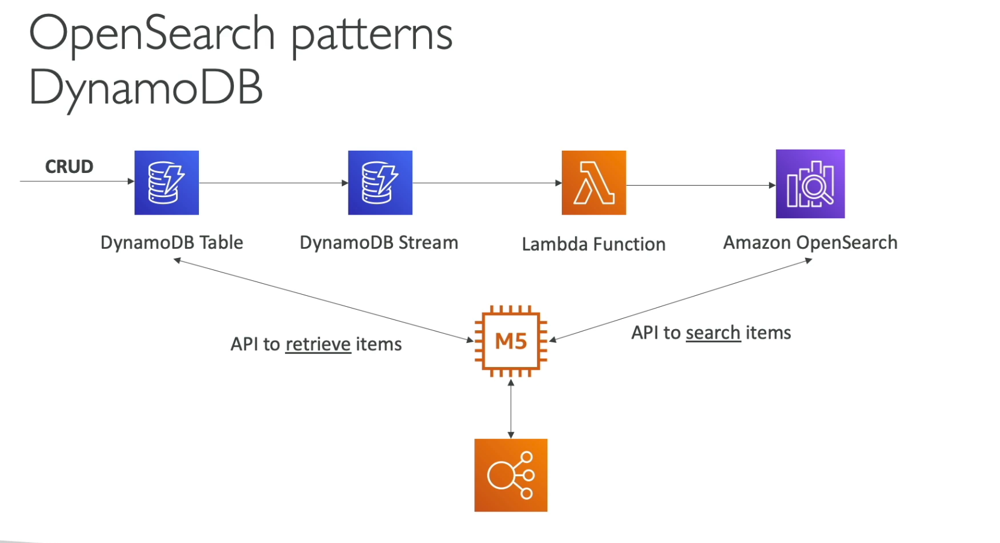
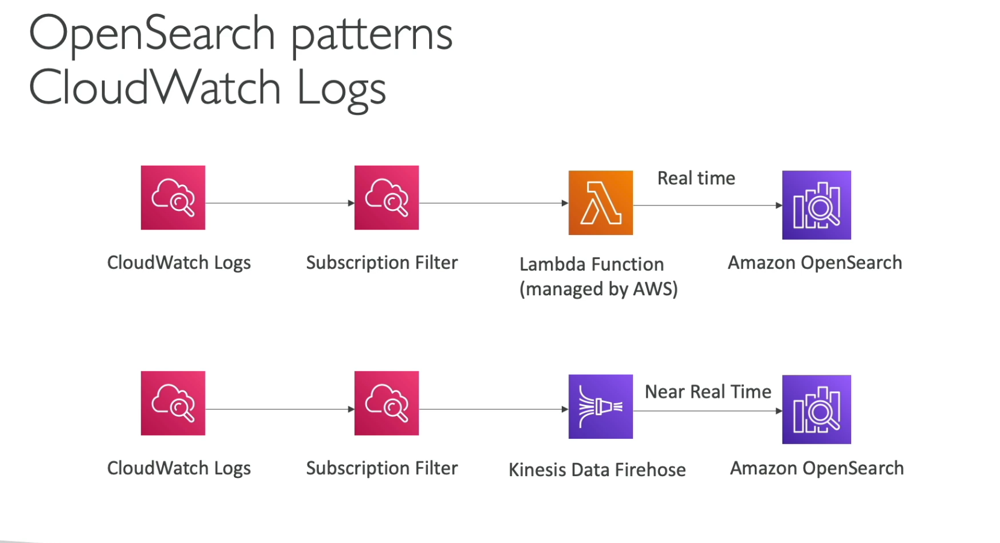
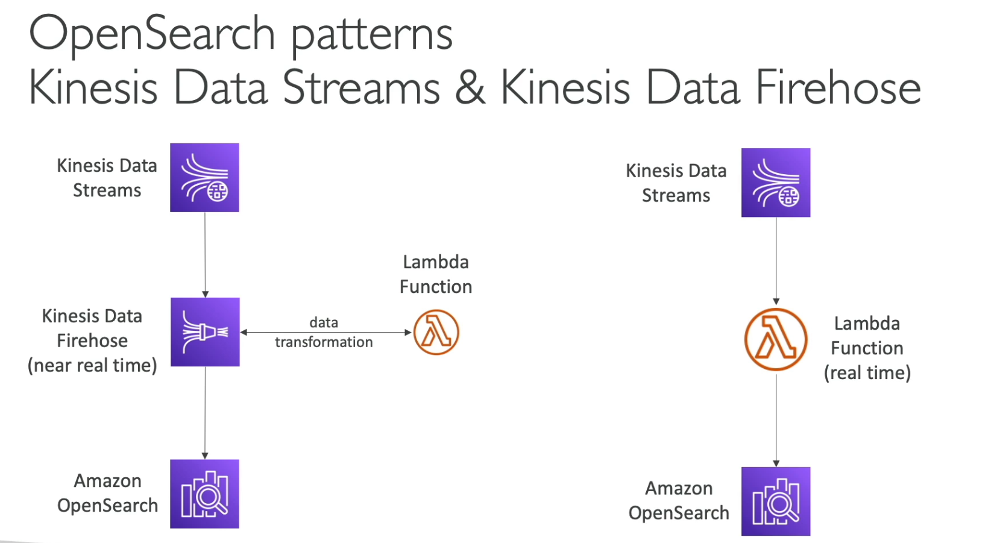
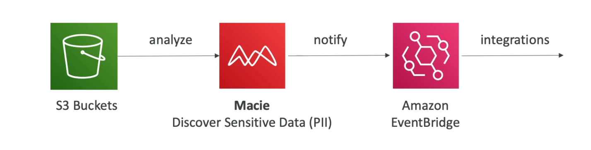

[Back](./AWS.md)

# AppSync

## AppSync - Usage

- AppSync is a managed service that uses **GraphQL**
- Uploading a **GraphQL schema** is **required**
- Ability to have a **merged API** (combining multiple GraphQL APIs)
- Retrieve data in real-time with **WebSocket** or **MQTT on WebSocket**

## AppSync - Integrations

- Fetch data from:
  - DynamoDB
  - Aurora
  - OpenSearch
  - Lambda
  - Public HTTP APIs

## AppSync - Security

- There are four ways you can authorize applications to interact with your AWS AppSync

  - API key
  - AWS IAM
  - OpenID Connect
  - Cognito User Pools

- For **custom domain names & HTTPS** it is recommended to use **CloudFront in front of AppSync**

# Amplify

## Amplify - Basics

- Create mobile and web applications via the console or CLI

## Amplify - Authentication

- run `amplify add auth`
- Leverages Amazon Cognito

## Amplify - Datastore

- run `amplify add api`
- Leverages Amazon DynamoDB and Amazon AppSync

## Amplify - E2E Testing

- Use the **test step** in **amplify.yml** to run any test commands at build time
- Integrated with Cypress testing framework

# OpenSearch

- Imagine we have a DynamoDB table, queries only exist by primary key or indexes
- With OpenSearch, you can search any field
- Used for:
  - Saving/Searching DynamoDB table data (search OpenSearch and retrieve data from the DynamoDB table)
  - Saving/Searching CloudWatch logs
  - Saving/Searching KDS and KDF data

## OpenSearch - Architectures

# Athena

- **Serverless** query service to analyze data stored in S3
- Uses Standard SQL Language to query the files
- Pricing $5.00 per TB of data scanned

## Athena - Performance Improvement

- Use columnar data for less scan
- Partition datasets in S3 for easy querying
- Use larger files
- Compress data

## Athena - Federated Query

- Federated query allows you to run SQL queries across data stored in services other than S3 (RedShift, DynamoDB, on-premises)
- Uses **Data Source Connectors** that run on **Lambda**

# AWS MSK

- MSK = Managed Streaming for Apache Kafka
- Alternative to Amazon Kinesis to stream data
- 1MB of records size but can be increased to 10MB
- Data is stored on EBS volumes for as long as you want

## MSK - Consumers

- Kinesis Data Analytics for Apache Flink
- AWS Glue
- Lambda
- Applications running on EC2, ECS, EKS

# ACM

- ACM = AWS Certificate Manager
- Manage and deploy SSL/TLS Certificates
- Load TLS certificates on
  - ELB
  - CloudFront
  - API Gateway

# AWS Macie

- Macie helps identify and alert you to sensitive data
- Uses machine learning
- Notify via EventBridge

# AWS AppConfig

- Deploy dynamic configuration changes to your applications
- You don't need to restart the application
- Validate configuration changes before deployment using:
  - JSON Schema
  - Lambda function

# AWS Nitro Enclaves

- Process highly sensitive data in an isolated compute environment (healthcare, financial, etc...)
- Fully isolated virtual machines

# SES

- Simple Email Service

# AWS Service Catalog

- Use AWS Service Catalog when you need to offer a selection of pre-approved, standard cloud resources (like virtual machines, databases, or entire application stacks) to your organization’s employees or teams. It helps ensure that only compliant, secure, and cost-effective resources are deployed
