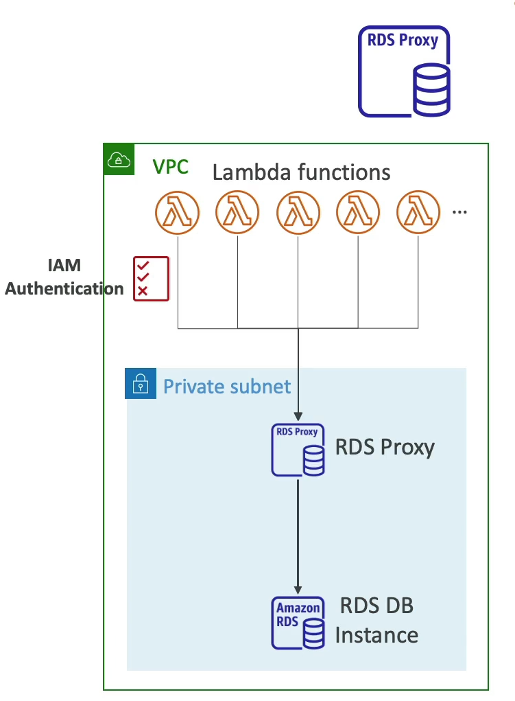
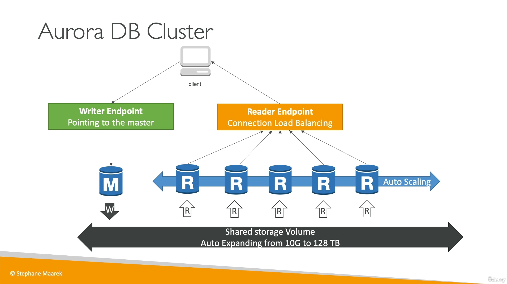

[Back](./AWS.md)

# RDS

## General

- RDS = Relational Database Service
- It a managed DB by AWS that uses SQL as a query language
- RDS uses Security Groups to control the inbound and outbound traffic
- RDS doesn't have a policy like S3 Bucket but uses SG
- Supported database engines:
  - PostgreSQL
  - MySQL
  - MariaDB
  - Oracle
  - Microsoft SQL Server
  - IBM DB2
  - Aurora (Supports MySQL and PostgreSQL)

## Connect to RDS instance

- Request an endpoint (DNS name) for the instance from the Database administrator
- Use the **DescribeDBInstances API** and get the endpoint (DNS name) for the database instance
- It is **NOT** recommended to use **IPs** since they could change during failover

## RDS Logs

The AWS RDS Service contains several logs, such as the ones given below:

- Error logs
- General query log
- Slow query log

## Advantages over using RDS versus deploying DB on EC2

- RDS Pros:

  - Automated provisioning, OS patching
  - Continuous backups and restore to specific timestamp
  - Scaling capability (vertical and horizontal)
  - Read replicas for improved read performance
  - Multi AZ setup for DR (Disaster Recovery)
  - Monitoring dashboards
  - Maintenance windows for upgrades
  - Storage backed by EBS

- RDS Cons:
  - You can't SSH into your instances **(except on RDS Custom)**

## RDS - Storage Auto Scaling

- You have to set **Maximum Storage Threshold**
- Automatically modify storage if:
  - Free storage is less than 10% of allocated storage
  - Low-storage lasts at least 5 minutes
  - 6 hours have passed since last modification
- Useful for applications with unpredictable workloads
- Supports **all** RDS database engines

## RDS Read Replicas

- Read Replicas help you to scale your **Reads**
- Up to 15 Read Replicas per database
- Within AZ, Cross AZ or Cross Region
- Replication is **ASYNC** so reads are eventually consistent
- Replicas can be promoted to their own DB
- Applications must update the connection string to leverage (to make use of) read replicas
- Read replicas are used for **SELECT** (=read) only kind of statements (not **INSERT, UPDATE, DELETE**)
- Use Cases:
  - you want to run a reporting application to run some analytics but don't want to affect the DB workload
  - adding a replica to other region so it can promote as the Master DB if a disaster happen in our region

### Read Replicas - Network cost

- Same region = no costs
- Different region = paying costs

## RDS Multi AZ (Disaster Recovery)

- **SYNC** replication
- An RDS DB instance standby is created
- The application gets one DNS name
- Automatic app failover to standby
  instance automatically changes to the standby database instance
- Increases availability
- **Not used for scaling** (no one can read/write to the standby database)
- Applications doesn't require an update the connection string (because they don't make use of the standby instances)

### The operation from Single AZ to Multi AZ

- Zero downtime operation **(no need to stop the DB)**
- You have just to click on 'modify' for the database
- How it works behind the scenes:
  - A snapshot is taken from the DB
  - A new DB is restored from the snapshot in a new AZ

## Combining RDS Read Replicas & RDS Multi AZ

- Note: The Read Replicas can be setup as Multi AZ for Disaster Recovery

## Cross-Region Replication

#### Can I use RDS multi-az for cross region replication?

- Amazon RDS Multi-AZ deployments are designed for high availability within a single region, not for cross-region replication. For cross-region replication, you should use Amazon RDS Read Replicas.

## RDS Proxy

- Improves database efficiency by reducing the stress on the database and minimize open connections (and timeouts)
- RDS proxy is Serverless, autoscaling, high available (multi-AZ)
- Reduced RDS & Aurora failover time by 66% (because the failover is not handled anymore through the instances themselves)
- RDS Proxy is never publicly accessible (must be accessed from VPC, so you cannot connect directly through the internet)
- Enforce IAM Authentication for DB, and securely store credentials in AWS Secrets Manager
- It is handy to handle connections between lambda functions and the DB
- Supports:
  - MySQL
  - PostgreSQL
  - MariaDB
  - Microsoft SQL Server
  - Aurora (Supports MySQL and PostgreSQL)

## Aurora

- Aurora is cloud optimized from AWS (not open source)
- Aurora **shared** storage automatically grows from 10GB up to 128TB
- Aurora can have up to Master + 15 replicas and the replication process is faster
- Automated failover for master (even with Read Replicas)
- Aurora costs more
- Support for Cross Region Replication
- Backtrack: restore data at any point of time without using backups
- Aurora has support for **transactional operations** (if any update fails, the transaction must roll back)
- 6 copies of your data across 3 AZ
  - 4 copies out of 6 needed for writes
  - 3 copies out of 6 needed for reads

### Aurora DB Cluster

- Writer Endpoint: Pointing to the master DB
- Reader Endpoint: Connection Load Balancing (from all read replica's)

## RDS & Aurora Security

- At-rest encryption (the data is encrypted at the volumes):
  - Database master & replicas encryption using AWS KMS - **must be defined as launch time**
  - If the master is not encrypted, the read replicas cannot be encrypted
  - To encrypt an un-encrypted database, go through a DB snapshot & restore as encrypted
- In-Flight encryption: RDS and Aurora are TLS ready by default use the `AWSTLS` root certificates on client-side

---

- IAM Authentication: IAM roles to connect to your database (ex: using EC2)
- - Supported on MySQL and PostgreSQL.
- Security Groups: Control Network access to your RDS / Aurora DB
- Audit Logs can be enabled, but will be lost soon so: sent logs to CloudWatch Logs for longer retention
