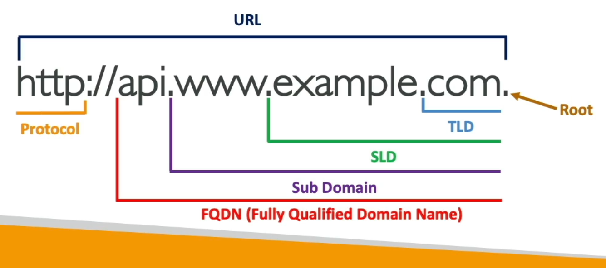
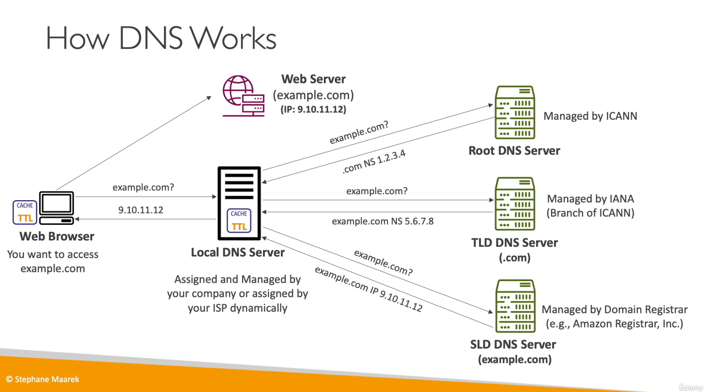

[Back](./AWS.md)

# Route 53

## What is DNS?

- TLD = Top Level Domain
- SLD = Second Level Domain
- FQDN = Fully Qualified Domain Name = Absolute Domain Name
- FQDN is the full domain name, excluding the protocol

  

## Amazon Route 53

- Fully managed and Authoritative DNS
  - Authoritative = The customer (you) can update the DNS records
- Ability to check the health of your resources
- The only AWS service which provides 100% availability Service Level Agreement (SLA)
- Why is it called Route 53? 53 is a reference to the traditional DNS port

## Route 53 usage with domains from other registrars

1. Create a Public Hosted Zone in Route 53
2. Change the NS (name servers) on the registrar website to match the NSs of AWS Hosted Zone
3. Then we can use Route 53 on Amazon

## Route 53 - Hosted Zone

- Hosted Zone: A container for records that define how to route traffic to a **domain and it's subdomains**

- **One Hosted Zone represents One Domain**

- Public Hosted Zones: contains records that specify how to route traffic on the internet (public domain names)

  - ex: `application.mypublicdomain.com`

- Private Hosted Zones: contains records that specify how you route traffic within one or more VPCs (private domain names)

  - ex: `application.company.internal`

- You pay $0.50 per month per hosted zone

## Route 53 - DNS Records

- Record Types:
  - A: maps a hostname to IPv4
  - AAAA: maps a hostname to IPv6
  - CNAME: points a hostname to any other hostname (charges for DNS query)
  - NS: Name Servers for the Hosted Zone: Control how traffic is routed for a domain
- Alias

## Route 53 - TTL

- Cache for DNS lookup (default 300 sec)
- TTL is required for each DNS record
- Alias don't support TTL
- Common solution: If you plan on changing a record, the idea is that sometimes you will decrease the TTL for, say, 24 hours, and then when you know that all the clients have a new TTL that is low, then you change the record value which gets updated for everyone, and then you increase the TTL.

## Route 53 - Alias Records

| Feature                 | CNAME                                                            | Alias                                                                                  |
| ----------------------- | ---------------------------------------------------------------- | -------------------------------------------------------------------------------------- |
| Purpose                 | Point a hostname to another hostname                             | Point a hostname to one AWS Resource                                                   |
| Charge                  | Costs money                                                      | Free of charge                                                                         |
| Health Check Capability | No                                                               | Yes                                                                                    |
| Can use Zone Apex       | No                                                               | Yes                                                                                    |
| Supports TTL            | Yes                                                              | No                                                                                     |
| Supports EC2 DNS Name   | Yes                                                              | No                                                                                     |
| Targets                 | The target is a domain name which must have an A or AAAA records | A (IPv4) or AAAA (IPv6) AWS resource, you specifiy an AWS Resource and AWS resolves it |

Alias AWS resources Record Targets:

- ELB
- API Gateway
- VPC Endpoints
- S3 Websites (not S3 buckets)
- CloudFront Distribution
- Elastic Beanstalk environments
- Global Accelerator accelerator
- Route 53 record in the same hosted zone

## Route 53 - Routing Policies

- Amazon Route 53 offers several routing policies to manage how DNS queries are handled.

### IP-based Routing

- Routing is based on the client's IP address (or an IP range)

### Simple

- Route traffic to a single resource, or multiple
- If multiple values are returned, a random one is chosen by the **client**
- Can't be associated with Health Checks

### Multi-value

- Routing traffic to multiple resources
- Can be associated with health checks (return only values for healthy resources)
- **Up to 8 healthy records are returned for each Multi-Value query**
- It's different from 'simple' because in 'simple' we don't know if something is healthy or not

### Weighted

- Assign each record a relative weight %
- **DNS records must have the same name and type**
- Can be associated with Health Checks
- Assign a weight of 0 to a record to stop sending traffic to a resource
- **Example:** You are planning to launch a web based application in two different regions within US on AWS due to your organization compliance policies. You have setup 2 EC2 instances attached to an elastic load balancer in us-east-1. You have replicated the same setup in us-west-1. Now you have two load balancers which needs to listen traffic from internet. You would want to split the requests equally between both load balancers from a domain name hosted on your AWS Route 53. How should you configure your Route 53 record sets?
- **Solution:** Create two **record sets** one each for us-east-1 and us-west-1 load balancers. Set weighted routing policy with weights as 1 and 1 respectively
- **Mistake:** Create one record set and select both load balancers as Alias Targets. Set weighted routing policy with weights as 1 and 1 respectively (A record set can only have one Alias target)

### Latency

- Redirect to the resource that has the least latency close to us
- Can be associated with Health checks (has a failover capability)

### Failover

- If the primary instance is unhealthy, the client will get a DNS answer with the secondary instance
- Can be associated with Health checks

### Geolocation

- This routing is based on the user location (country, continent)
- You can have a location 'default' so all other countrys that are not specified as a record will get the default

### Geo-proximity

- Is helpful for shifting traffic from one region to an another
- **You must use Route 53 Traffic Flow to use this feature**
- To change the size of the geographic region, specify bias values:
  - To expand (1 to 99) - more traffic to the resource
  - To shrink (-1 to -99) - less traffic to the resource

## Route 53 - Traffic Flow

- Visual editor
- Under Traffic Flow a Traffic Policy can be created:
  - Policies can be applied to different Route 53 Hosted Zones (different domain names)
  - Supports versioning

## Route 53 - Health Checkers

- Health checks = Automated DNS Failover
- You have to configure the **security groups** to allow incoming requests from Route 53 Health Checkers
- Health Check types:
  - Health checks that monitor an endpoint (app, server, other AWS resource...)
    - About 15 global health checkers will check the endpoint health
    - If > 18% of health checkers report the endpoint is healthy, Route 53 consider it healthy, otherwise it's unhealthy
    - Check every 30 sec (default)
    - Via HTTP, HTTPS and TCP
    - Health checkers can check the **first 5120 bytes** of the response if its text based
  - Health checks that monitor other health checks (Calculated Health Checks)
    - Listens up to 256 health checkers
  - Health checks that monitor CloudWatch Alarms
    - Usage: if we can't enter a private network we create a CloudWatch alarm and listen to it
