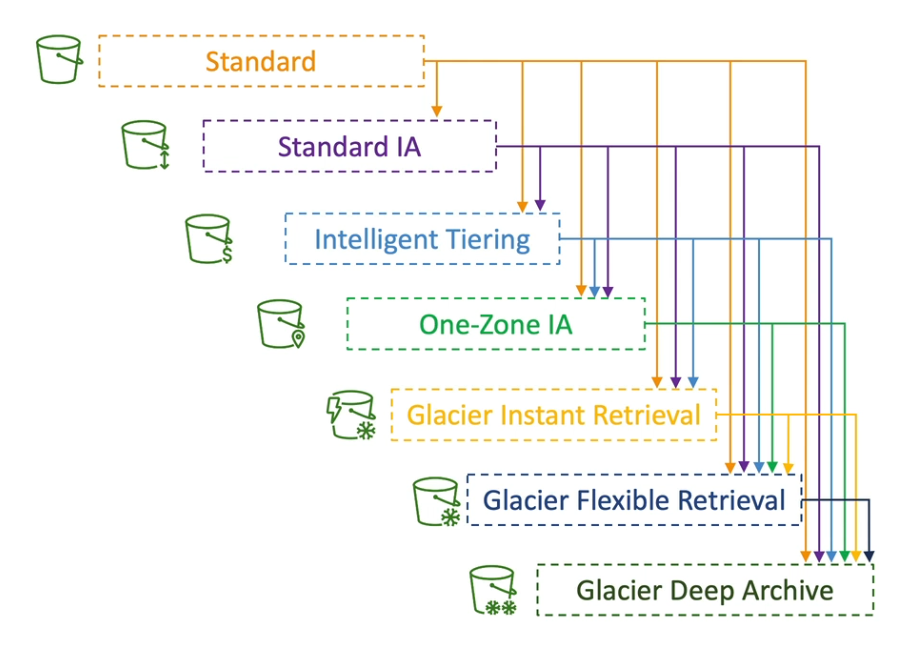
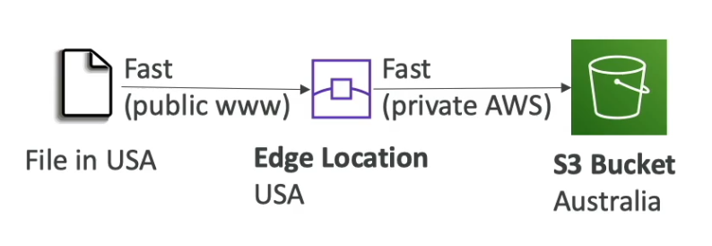
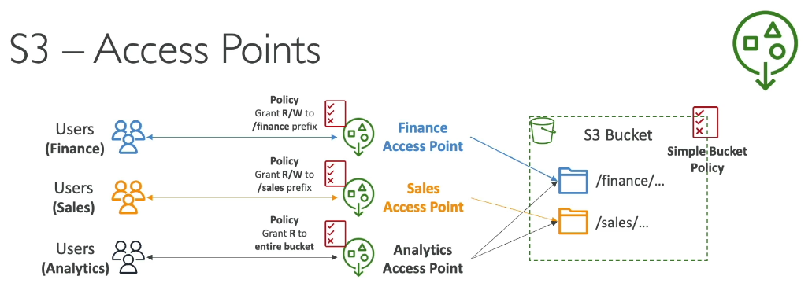
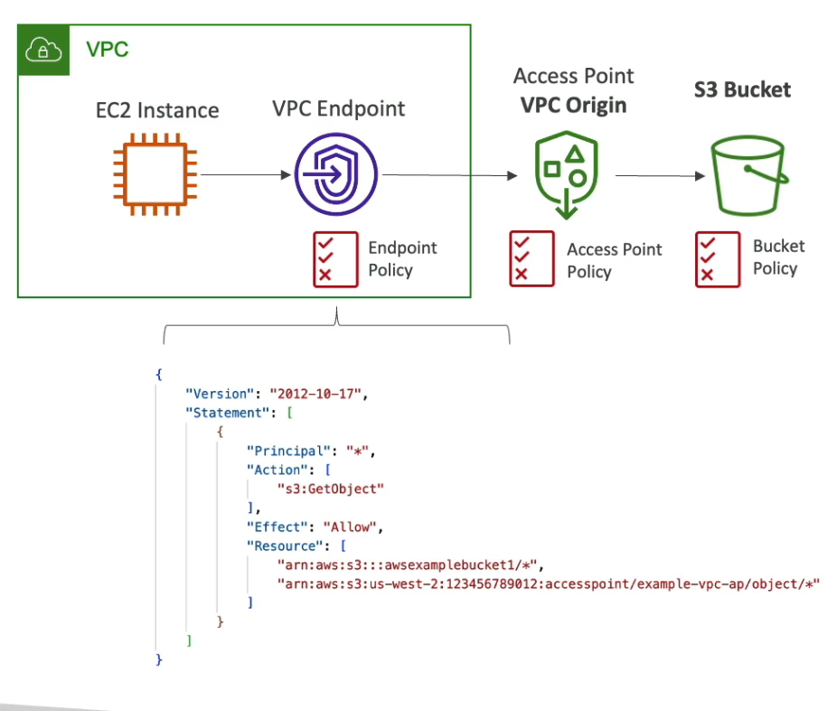
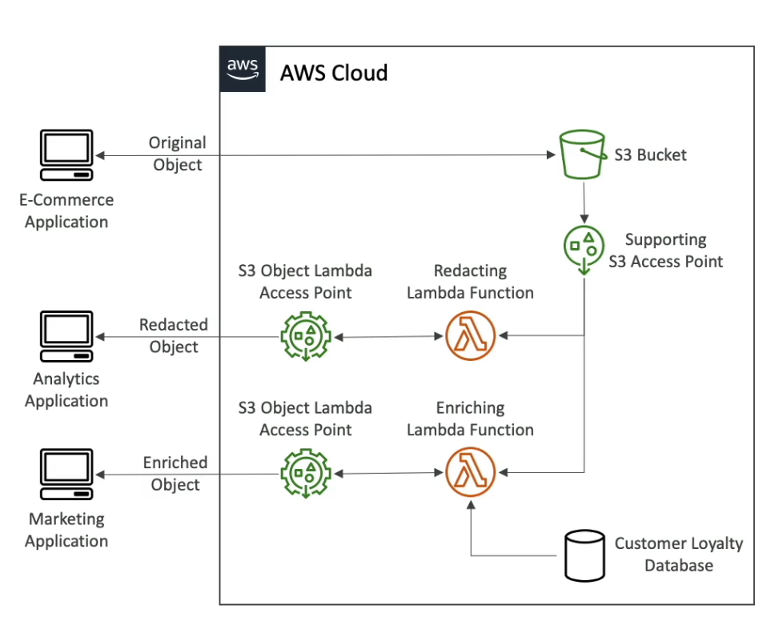

[Back](./AWS.md)

# S3

## General

- S3 is **infinitely scaling** storage
- S3 = Amazon Simple Storage Service

## S3 Buckets

- Amazon S3 allows people to store objects (files) in buckets
- Buckets must have a globally unique name (**across all regions all accounts worldwide**)
- Buckets are defined at the region level
- Bucket settings for **Block Public Access**: These settings were created to prevent public access (even if a bucket policy allows it)
- Bucket settings for **Block Public Access** can be set at the **AWS account** level if you know that no bucket on your account should be publicly accessible

## S3 Objects

- Files in buckets are called objects
- The **key** of an object is its **FULL** path:
- The key is composed of **prefix + object name**
  - `s3://my-bucket-name/my_folder1/another_folder/my_file.txt`
  - prefix is: `my_folder1/another_folder/`
  - object name is: `my_file.txt`
- Max. Object Size is 5TB (5000GB)
- If uploading more than 5GB, must use **multi-part upload**
- Objects has a version ID (if versioning is enabled) default version is **null**

## S3 Policies

- User-based policy
  - IAM Policies - what should be allowed for a specific user/role from IAM
- Resource-based policy

  - Bucket Policies - JSON based policies, used to:
    - Grant public access to the bucket
    - Force objects to be encrypted at upload
    - Grant access to another account (Cross Account Access)

- Access Control List (ACL)

  - AWS recommends not to use ACL
  - An ACL is a method used to manage access permissions to S3 buckets and the objects within them.
  - ACLs can be applied at both the bucket level and object level.
  - Object Access Control List (ACL) - at the object level
  - Bucket Access Control List (ACL) - at the bucket level

```json
{
  "Version": "2012-10-17",
  "Statement": [
    {
      "Sid": "PublicRead",
      "Effect": "Allow",
      "Principal": "*",
      "Action": ["s3:GetObject"],
      "Resource": ["arn:aws:s3:::examplebucket/*"]
    }
  ]
}
```

## S3 Static Website Hosting

- S3 can host static websites and have them accessible on the internet
- The website URL will be depending on the region
- If you get a **403 Forbidden** error, make sure the bucket policy allows public reads **(This is not a CORS Error)**
- To allow a static website hosted on a **S3 bucket** to **fetch** files from **another S3 bucket**, enable **CORS** on the second bucket and configure bucket policies on both buckets to permit the necessary access.

## S3 - Versioning

- It is enabled at the **bucket level**
- Same **Object Key** overwrite will change the "version": 1,2,3
- It is best practice to version your buckets
  - Ability to restore deleted objects
  - Easy roll back to previous version
- Suspending versioning on the bucket does not delete the previous versions

### Deleting an Object

- Deleting an object with versioning enabled will add a delete marker on top of the object
- Deleting the delete marker will restore the object
- Deleting an object or a delete marker with a version ID, is a permanent delete

## S3 - Replication (CRR & SRR)

### Kinds of replication

- CRR = Cross-Region Replication, use cases:
  - Compliance
  - Lower latency access for user in another region
  - Replication across accounts
- SRR = Same-Region Replication, use cases:
  - Log aggregation
  - Replication between production and test accounts

### Setup

- Must enable versioning in source and destination buckets
- Must give proper IAM permissions to S3 so they can read/write to specified buckets
- Buckets can be in different AWS accounts

### Data

- Copying is **asynchronous**

- Replications are **Read Only**

- After you enable Replication, only new objects are replicated
- Optionally, you can replicate existing objects using **S3 Batch Replication**
  - Replicates existing objects and objects that failed replication
- For DELETE operations

  - Can replicate delete markers from source to target (optional setting)
  - Deletions with a version ID are not replicated (to avoid malicious deletes)

- There is **no chaning** of replication

  - If bucket 1 has replication into bucket 2, and bucket 2 has replication into bucket 3
  - Then objects created in bucket 1 are not necessarly replicated to bucket 3
  - Example: let's assume that myfile.txt in B2 is modified. After the modification, it is assigned a new version number 2 in B2. This modified object (with version number 2) is then replicated to Bucket 3 (B3). In Bucket 3 (B3), myfile.txt will have the version number 2, indicating that it is a replication of the modified object from Bucket 2, not directly from Bucket 1.
  - So, you have to replicate B1 into B2, and B1 into B3.

## Lifecycle Rules

- Transition Actions: configure objects to transition to another storage class
- Expiration Actions: configure objects to expire (delete) after some time, like:

  - Access log files can be set to delete after a 365 days
  - Can be used to delete old versions of files (if versioning is enabled)
  - Can be used to delete incomplete Multi-Part uploads

- Rules can be created for a certain prefix (example: s3://mybucket/mp3/\*)
- Rules can be created for certain objects Tags (example: Department: Finance)

### Storage Class Analysis

- Help you decide when to transition objects to right storage class, does **not** work for One-Zone IA or Glacier
- Report is updated daily
- 24 to 48 hours to start seeing data analysis

## S3 Storage Classes

- When you create/upload an object in S3, you can choose it's class, and through time move between classes manually or using S3 Lifecycle configurations
- You pay pricing for storage + object retrieval cost



### Storage Classes

#### Standard - General Purpose

#### Standard - Infrequent Access (IA)

#### Intelligent Tiering

- Used when we don't know the usage pattern
- Moves objects automatically between access tiers based on usage
- Small monthly monitoring and auto-tiering fee
- There are no retrieval charges in S3 Intelligent-Tiering

#### One AZ-Infrequent Access

- Data lost when AZ is destroyed
- Usage:
  - Secondary backup copies of on-premises data
  - Data you can recreate

#### Glacier Instant Retrieval

- Millisecond retrieval, great for data accessed once a quarter (15min)
- Minimum storage duration of 90 days

#### Glacier Flexible Retrieval

- Minimum storage duration of 90 days
- Retrieval time:

  - Expedited (1min to 5min)
  - Standard (3h to 5h)
  - Bulk (5h to 12h)

#### Glacier Deep Archive

- Minimum storage duration of 180 days
- Retrieval time:
  - Standard (12h)
  - Bulk (48h)

## S3 Event Notifications

- You can use the Amazon S3 Event Notifications feature to receive notifications when certain events happen in your S3 bucket. (like uploading a file), deliverd to:
  - Lambda
  - SQS
  - SNS

## S3 - Performance

- Amazon S3 automatically scales to high request rates, latency 100-200ms
- Your application can achieve at least:
  - 3500 PUT/COPY/POST/DELETE or
  - 5500 GET/HEAD requests per second **per prefix** in a bucket

### S3 Transfer Acceleration

- Can be used for **upload** and **download**
- Increase transfer speed by transfering a file to an AWS edge location which will forward the data to the S3 bucket in the target region
- Compatible with multi part upload
- The idea is to use the private AWS private fast network



### S3 Byte-Range Fetches

- Parallelize GETs by requesting specific byte ranges
- Better resilience in case of failures (retry with a smaller byte range)
- Can be used to speed up downloads
- Can be used to retrieve only partial data (ex: only the first 250 bytes that represents the header of a file)

### S3 Select & Glacier Select

- Retrieve less data using **SQL** by performing **server-side filtering** to filter the contents of an Amazon S3 object and retrieve only the subset of data that you need (ex: CSV file)
- Less network transfer, less CPU cost client side

## S3 Metadata & Object Tags

- Metadata (key / value pairs - system defined or user defined metadata)
  - when uploading an object, you can also assign metadata
  - User-defined metadata keys must begin with "x-amz-meta-"
- Tags (key / value pairs - up to 10)

  - Useful for fine grained permissions (only access specific objects with specific tags)
  - Useful for analytics purposes (using S3 Analytics to group by tags)
  - Useful for lifecycle rules

- You **cannot** search the object by **metadata or object tags** **(Common exam question)**
  - Instead, you must use an external DB as a search index such as DynamoDB

# S3 Security

## S3 Object Encryption

### Server Side Encryption SSE-S3

- Keys managed, and owned by AWS
- When uploading the object, set header: `"x-amz-server-side-encryption":"AES256"`
- Encryption type is **AES-256**
- Enabled by **default** for new buckets & new objects

### Server Side Encryption SSE-KMS

- Keys managed by AWS KMS (Key Management Service)
- When uploading the object, set header: `"x-amz-server-side-encryption":"aws:kms"`

#### Throttling

- You may be impacted by the KMS API limits (because you are calling an another service for encryption)
- We can reduce the API calls (so reducing costs) made to KMS by retreving a **Bucket Key** from KMS that will be used for encryption. But you will see less KMS CloudTrail events in CloudTrail

#### Advantages

- You have full control over the rotation policy of the encryption key.
- Audit key usage using CloudTrail (anytime someone uses a key in KMS, it is logged in CloudTrail Service)

### Server Side Encryption (customer provided keys) SSE-C

- Server-Side Encryption using keys fully managed by the customer outside of AWS
- HTTPS **must** be used
- Encryption key must be provided in HTTP headers, for every HTTP request made
- S3 does **NOT** store the encryption key you provide, it is discarded after it is used
- In order to read the file, the user must provide the key that is used for encryption in order to read that file

### Client-Side Encryption

- Customer fully manages the **keys** and **encryption/decryption**
- Use client libraries such as **Amazon S3 Client-Side Enctyption Library**

## S3 - Force Encryption in transit

- Deny every request if `"awsSecureTransport": "false"`

```json
{
  "Version": "2012-10-17",
  "Statement": [
    {
      // Security best practices often favor a deny-first approach instead of allow/true
      // Watch out for the effect (deny all traffic that is not secure)
      "Effect": "Deny",
      "Principal": "*",
      "Action": "s3:GetObject",
      "Resource": "arn:aws:s3:::my-bucket/*",
      //Add this condition with the following
      "Condition": {
        "Bool": {
          "aws:SecureTransport": "false"
        }
      }
    }
  ]
}
```

## S3 - Force Encryption at rest

- SSE-S3 encryption is automatically applied. Optionally, you can **force encryption** using a **bucket policy** and **refuse any API call to PUT an S3 object without encryption headers** (ex: SSE-KMS or SSE-C)
- Note: **Bucket policies** are evaluated **before** the **default encryption** happens

## MFA Delete

- Only the bucket owner (root account) can enable/disable `MFA Delete`
- To use `MFA Delete`, Versioning **must** be enabled on the bucket
- Enabling MFA Delete has to happen via the CLI

- If `MFA Delete` is enabled, MFA will be required to:
  - Permanently delete an object version
  - Suspend Versioning on the bucket

## S3 Access Logs

- **Any request** made to S3, from any account/EC2, authorized or denied, will be logged into another S3 bucket
- The target logging bucket must be in the same AWS region

### Warning

- Do not set your loggin bucket to be the same as the monitored bucket (infinite loop)

## S3 Pre-Signed URLs

- Pre-Signed URLs are temporary URLs that you generate to grant time-limited access to some objects in your S3 bucket **without updating your bucket policy**, user can use (GET/PUT)
- Generate using the S3 Console (up to 12 hours), AWS CLI (up to 168 hours) or SDK
- Usage:
  - While your bucket **remains private** you can give access to your buckets to some users with an expiration time
  - Allow only logged-in users to download a **premium content** from your S3 bucket

## S3 - Access Points

- Access Points simplify security management for S3 Buckets because we can split it up
- **We still have to use a bucket policy** but it would be more simple policy
- Each Access Point has:
  - its own DNS name (You can choose to connect it to the internet or to a VPC Origin)
  - An access point policy (similar to bucket policy)



### VPC Origin

- We can define the S3 Access Point to be accessible only from within the VPC
- You must create a VPC Endpoint to access the S3 Access Point
- The VPC Endpoint has it is own policy too



### Object Lambda Access Points

- Use AWS Lambda Functions to **modify** the object before it is retrieved by the caller application
- The application calls the **S3 Object Lambda Access Point** which invokes the **Lambda Function** which will retrive the data from the **S3 Access Point**
- Use cases:
  - Converting across data formats, such as converting XML to JSON
  - Resizing and watermarking images on the fly using callers-specific details


