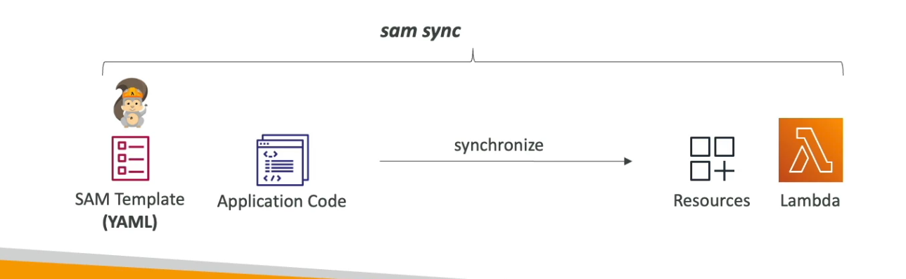
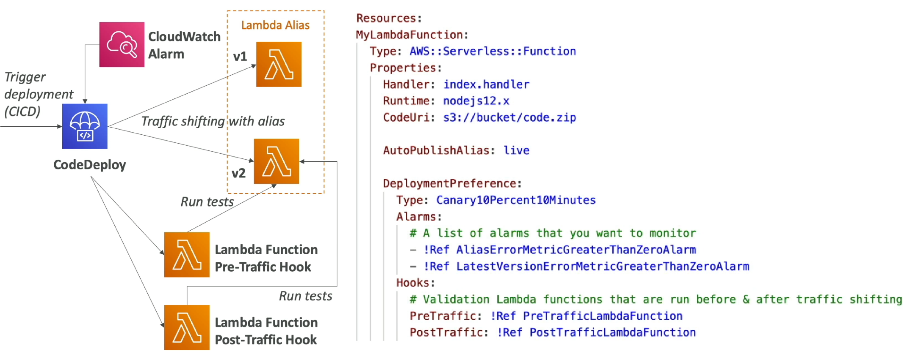
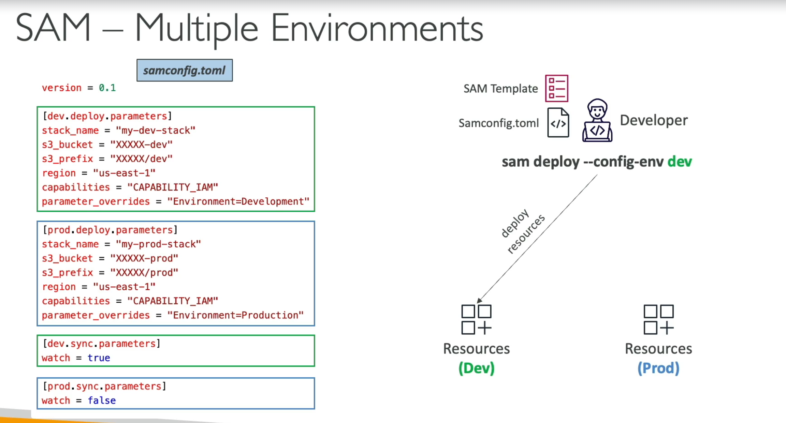

[Back](./AWS.md)

# SAM

## SAM - Basics

- SAM = Serverless Application Model
- All the configuration is YAML code or JSON
- Supports anything from CloudFormation: Outputs, Mappings, Parameters, Resources

## SAM - Structure

- Transform header indicates it's SAM template: `Transform: 'AWS::Serverless-2016-10-31'`
- It accepts the following resources
  - `AWS::Serverless::Function`
  - `AWS::Serverless:Api`
  - `AWS::Serverless::SimpleTable`
- Package & Deploy: use `sam deploy` command (previously you had to do `sam package` first)

## SAM Accelerate (SAM Sync)

- SAM Accelerate is a set of features to reduce latency while deploying resources to AWS
- Ability to synchronizes code changes to AWS without updating infrastructure (uses service APIs & bypass CloudFromation)



### Examples

- `sam sync` synchronize code and infrastructure configuration
- `sam sync --code` synchronize code changes without updating infrastructure (bypass CloudFromation, fast update)
- `sam sync --code --resource AWS::Serverless::Function` synchronize only all Lambda functions and their dependencies
- `sam sync --code --resource-id HelloWorldLambdaFunction` synchronize only a specific resource by its ID
- `sam sync --watch` Monitor for file changes and automatically synchronize when changes are detected

## SAM Policy Templates

- List of templates to apply permissions to your Lambda functions

```yaml
MyFunction:
  Type: "AWS::Serverless::Function"
  Properties:
    CodeUri: ${codeuri}
    Handler: hello.handler
    Runtime: python2.7
    # It is the policy below
    Policies:
      - SQSPollerPolicy:
          QueueName: !GetAtt MyQueue.QueueName
```

## SAM and CodeDeploy

- SAM Framework natively uses CodeDeploy to update Lambda functions
- In the SAM Template we can add:
  - `AutoPublishAlias: live` specify the name of the alias
  - `DeploymentPreference` Canary, Linear, AllAtOnce
  - `Alarms` Alarms that can trigger a rollback
  - `Hooks` Validation Lambda function that are run before & after traffic shifting



## SAM - Local Capabilities

- **SAM CLI + AWS Toolkits** allows you to debug your Lambda functions locally, inspect variables, and execute code line-by-line.
- `sam local start-lambda` Start a local endpoint that emulates AWS Lambda service
- `sam local invoke` Invoke lambda function with payload once and quit after invocation completes
- `sam local generate-event` Generate sample payloads for event sources (S3, SQS, etc...)
- `sam local start-api` Start a local HTTP server that hosts all your functions

## SAM - Multiple Environments

- We use **samconfig.toml** file to have different configurations for your environments (ex: dev, prod)
- Use `sam deploy --config-env dev` to use the defined configuration in the **samconfig.toml** file


