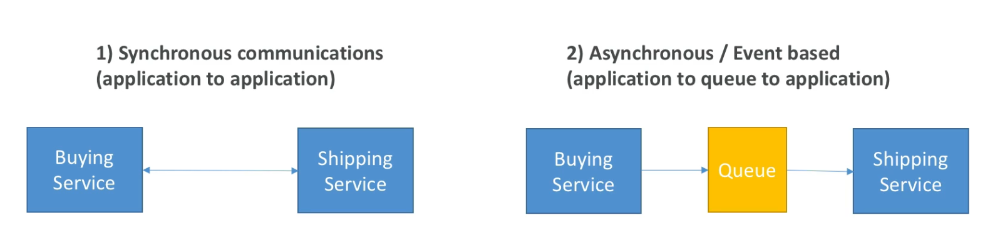
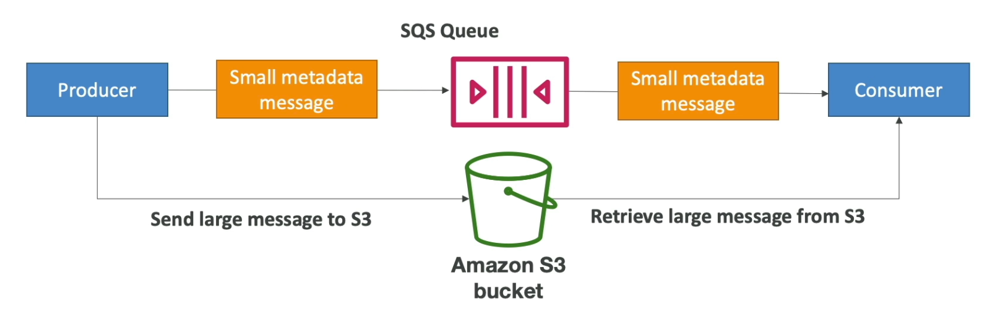
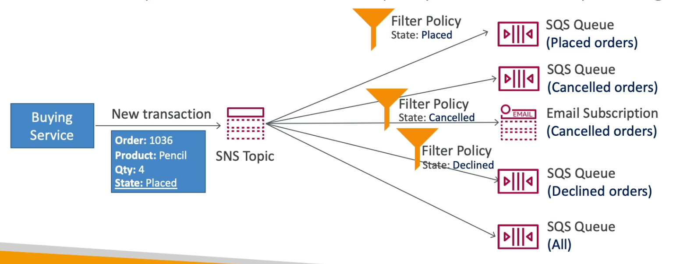

[Back](./AWS.md)

# SQS

## Introduction

- There are two patterns of application communication
  
- Synchronous communication between applications can be problematic if there are sudden spikes of traffic
- SQS communication is **Async**

## General

- SQS = Simple Queue Service
- Consumer pulls data from the SQS queue
- Fully managed service, used to **decouple applications**
- SQS could be used to decouple between application **tiers**, ex: between frontend and backend
- SQS like a buffer between the **producer (the sender)** and the **consumer (the receiver)**
- Retain messages for 4 days (default), max 14 days
- Max message size is **256KB**
- You can't change the queue type after you create it, and you can't convert an existing standard queue into a FIFO queue

## SQS Queue Types

| Feature                      | SQS Standard                                   | SQS FIFO                                                           |
| ---------------------------- | ---------------------------------------------- | ------------------------------------------------------------------ |
| **Message Order**            | Best-effort ordering (order is not guaranteed) | First-in-First-out                                                 |
| **Throughput**               | Unlimited                                      | 300 msgs/s (no batching), 3000 msgs/s (with batching)              |
| **Duplicates**               | Might happen                                   | No Duplication wihtin 5 min (based on content or deduplication ID) |
| **Queue Naming**             | -                                              | Must end with `.fifo`                                              |
| **Message goruping support** | No Support                                     | Yes                                                                |
| **Delivery Type**            | At least once delivery                         | Exactly once delivery (within the timeframe of deduplication)      |
| **Idempotent**               | Non-Idempotent                                 | Idempotent                                                         |

## SQS - Consuming Messages

- Consumer deletes the messages using the **DeleteMessage API** after finishing processing
- A consumer can receive up to 10 messages at a time
- We can scale consumers horizontally (add more consumers) to improve throughput of processing

## SQS with ASG

- EC2 Instances in an ASG can be set to poll for messages from an SQS Queue
- ASG will scale based on **CloudWatch Metric - Queue Length (ApproximateNumberOfMessages)**

## SQS - Priority Queues

- In an architecture, you can ensure that premium customers' messages are given higher priority by creating two SQS queues: one for normal customers and one for premium customers. The application can then process messages from the high-priority queue

## SQS - Security

### Encryption

- In-flight encryption using HTTPS
- At-rest encryption using KMS keys
- Client-side encryption if the client want to perform encryption/decryption itself

### Access Controls (From IAM)

- IAM policies to regulate access to the SQS

### Access Policies (From the service itself)

- Useful for cross-account access to SQS queues
- Useful for allowing other services to write to an SQS queue ex: SNS, S3

## SQS - Message Visibility Timeout

- After a message polled by a consumer, it becomes invisible to other consumers
- **30 sec** invisibility by default
- If a message is not processed and deleted within the visibility timeout, it will go back and be visible in the queue
- A consumer could call the **ChangeMessageVisibility API** to get more time
- If visibility timeout is **high(hours)**, and consumer crashes, re-processing will take time
- If visibility timeout is **low(seconds)**, we may get duplicates

## SQS - Dead Letter Queue (DLQ)

- If a consumer fails to process a message withing the Visibility Timeout the message goes back to the queue
- We can set a threshold of how many times a message can go back to the queue, **MaximumReceives**
- After the **MaximumReceives** Threshold is exceeded, the message goes into a **dead letter queue** (another SQS queue)
- **DLQ of a FIFO queue must also be a FIFO queue**
- **DLQ of a standard queue must also be a standard queue**
- DLQ is useful for **debugging**
- We can use **Redrive to Source** option to send the messages back to the source SQS queue after we have fixed our code

## SQS - Delivery Delay

- Delay a message (consumers will not see it immediately) up to 15 min
- Default is 0 seconds (message is available right away)
- Can set a default at a queue level
- Can override the default on send using the **DelaySeconds** parameter when sending a message

## SQS - Short Polling

- Short polling is the default method when you use the `ReceiveMessage` API call.
- It checks the queue for messages and returns immediately, even if no messages are found.
- Use short polling when you need immediate responses or if your application requires high-frequency polling and no latency

## SQS - Long Polling

- The idea of long polling is when a consumer requests messages from the queue it can optionally wait for messages to arrive if there are none in the queue
- Long Polling decreases the number of **API Calls** made to SQS while decreasing the latency of the application
- Long polling can be enabled at the queue level, or at the API level while making a call using **ReceiveMessageWaitTimeSeconds**

## SQS - Extended Client Library for Java

- Exceeds message size limit > 256KB
- Using SQS Extended Client Library for Java
- Using the small message in the SQS as a pointer to an S3 bucket
  

## SQS - APIs

- CreateQueue (MessageRetentionPeriod, as an argument)
- DeleteQueue
- PurgeQueue: Delete all the messages in queue
- SendMessage (DelaySeconds, as an argument): to add a message into the queue
- DeleteMessage: to delete a message from SQS queue
- ReceiveMessage (MaxNumberOfMessages (default: 1, max: 10), as an argument)
- ReceiveMessageWaitTimeSeconds: LongPolling
- ChangeMessageVisibility: change the message timeout

## SQS - FIFO

### Deduplication

- De-duplication interval is 5 min
- Two deduplication methods:
  - Content based deduplication: will do an SHA-256 hash of the message body
  - Explicitly provide a message deduplication ID
- After 5 minutes, a message with the same deduplication ID or content can be accepted again as a new message.

### Message Grouping

- If you specify the same value of **MessageGroupID** in an SQS FIFO queue, you can only have one consumer polling messages from that group
- Ordering across groups is **not** guaranteed, but inside a group **is** guaranteed
- Usage example: Each Group ID can have a different consumer (parallel processing)

# SNS

## General

- SNS = Simple Notification Service
- SNS max message size = 256 KB
- SNS Push data to subscribers
- Each subscriber to the topic will get all the messages by default
- SNS has both standard type and FIFO
- **Cross-Region Delivery:** works with SQS Queues and Lambda Functions in other regions
- Types of subscribers:

  - Emails
  - SMS & Mobile Notifications
  - HTTP(s) endpoints
  - SQS
  - Lambda
  - Kinesis Data Firehose (**NOT Kinesis Data Streams**)

## SNS Security

### Encryption

- In-flight encryption using HTTPS API
- At-rest encryption using KMS keys
- Client-side encryption if the client want to perform encryption/decryption itself

### Access Controls (From IAM)

- IAM policies to regulate access to the SNS

### Access Policies (From the service itself)

- Useful for cross-account access to SNS Topics
- Useful for allowing other services to write to an SNS queue ex: S3

## SNS + SQS: Fan Out Pattern

- Combining SNS with SQS (or other type of subscribers) is called fan out pattern
- Push once in SNS, receive in all SQS queues that are subscribers
- Ability to add more SQS subscribers over time
- Make sure your SQS queue **access policy** allows for SNS to write

## SNS - FIFO

- Can **only** have **SQS standard and FIFO queues** as subscribers, the other types of subscribers are **not** allowed

## SNS - Subscription Filter Policy

- Subscription Filter Policy is set on the subscription between the SNS topic and the subscriber
- It is a JSON Policy used to filter messages sent to SNS subscriber
- If a subscription doesn't have a filter policy it receives every message
  
