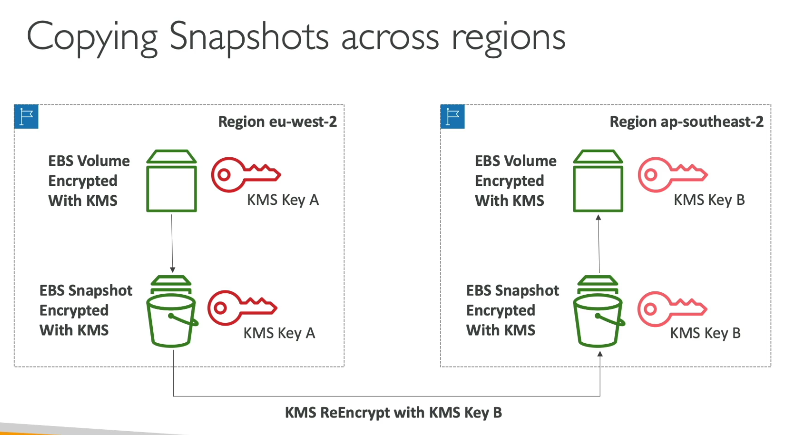

[Back](./AWS.md)

# Security

# AWS Encryption SDK

- The AWS Encryption SDK is a **client-side** encryption library designed to make it easy for everyone to encrypt and decrypt data using industry standards and best practices.
- When using the AWS Encryption SDK, how does the developer keep track of the **data encryption keys** used to encrypt data? the SDK encrypts the **data encryption key** and stores it (encrypted) as part of the returned ciphertext

# KMS

## KMS - Basics

- Ability to audit KMS key usage using CloudTrail
- KMS keys are scoped to a region
- We can encrypt any secret, like environment variables in a lambda function
- Services must have appropriate IAM permissions for calling KMS
- Use **Encrypt** and **Decrypt** APIs

## KMS - Keys Types

| Feature        | Symmetric                                                      | Asymmetric                                                           |
| -------------- | -------------------------------------------------------------- | -------------------------------------------------------------------- |
| Type           | AES-256 keys                                                   | RSA & ECC key pairs                                                  |
| Number of keys | Single encryption key that is used to Encrypt and Decrypt      | Public (Encrypt) and Private Key (Decrypt) pair                      |
| Access         | You never get access to the KMS key (must call KMS API to use) | The public key is downloadable, but you can't access the private key |
| Usage          | AWS Services for encryption at rest                            | Mostly by users out of AWS                                           |

## KMS - Key Management

| Feature            | AWS Owned Keys (not part of KMS service) | AWS Managed Keys              | Customer Managed Keys created in KMS                | Customer Managed Keys Imported                |
| ------------------ | ---------------------------------------- | ----------------------------- | --------------------------------------------------- | --------------------------------------------- |
| Name Example       | SSE-S3, SSE-SQS, SSE-DDB (default key)   | aws/service-name, ex: aws/rds | -                                                   | -                                             |
| Cost of the Key    | Free                                     | Free                          | $1/Month per key                                    | $1/Month per key                              |
| Cost of API calls  | Free                                     | $0.03/10000 calls             | $0.03/10000 calls                                   | $0.03/10000 calls                             |
| Key Policy Control | No Control                               | No Control                    | Full control                                        | Full control                                  |
| Key Rotation       | Managed by AWS                           | automatic every 1 year        | must be enabled, automatic & on-demand (rotate now) | only **manual rotation** possible using alias |

## KMS - Copying Snapshots across regions

- KMS keys are scoped to a region
- Snapshot copied to a new region will be encrypted using a new key (AWS will do this for you)



## KMS - Key Policies

- A user must have the proper IAM permissions to access the key even if the KMS key policy allows every one
- If the policy explicitly allow a user in the principal, the user doesn't need an IAM policy

### Default KMS Key Policy

- Created if you don't provide a specific KMS Key Policy

### Custom KMS Key Policy

- Define users, roles that can access the KMS key
- Useful for cross account access of your KMS key

## KMS - Data keys

- The **KMS Encrypt API** has a size limit of **4KB** for encryption.
- For data larger than 4KB, we use **Envelope Encryption**
- Envelope Encryption involves using the **GenerateDataKey API**, which gives you a **Data Encryption Key (DEK)** You use this key to encrypt your data **locally** (without using KMS Encrypt API).
- The GenerateDataKey API returns the same key in two forms:
  - Plaintext key: Used for encrypting your data.
  - Encrypted key: Stored securely for future decryption. When you need to decrypt the data, you provide the encrypted key to KMS, and KMS gives you back the plaintext key.
- The **Customer Master Key (CMK)** is only used to **encrypt** the **data key (DEK)**, not your actual data. The data key (DEK) is what you use to encrypt the data.
- The **GenerateDataKeyWithoutPlaintext API** is for generating the encrypted data key without needing the plaintext key immediately (you can retrieve it later for use).
- AWS provides an **Encryption SDK** that handles Envelope Encryption for you, so you don’t have to manage it manually.
- The **AWS Encryption SDK** also includes a **DEK caching mechanism**, which helps reduce the number of requests to KMS by temporarily storing DEKs for reuse.

## KMS - Limits

- All operations (encrypt/decrypt) **share** the same quota (same limit)
- When you exceed the quota you will get **ThrottlingException**

### Throttling Strategies

- Use exponential backoff
- For GenerateDataKey API, consider using DEK caching from the encryption SDK
- You can request a quota increase through API or AWS support

# CloudHSM

- CloudHSM = Hardware Security Model
- If we use CloudHSM AWS will provision encryption dedicated hardware
- You manage your own encryption keys entirely (not AWS)
- Supports both symmetric and asymmetric encryption
- Must use the **CloudHSM Client Software** for encryption

# SSM Parameter Store

## SSM - Basics

- Secure storage for configuration and secrets
- Usage example: storing one time fixed license keys, that doesn't need rotation
- KMS encryption is optional
- Has version tracking to see previous versions
- Security through IAM
- No secret rotation out of the box (can enable rotation using Lambda triggered by EventBridge every X days)
- **Make sure the service consuming the parameter has access to SSM and to KMS if the secret is encrypted (in order to decrypt it)**

## SSM - Integrations

- Notifications with Amazon EventBridge (ex: notify the user for parameters that will soon expire **for SSM Advanced**)
- Rotation with EventBridge. No secret rotation out of the box (can enable rotation using Lambda triggered by EventBridge every X days)
- Integration with CloudFormation to reference parameters using the `resolve` keyword ex: `resolve:ssm:S3AccessControl:2`

## SSM - Store Hierarchy

- SSM has store hierarchy helps you define your parameters in a organized way and simplify IAM policies specific to a path

```
/my-department/
    my-app/
        dev/
            db-url
            db-password
        prod/
            db-url
            db-password
    other-app/
```

## SSM Standard vs SSM advanced

| Feature                | Standard | Advanced                              |
| ---------------------- | -------- | ------------------------------------- |
| Total nr of parameters | 10000    | 100000                                |
| Max size of parameter  | 4KB      | 8KB                                   |
| Parameter Policy (TTL) | No       | Yes                                   |
| Cost                   | No       | Yes, per advanced parameter per month |

# AWS Secrets Manager

- Meant for storing secrets
- Is the best option to store **databases passwords**
- You can also store **certificates** in AWS Secrests Manager (don't store them in S3 bucket)
- KMS encryption is **required**
- Capability to force **managed rotation** of secrets every X days (via a lambda function)
- It has a tight integration with RDS, Aurora
- Ability to replicate secrets (sync replication) across multiple AWS regions (for disaster recovery)
- Ability to promote read replica secret to standalone secret
- Integration with CloudFormation to reference parameters using the `resolve` keyword ex: `resolve:ssm:S3AccessControl:2`
