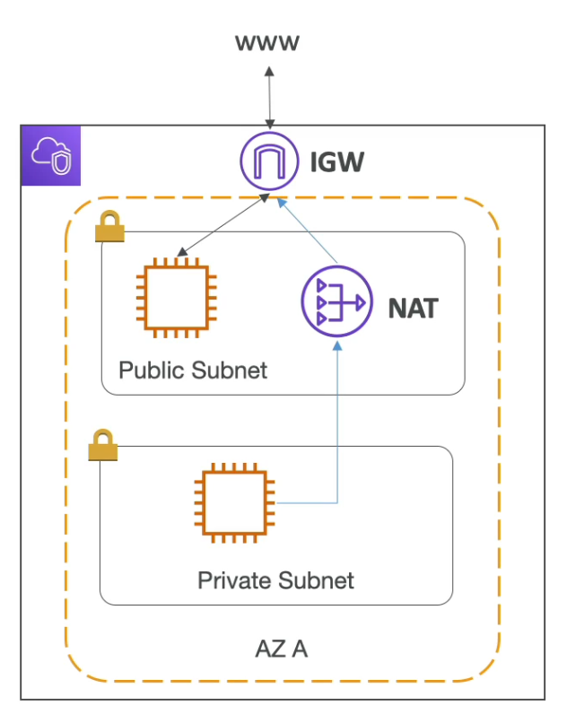
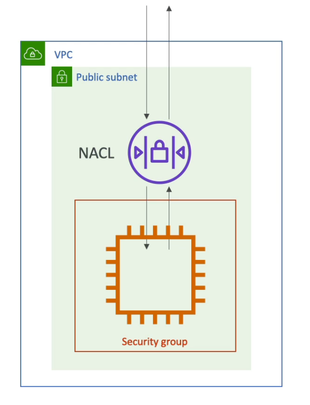
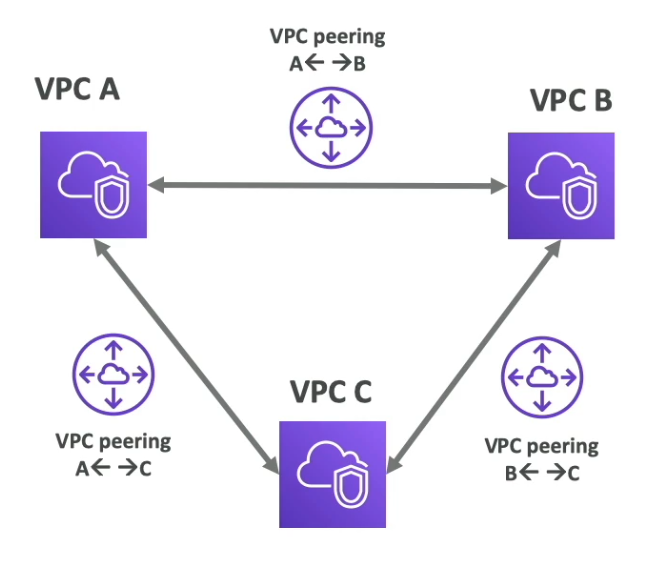
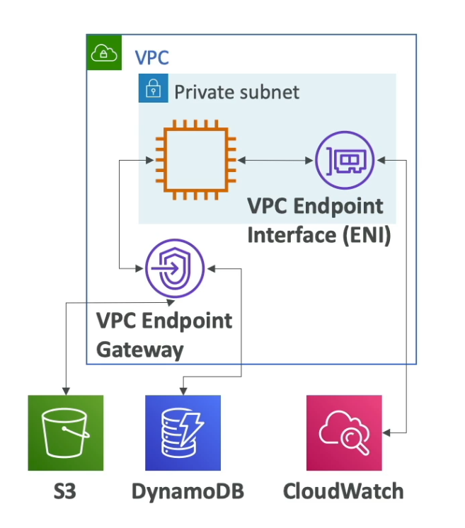
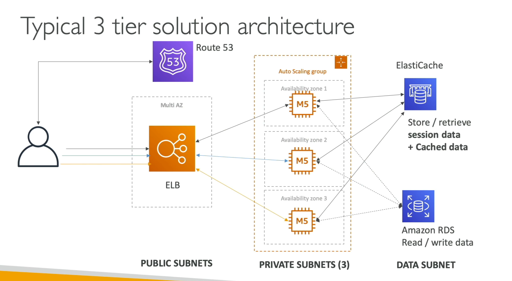
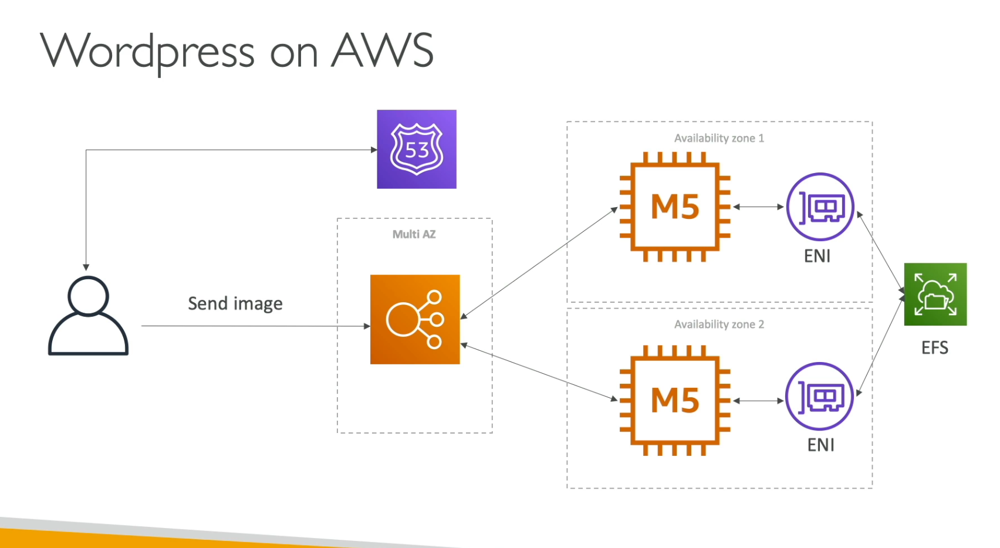

[Back](./AWS.md)

# VPC

## General

- VPC = Virtual Private Cloud
- VPC is private network to deploy your resources
- Subnets: allow you to partition your network inside your VPC
  - A public subnet is a subnet that is accessible from the internet
  - A private subnet is a subnet that is not accessible from the internet
- To define access to the internet and between subnets, we use **Route Tables**

## Internet Gateway & NAT Gateway & NAT Instances

- Internet Gateway: helps our VPC instances connect with the internet
- Public subnets have a route to the internet gateway
- NAT: Allow your instances in your **private subnets** to access the internet while remaining private, NAT has to be hosted in a public subnet

  - NAT Gateways (AWS-managed)
  - NAT Instances (self-managed)

### VPC & Lambda

- Deploying a Lambda function in a public subnet doesn't give it internet access or a public IP (For EC2 it does)
- In order for a Lambda function to connect to the internet, it has to happen via NAT Gateway or a NAT Instance

## Network ACL (NACL) & Security Groups

| Feature        | Network ACL (NACL)                                                                                                                                                          | Security Groups                                                                                                                                                     |
|----------------|-----------------------------------------------------------------------------------------------------------------------------------------------------------------------------|---------------------------------------------------------------------------------------------------------------------------------------------------------------------|
| Description    | A Firewall which controls traffic from and to subnet                                                                                                                        | A firewall that controls traffic to and from an ENI/EC2 Instance                                                                                                    |
| Rules          | Can have **ALLOW** and **DENY** rules                                                                                                                                       | Can have only **ALLOW** rules                                                                                                                                       |
| Attachment     | Are attached at the subnet level                                                                                                                                            | Attached to an ENI / EC2 Instance                                                                                                                                   |
| Rules Includes | IP addresses                                                                                                                                                                | IP Addresses and other security groups                                                                                                                              |
| State          | Stateless: If you allow inbound HTTP traffic (port 80) in a NACL, you also need to create a rule to allow outbound HTTP traffic (port 80) for the response to be sent back. | Stateful: If you allow inbound HTTP traffic (port 80) in a security group, the response traffic is automatically allowed without needing an explicit outbound rule. |

## VPC Flow Logs

- Captures information about all **IP traffic** going into your interfaces:

  - **VPC Flow Logs**
  - **Subnet Flow Logs**
  - **Elastic Network Interface (ENI) Flow Logs**

- Helps to monitor & troubleshoot connectivity issues
- Captures network information from AWS managed interfaces too: ELB, ElastiCache, RDS, Aurora, etc...
- Flow logs can be sent to:
  - S3
  - CloudWatch Logs
  - Kinesis Data Firehose

## VPC Peering

- Connect two or more VPCs, make them behave as if they were in the same network
- Must not have overlapping CIDR (IP Address Range)
- VPC Peering connection is **not transitive** (connection must be established for each VPC that need to communicate with one another), see picture below

## VPC Endpoints

- Endpoints allow you to connect to **AWS services** using a **private network** instead of the public **www** network
- This gives you:
  - enhanced security
  - lower latency to access AWS services
- VPC Endpoint gateway: for S3 & DynamoDB **only**
- VPC Endpoint Interface: for the rest of the services

## VPC Site to Site VPN & Direct Connect

- **Site to Site VPN** & **Direct Connect** Are features that can be used to connect a VPC to your On-premises Data Center

| Feature    | Site to Site VPN              | Direct Connect                              |
| ---------- | ----------------------------- | ------------------------------------------- |
| Network    | Goes over the public internet | Goes over a private network (secure & fast) |
| Setup Time | Easy and fast to setup        | Takes at least a month to establish         |

## Architectures

### Typical 3 Tier Architecture

### WordPress on AWS

### LAMP Stack on EC2

- LAMP:

  - Linux: OS for EC2 instances
  - Apache: Web Server that run on Linux (EC2)
  - MySQL: database on RDS
  - PHP: Application logic (running on EC2)

- Can add Redis / Memcached (ElastiCache) to include a caching tech
- To store local application data & software: EBS drive (root)
