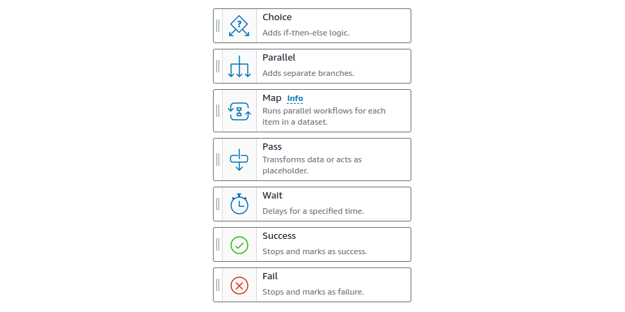
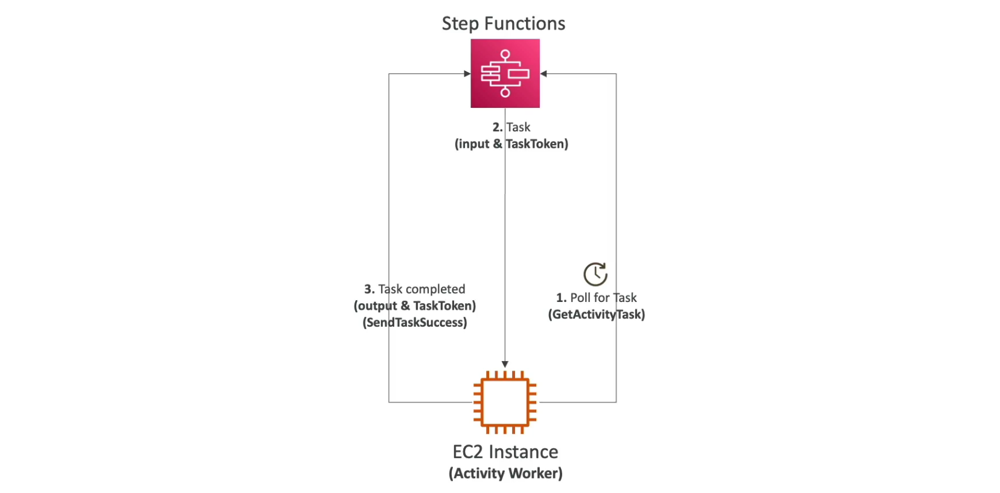

[Back](./AWS.md)

# Step Functions

## Step Functions - Basics

- **Model** your **workflows** as **State Machines**
- Step Functions are written in **JSON**
- Step Functions provide visualization of the workflow and execution of the workflow

### Step Functions are used for

- Order fulfillment
- Data processing

### Start workflow via

- AWS Console
- SDK
- API Gateway
- EventBridge

## Step Functions - Tasks Types

- Call AWS service (invoke lambda functions, publish to SNS topic)
- Activity Tasks (EC2, ECS, on-premises, etc...).
  - Activities poll the Step Functions for work
  - Activities send results back to Step Functions

## Step Functions - States

- Choice: Test for condition to send to a branch
- Parallel: Begin parallel branches of execution
- Map: Dynamically iterate steps
- Pass: pass data from previous step or pass fixed data
- Wait: Provide a delay for a certain amount of time
- Success: Stops and marks as success
- Fail: Stops and marks as failure



## Step Functions - Error Handling

- Error handling has to happen in step functions **not** in the application code (ex: not in the lambda function)
- Use **Retry** and **Catch** (transition to failure path) in the State Machine
- When max retry attempts are reached, the **Catch** kicks in

### Predefined error codes

- **States.ALL** matches any error
- **States.Timeout** Task time out
- **States.TaskFailed** execution failure
- **States.Permissions** insufficient permissions
- **MyCustomError** The task may report its own custom errors

### Retry

- Use 'ErrorEquals' in the JSON to match the error, ex: `"ErrorEquals": ["States.ALL"]`
- IntervalSeconds: delay before next retry
- MaxAttempts: max attempts
- BackoffRate: multiply the delay after each retry (5/10/20 sec)

```json
  "Retry": [
    {
      "ErrorEquals": ["States.ALL"],
      "IntervalSeconds": 5,
      "MaxAttempts": 5,
      "BackoffRate": 2.0
    }
  ]
```

### Catch

- Use 'ErrorEquals' in the JSON to match the error, ex: `"ErrorEquals": ["States.ALL"]` or `"ErrorEquals": ["MyCustomError"]`
- Next: Next state to send to
- ResultPath: Defines where to inject the error information into the state input, and pass the error payload too

```json
"Catch": [
    {
        "ErrorEquals": ["States.TaskFailed"],
        "Next": "CustomErrorFallback", //references the state at the end
        "ResultPath": "$.error" // pass the error into the next task
    }
]

"CustomErrorFallback": {
    "Type": "Pass",
    "Result": "This is a fallback",
    "End": true
}
```

## Step Functions - Wait For Task Token

- Task might wait for other AWS service, 3rd party API call, human approval, etc...
- Allows you to pause Step Functions during a Task until a Task Token is returned
- Append **.waitForTaskToken** to the **Resource** field to tell Step Functions to wait for the Task Token to be returned
- Ex: `"Resource": "arn:aws:states::sqs:sendMessage.waitForTaskToken"`
- Task will pause until it receives that Task Token back with a **SendTaskSuccess** or **SendTaskFailure** API call used by the service from outside the step function

## Step Functions - Activity Worker

- Activity Worker can be running on EC2, On-premises, lambda, etc...
- Activity Worker **polls** for a task using **GetActivityTask API**
- After Activity Worker completes its work, it sends a response of its success/failure using **SendTaskSuccess** or **SendTaskFailure**

### To keep the task active

- Configure how long a task can wait by setting **TimeoutSeconds**
- Periodically send a heartbeat from your Activity worker using **SendTaskHeartBeat** within the time you set in **HeartBeatSeconds** configuration that you set on your step function, which define how long is the maximum time to wait for a heart beat



## Step Functions - Standard vs Express

| Feature            | Standard Workflow                | Express Workflow sync/async                                                             |
| ------------------ | -------------------------------- | --------------------------------------------------------------------------------------- |
| Maximum duration   | 1 year                           | 5 minutes                                                                               |
| Workflow execution | Exactly-once workflow execution. | **sync:** At-most-once workflow execution. **async:** At-least-once workflow execution. |
| Execution Rate     | 2000/sec                         | 100.000/sec                                                                             |
| Use cases          | Processing payments              | IoT data ingestion, streaming data                                                      |

- Note: Express Async, doesn't return the response, see CloudWatch for logs. while for Express Sync the response is returned
