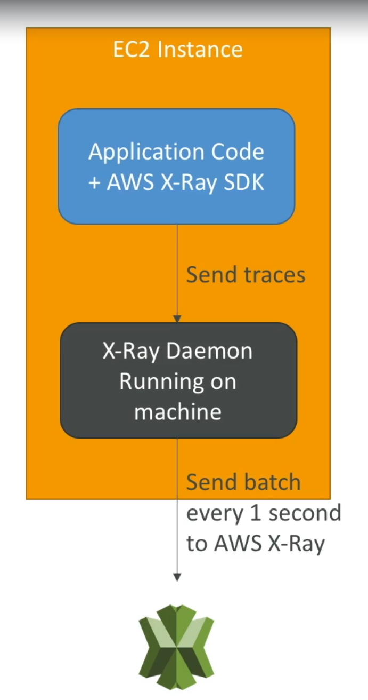
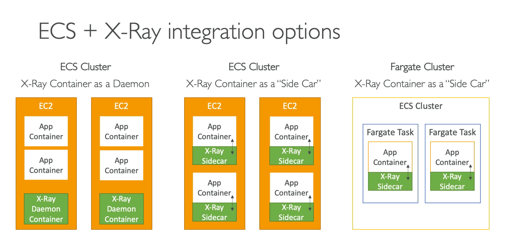

[Back](./AWS.md)

# X-Ray

- X-Ray gives you a **visual analysis** of your applications through a **service map**
- X-Ray helps with **troubleshooting performance (bottlenecks)** and understand **dependencies** in a **microservice architecture**
- X-Ray helps with **instrumentation** which means writing **trace** information to measure the product's performance

## X-Ray - Compatibility

- AWS Lambda
- API Gateway
- Any application server on premises
- EC2
- ECS
- ELB
- Elastic Beanstalk

## X-Ray - Key Concepts

- **Trace:** is an **end-to-end** way to follow a **request**, segments collected together to form an end-to-end trace
- **Segments:** records information about the request, each application / service will send them
- **Subsegments:** if you need more details in your segment
- **Sampling:** decrease the amount of requests sent to X-Ray, to reduce costs
- **Annotations:** Key/Value pairs used to index traces and use with searching and filtering
- **Metadata:** Key/Value paris, not indexed, not used for searching and filtering

## X-Ray - Required segment fields

- Following are the required segment fields in a segment document:
  - Name
  - Id
  - Trace_id
  - Start_time
  - End_time
  - In_progress
- Note: there are also optional segment fields in a segment document

## X-Ray Security

- IAM for authorization
- KMS for encryption at rest

## X-Ray - How to enable it?

### X-Ray with EC2

1. Your code must import the AWS X-Ray SDK (requires little code midifications)
2. Install the X-Ray Deamon on the instance running the application
3. The instance must have the IAM rights to write data to X-Ray

- Note: X-Ray Daemon running on the machine will send batch every 1 second (containing segments) to AWS X-Ray
- Note: The X-Ray Daemon has a config to send records in different traces across accounts (Make sure the IAM permission are correct)
- Note: The API read/write requests are done by the X-ray Daemon while the EC2 has IAM policy to allow the actions



### X-Ray with Elastic Beanstalk

1. You should run the **X-ray Daemon** by setting an option in the Elastic Beanstalk **console** or with a **configuration file** (in .ebextensions/xray-daemon.config)
2. Make sure your application code is instrumented with the X-Ray SDK
3. Ensure your instance profile has the correct IAM permissions so that the X-Ray daemon can function correctly, even though Elastic Beanstalk provisions the underlying infrastructure.

### X-Ray with Lambda

1. Enable **X-Ray Integration** in the **Lambda Function Configuration** by activiting **active tracing**
2. Ensure it has an IAM execution role with proper policy
3. Ensure that X-Ray SDK is imported in the code
4. Bu enabling the integration you get an environment variable to communicate with X-Ray: AWS_XRAY_DAEMON_ADDRESS, for the x-ray daemon IP port

- Note: You do not need to manually install the **X-Ray Daemon** for lambda, it is done for you by enabling the X-Ray Inegration

### X-Ray with ECS

#### Cluster with EC2

- X-Ray Container as a Daemon (1 X-Ray Container per EC2 Instance)
- X-Ray Container as a "Side Car" (1 X-Ray Sidecar per app container)

#### Cluster with Fargate

- X-Ray Container as a "Side Car" (1 X-Ray Sidecar per app container)



#### Setup in the task definition of ECS

1. You need to map the **Container Port** of the X-Ray Daemon to 2000 UDP (enabling the X-Ray container to listen on port 2000)
2. Set an Environment Variable name: **AWS_XRAY_DAEMON_ADDRESS** and the value: **xray-daemon:2000** to point at the Daemon container
3. Link the Two Containers from a Networking Standpoint (define the 'links' part in the task definition)

### X-Ray with DynamoDB

- Until now, it is not possible to enable AWS X-Ray in DynamoDB. You can only track the traces generated by calls to DynamoDB in Lambda with the AWS SDK (use the AWS SDK inside Lambda code to monitor DynamoDB API calls in X-Ray)

## X-Ray Sampling Rules

- With sampling rules, you control the amount of data that you record
- You can modify sampling rules without changing your code
- **By default**, each second the X-Ray SDK records the first request and **five percent** of any additional requests in that second
- The first request per second is called the **reservoir**, which ensures that at least one trace is recorded each second as long the service is serving requests.
- Five percent is called the **rate** at which additional requests beyond the reservoir size are sampled
- You can have custom sampling rules for changing the reservoir size and the rate

## X-Ray - Commands

- `~/xray-daemon$./xray -o` command option can be used while running X-Ray daemon locally & not on Amazon EC2 instance. This will skip checking Amazon EC2 instance metadata. (to remmember: offline)
- `~/xray-daemon$./xray -r` this command can be used to assume an IAM role while saving results in different accounts. (to remmember: role)
- `~/xray-daemon$./xray -t` this command can be used to bind a different TCP port for the X-Ray service. (to remmember: tcp)
- `~/xray-daemon$./xray -b` this command can be used to bind a different UDP port for the X-Ray service

## X-Ray APIs

### Write APIs

- APIs are used by **X-Ray Daemon**
- Uses managed policy called **AWSXRayWriteOnlyAccess**

```json
//AWSXRayWriteOnlyAccess
{
  "Version": "2012-10-17",
  "Statement": [
    {
      "Effect": "Allow",
      "Action": [
        "xray:PutTraceSegments",
        "xray:PutTelemetryRecords",
        "xray:GetSamplingRules",
        "xray:GetSamplingTargets",
        "xray:GetSamplingStatisticSummaries"
      ],
      "Resource": ["*"]
    }
  ]
}
```

- PutTraceSegments: Uploads segment documents to AWS X-Ray
- PutTelemetryRecords: Allows an entity to send operational and performance metrics to AWS X-Ray
- GetSamplingRules: Retrive all sampling rules (to know what/when to send)

### Read APIs

- GetServiceGraph: get the main service graph
- GetTraceGraph: Retrieves a service graph for one or more specific trace IDs
- GetTraceSummaries: **Retrieves IDs** and **annotations** for traces avaliable for a specified **time frame**
- BatchGetTraces: Retrieves a list of traces speficied by ID

# AWS distribution for OpenTelemetry

- AWS supported distribution of the open-source project OpenTelemetry
- OpenTelemetry provides **Auto Instrumentation Agents** to collect traces **without changing your code**
- OpenTelemetry provides a single set of APIs

## Migrate from X-Ray to AWS Distro for Telemetry

- Migrate from X-Ray to AWS Distro for Telemetry if you want to:
  - Standardize with open-source APIs
  - Send trace data to multiple destinations simultaneously

## Sending trace data to destinations

- AWS X-Ray
- Amazon CloudWatch
- Amazon Managed Service for Prometheus
- Partner Monitoring Solutions
